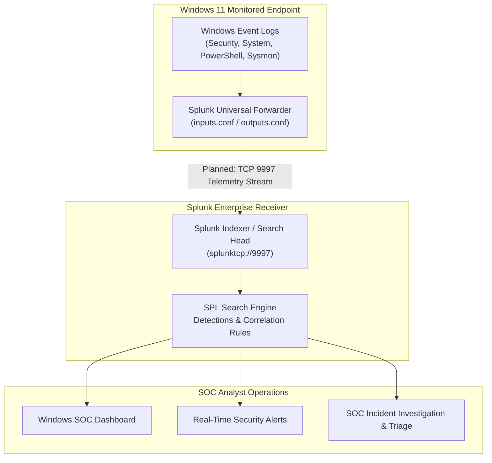

# 🪟 P2 — Windows Security Monitoring with Splunk

[](../README.md)
[-yellow.svg)](#-implementation-status)
[](#-target-environment)
[](https://www.splunk.com/)
[](#-intended-architecture)

> **Master Portfolio Component:** This project represents **Project P2** in the [Splunk SOC & Threat Hunting Lab](../README.md) (`NATTOMR/splunk-soc-threat-hunting-lab`). It builds upon the foundational SIEM concepts established in P1 by establishing live host-level endpoint telemetry streaming, advanced Windows Event Log auditing, detection engineering for adversary tradecraft, and SOC analyst workbench dashboards.

---

## 1. Project Overview

Project P2 establishes an enterprise-modeled Windows security monitoring pipeline using **Splunk Enterprise** and the **Splunk Universal Forwarder** deployed on a **Windows 11** workstation endpoint. 

The primary focus is to transition from static batch log analysis to dynamic host-based security telemetry collection, capturing critical operating system events, privilege changes, process executions, and authentication spikes to facilitate real-time threat detection and incident triage.

---

## 2. Objectives

- **Endpoint Forwarder Deployment:** Install, configure, and secure the Splunk Universal Forwarder on a Windows 11 endpoint to ship logs over port `9997/tcp`.
- **Advanced Windows Audit Policy Configuration:** Configure Local Security Policy (`auditpol`) to generate detailed telemetry across Account Logon, Privilege Use, Process Creation, and Object Access.
- **Process & Command-Line Auditing:** Enable Process Creation auditing (Event ID 4688) with command-line argument logging.
- **PowerShell Script-Block Logging:** Enable deep script-block logging (Event ID 4104) and transcription to detect fileless adversary tradecraft.
- **SPL Detection Engineering:** Author targeted SPL queries detecting credential stuffing, unauthorized account modifications, privilege escalation, and suspicious parent-child process relationships.
- **Windows SOC Dashboarding:** Construct an interactive, operational dashboard delivering unified visibility across host health, authentication events, and process telemetry.
- **MITRE ATT&CK Alignment:** Map every detection rule and investigation workflow directly to standard ATT&CK Tactics and Techniques.

---

## 3. Intended Architecture

The diagram below illustrates the target architecture designed for Project P2.

```
Windows 11 Endpoint
        │
        │ Windows Event Logs (Security, System, PowerShell, Sysmon)
        ▼
Splunk Universal Forwarder
        │
        │ TCP 9997 (Encrypted Log Stream - Planned)
        ▼
Splunk Enterprise (Receiver / Indexer / Search Head)
        │
        ├── SPL Searches & Correlations
        ├── Detection Rules
        ├── High-Fidelity Alerts
        └── Windows SOC Dashboard
                │
                ▼
        SOC Analyst Investigation (Triage & Incident Response)
```



> [!IMPORTANT]
> **Status Note on Port 9997 Forwarding:** The architecture above represents the intended design. Live network forwarding over TCP 9997 is currently **PLANNED** and will be confirmed as **IMPLEMENTED** only after the forwarder agent is installed, configured, and verified.

---

## 4. Target Environment

- **Monitored Endpoint:** Windows 11 (64-bit)
- **Log Collection Agent:** Splunk Universal Forwarder for Windows (Planned)
- **Central SIEM:** Splunk Enterprise (Receiver configured on `9997/tcp` - Planned)
- **Target Index:** `index=windows` (Planned)
- **Primary Channels:**
  - `WinEventLog:Security`
  - `WinEventLog:System`
  - `WinEventLog:Microsoft-Windows-PowerShell/Operational`
  - `WinEventLog:Microsoft-Windows-Sysmon/Operational` (Planned Extension)

---

## 5. Implementation Status

To ensure engineering integrity, components are strictly tracked by verification status:

| Project Milestone / Component | Implementation Status | Notes |
|---|:---:|---|
| **Project Structure & Planning** | ✅ **IMPLEMENTED** | Repository skeleton, directories, and documentation established. |
| **Windows Audit Policy Design** | 🟡 **IN PROGRESS** | Defining required SACLs and GPO/auditpol baseline. |
| **Splunk Enterprise Receiver (Port 9997)** | ✅ **IMPLEMENTED** | Splunk Enterprise 10.4.3 receiver active on 192.168.100.7:9997. |
| **Splunk Universal Forwarder Setup** | 🟡 **IN PROGRESS** | Awaiting MSI installation and config deployment on Windows 11. |
| **Live Telemetry Ingestion** | ⚪ **PLANNED** | Awaiting verification of first live events in `index=windows`. |
| **Authentication Monitoring (4624/4625)** | ⚪ **PLANNED** | Failed logon bursts and logon type categorization. |
| **Account Activity & Creation (4720/4726)** | ⚪ **PLANNED** | User creation, deletion, and group modification tracking. |
| **Privilege Escalation Telemetry (4672)** | ⚪ **PLANNED** | Special privilege logon and elevation tracking. |
| **Process Creation Tracking (4688)** | ⚪ **PLANNED** | Command-line logging and suspicious executable monitoring. |
| **PowerShell Script-Block Logging (4104)** | ⚪ **PLANNED** | Obfuscated code, encoded commands, and download cradle detection. |
| **Brute-Force & Anomaly Detections** | ⚪ **PLANNED** | Correlation rules for repeated auth failures within sliding windows. |
| **Windows SOC Security Dashboard** | ⚪ **PLANNED** | Multi-panel visual workbench for Windows endpoint events. |
| **Incident Investigation Scenarios** | ⚪ **PLANNED** | End-to-end simulated incident analysis and writeup. |

### 📋 Milestone Log & Detailed Tracking
- **2026-09-09 — Milestone P2.1 (Infrastructure & Receiver Verification):**
  - Verified Ubuntu 24.04.4 LTS server (`192.168.100.7`) and active Wazuh infrastructure (Manager, Indexer, Dashboard, Agents).
  - Verified Windows 11 endpoint (`192.168.100.8`) with active Sysmon64 (22,921+ records ingested into Wazuh archives; Event ID 13 verified).
  - Installed and started Splunk Enterprise 10.4.3 on `/opt/splunk` (service user `splunk`, ports 8000, 8089, 8065, 8191 active).
  - Configured VirtualBox `LabNetwork` (`192.168.100.0/24`), validated host-to-guest port forwarding (`18000:8000`), and verified Windows-to-Ubuntu connectivity.
  - Configured Ubuntu firewall (`ufw`) and enabled Splunk receiver port `9997/tcp`.
  - Corrected accidental self-forwarder configuration to ensure correct architecture: Windows UF → Ubuntu Splunk Enterprise receiver.
  - Progress Documentation: [`docs/P2-SPLUNK-SOC-INTEGRATION.md`](../docs/P2-SPLUNK-SOC-INTEGRATION.md).
- **Current Completion:** 11 / 23 tracked tasks completed (**47.8%**).
- **Next Milestone:** **P2.2 — Windows Universal Forwarder → Splunk Enterprise**.

---

## 6. Project Scope & Event Coverage

Once operational, the project will cover the following key security domains:

### 1. Authentication & Logon Monitoring
- **Event ID 4624:** Successful Logon (Logon Type 2 [Interactive], Type 3 [Network], Type 10 [RemoteInteractive / RDP]).
- **Event ID 4625:** Failed Logon (Status and Sub-Status codes identifying bad passwords, unknown usernames, or expired accounts).
- **Event ID 4634 / 4647:** Account Logoff sessions.
- **Event ID 4648:** Explicit credential logon attempts (`runas`).

### 2. Account Management & Directory Changes
- **Event ID 4720:** User account created.
- **Event ID 4722:** User account enabled.
- **Event ID 4724:** Attempt made to reset an account password.
- **Event ID 4726:** User account deleted.
- **Event ID 4728 / 4732 / 4756:** Member added to a privileged security group (e.g., local Administrators).

### 3. Privilege-Related Activity
- **Event ID 4672:** Special privileges assigned to new logon (Admin / SeDebugPrivilege).
- **Event ID 4703:** Token right adjusted.

### 4. Process Creation & Execution
- **Event ID 4688:** New process created (with full command-line arguments enabled).
- Monitoring suspicious LOLBins (Living-off-the-Land Binaries) such as `certutil.exe`, `mshta.exe`, `bitsadmin.exe`, and `rundll32.exe`.

### 5. PowerShell Activity & Execution
- **Event ID 4104:** Script Block Execution (capturing de-obfuscated script payloads).
- **Event ID 4103:** Module Logging.

### 6. Scheduled Tasks & Persistence
- **Event ID 4698 / 4702:** Scheduled task created or updated.
- **Event ID 7045 (System):** New Windows service installed.

---

## 7. Project Structure

```text
P2-Windows-Security-Monitoring/
├── README.md                            # Project overview, architecture, and roadmap
├── configs/                             # Configuration templates (Reference examples only)
│   ├── inputs.conf.example              # Example Universal Forwarder input stanzas
│   ├── outputs.conf.example             # Example Universal Forwarder output destination
│   └── props.conf.example               # Example event parsing and sourcetype rules
├── dashboards/                          # Dashboard definitions and documentation
│   └── README.md                        # Planned Windows SOC Dashboard specifications
├── detections/                          # Detection engineering rules
│   └── README.md                        # Planned detection catalog mapped to MITRE ATT&CK
├── docs/                                # Detailed technical guides and engineering notes
│   ├── architecture.md                  # Detailed endpoint-to-indexer communication pipeline
│   ├── windows-auditing.md              # Windows Local Security Policy & auditpol setup guide
│   ├── splunk-forwarder.md              # Forwarder deployment & service configuration guide
│   ├── log-ingestion.md                 # Event channel indexing & data model specification
│   ├── detections.md                    # Detection engineering logic & threshold methodology
│   └── investigation.md                 # Incident response playbook & triage workflows
├── queries/                             # Modular SPL query repository (Organized by use case)
│   ├── README.md                        # Query library index and execution guidelines
│   ├── accounts/                        # Queries: User creations, group changes, deletions
│   ├── authentication/                  # Queries: Successful/failed logins, RDP, logon types
│   ├── brute-force/                     # Queries: Threshold-based password guessing patterns
│   ├── powershell/                      # Queries: Script blocks, encoded commands, execution
│   └── processes/                       # Queries: Process creation, LOLBins, CLI arguments
├── reports/                             # Formal investigation writeups & forensic reports
│   └── README.md                        # Case notes and investigation deliverables index
└── screenshots/                         # Verifiable visual exhibits & evidence (Captured upon verification)
    └── README.md                        # Asset index for verified lab screenshots
```

---

## 8. Master Portfolio Navigation

| Milestone | Project Title | Location / Link | Status |
|:---:|---|:---:|:---:|
| **P1** | Splunk SOC Home Lab & Log Analysis | [NATTOMR/splunk-p1-soc-home-lab](https://github.com/NATTOMR/splunk-p1-soc-home-lab) | ✅ Completed |
| **P2** | **Windows Security Monitoring** | *Current Directory* | 🟡 **In Progress** |
| **P3** | Linux Security Monitoring | [Master Hub](../README.md#-project-roadmap) | ⚪ Planned |
| **P4** | Brute-Force Detection & Investigation | [Master Hub](../README.md#-project-roadmap) | ⚪ Planned |
| **P5** | Network Threat Detection | [Master Hub](../README.md#-project-roadmap) | ⚪ Planned |
| **P6** | Web Attack Detection | [Master Hub](../README.md#-project-roadmap) | ⚪ Planned |
| **P7** | Phishing Email Investigation | [Master Hub](../README.md#-project-roadmap) | ⚪ Planned |
| **P8** | MITRE ATT&CK Threat Hunting | [Master Hub](../README.md#-project-roadmap) | ⚪ Planned |
| **P9** | Splunk SOC Dashboard | [Master Hub](../README.md#-project-roadmap) | ⚪ Planned |
| **P10** | Wazuh + Splunk SIEM Integration | [Master Hub](../README.md#-project-roadmap) | ⚪ Planned |

👉 **Return to Portfolio Master:** [Splunk SOC & Threat Hunting Lab](../README.md)
