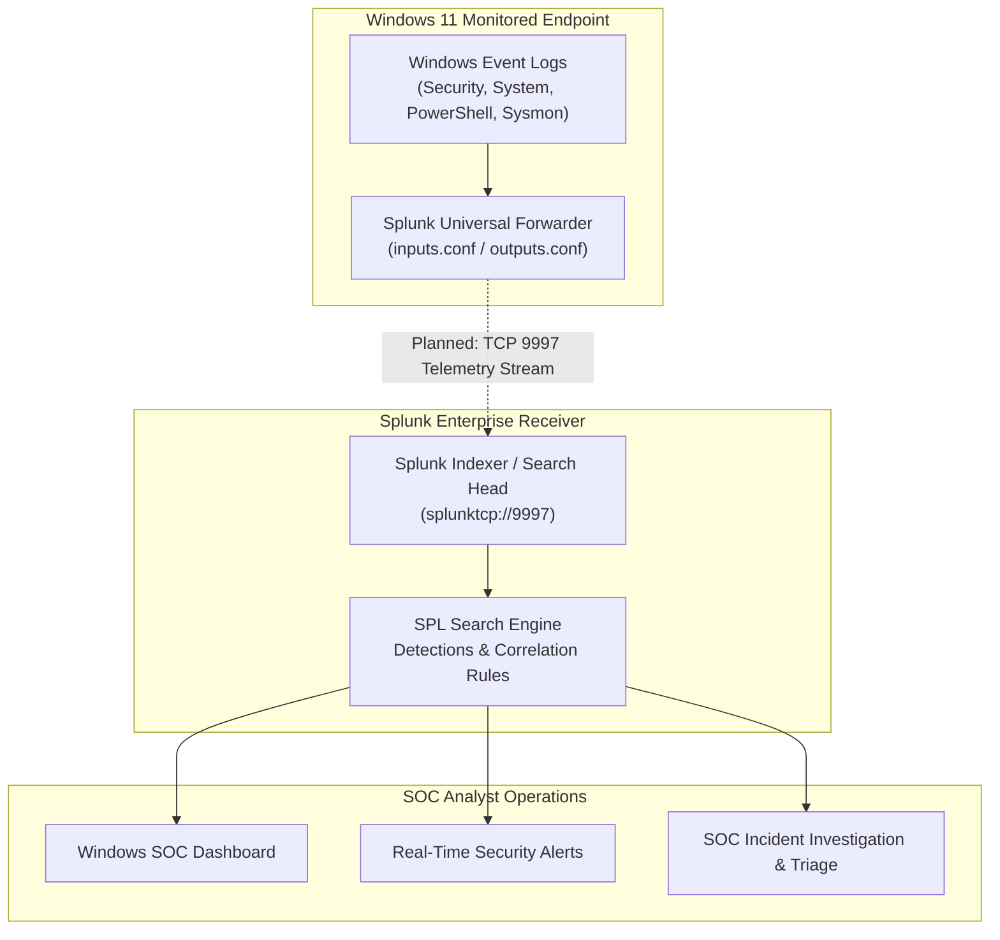

# 🪟 P2 — Windows Security Monitoring with Splunk

[](../README.md)
[-yellow.svg)](#-implementation-status)
[](#-target-environment)
[](https://www.splunk.com/)
[](#-intended-architecture)

> **Master Portfolio Component:** This project represents **Project P2** in the [Splunk SOC & Threat Hunting Lab](../README.md) (`NATTOMR/splunk-soc-threat-hunting-lab`). It builds upon the foundational SIEM concepts established in P1 by establishing live host-level endpoint telemetry streaming, advanced Windows Event Log auditing, detection engineering for adversary tradecraft, and SOC analyst workbench dashboards.

---

## 1. Project Overview

Project P2 establishes an enterprise-modeled Windows security monitoring pipeline using **Splunk Enterprise** and the **Splunk Universal Forwarder** deployed on a **Windows 11** workstation endpoint. 

The primary focus is to transition from static batch log analysis to dynamic host-based security telemetry collection, capturing critical operating system events, privilege changes, process executions, and authentication spikes to facilitate real-time threat detection and incident triage.

---

## 2. Objectives

- **Endpoint Forwarder Deployment:** Install, configure, and secure the Splunk Universal Forwarder on a Windows 11 endpoint to ship logs over port `9997/tcp`.
- **Advanced Windows Audit Policy Configuration:** Configure Local Security Policy (`auditpol`) to generate detailed telemetry across Account Logon, Privilege Use, Process Creation, and Object Access.
- **Process & Command-Line Auditing:** Enable Process Creation auditing (Event ID 4688) with command-line argument logging.
- **PowerShell Script-Block Logging:** Enable deep script-block logging (Event ID 4104) and transcription to detect fileless adversary tradecraft.
- **SPL Detection Engineering:** Author targeted SPL queries detecting credential stuffing, unauthorized account modifications, privilege escalation, and suspicious parent-child process relationships.
- **Windows SOC Dashboarding:** Construct an interactive, operational dashboard delivering unified visibility across host health, authentication events, and process telemetry.
- **MITRE ATT&CK Alignment:** Map every detection rule and investigation workflow directly to standard ATT&CK Tactics and Techniques.

---

## 3. Intended Architecture

The diagram below illustrates the target architecture designed for Project P2.

```
Windows 11 Endpoint
        │
        │ Windows Event Logs (Security, System, PowerShell, Sysmon)
        ▼
Splunk Universal Forwarder
        │
        │ TCP 9997 (Encrypted Log Stream - Planned)
        ▼
Splunk Enterprise (Receiver / Indexer / Search Head)
        │
        ├── SPL Searches & Correlations
        ├── Detection Rules
        ├── High-Fidelity Alerts
        └── Windows SOC Dashboard
                │
                ▼
        SOC Analyst Investigation (Triage & Incident Response)
```



## 3. Architecture & Telemetry Pipeline

The diagram below illustrates the verified, active architecture implemented for Project P2.

```
Windows 11 Endpoint (192.168.100.8)
        │
        │ Windows Event Logs (Security, System, Application, Sysmon)
        ▼
Splunk Universal Forwarder 10.4.3 (NT SERVICE\SplunkForwarder)
        │
        │ TCP 9997 (Active Forwarding Stream)
        ▼
Ubuntu Splunk Enterprise (192.168.100.7:9997)
        │
        ├── Ingestion & Indexing Pipeline
        │     ├── index=windows (Security, System, Application)
        │     └── index=sysmon  (Sysmon Operational Events)
        │
        ├── Analytics & Detection Engine
        │     ├── SPL Searches & Correlations
        │     ├── Detection Rules & Alerts
        │     └── Windows SOC Dashboard
        │
        ▼
SOC Analyst Investigation (Triage & Incident Response)
```

```mermaid
flowchart TD
    subgraph Endpoint["Windows 11 Monitored Workstation (192.168.100.8)"]
        SYS["Sysmon64 Service\n(Operational Log Channel)"]
        WE["Windows Event Logs\n(Security, System, Application)"]
        UF["Splunk Universal Forwarder 10.4.3\n(NT SERVICE\\SplunkForwarder)"]
    end

    subgraph SIEM["Ubuntu Splunk Enterprise (192.168.100.7)"]
        REC["Splunk Ingestion Receiver\nTCP 9997 (Active)"]
        IDX_W["index=windows\n(OS Security & System Telemetry)"]
        IDX_S["index=sysmon\n(Deep Process & Network Telemetry)"]
        ENG["SPL Search Engine\nDetections & Correlation Rules"]
    end

    subgraph Operations["SOC Analyst Operations (Host: 18000 / Splunk Web)"]
        DASH["Windows SOC Dashboard"]
        ALT["Real-Time Security Alerts"]
        INV["SOC Incident Investigation & Triage"]
    end

    SYS --> WE
    WE --> UF
    UF -->|TCP 9997 Stream (renderXml=true)| REC
    REC --> IDX_W
    REC --> IDX_S
    IDX_W --> ENG
    IDX_S --> ENG
    ENG --> DASH
    ENG --> ALT
    ENG --> INV
```

---

## 4. Lab Configuration

The live lab environment consists of two primary systems operating within an isolated VirtualBox NAT Network (`192.168.100.0/24`):

| Parameter | Windows 11 Victim Endpoint | Ubuntu Splunk Enterprise Server |
|---|---|---|
| **Hostname / Role** | Victim Workstation / Endpoint Telemetry Source | Central SIEM / Indexer / Search Head |
| **IP Address** | `192.168.100.8` | `192.168.100.7` |
| **Operating System** | Windows 11 Enterprise (64-bit) | Ubuntu 24.04.4 LTS (64-bit) |
| **Installed Agents / Services** | • `SplunkForwarder` (UF 10.4.3)<br>• `Sysmon64` (v15.15) | • `splunkd` (Splunk Enterprise 10.4.3)<br>• `wazuh-manager` |
| **Service Account** | `NT SERVICE\SplunkForwarder`<br>(Member of `Event Log Readers`) | `splunk` (Dedicated least-privilege system account) |
| **Active Network Ports** | Outbound TCP `9997` | • `9997/tcp` (Splunk Ingestion Receiver)<br>• `8000/tcp` (Splunk Web, host forward: `18000`)<br>• `8089/tcp` (Splunkd Management)<br>• `22/tcp` (SSH) |
| **Configured Event Channels** | • `WinEventLog://Security`<br>• `WinEventLog://System`<br>• `WinEventLog://Application`<br>• `WinEventLog://Microsoft-Windows-Sysmon/Operational` | Receiver socket: `0.0.0.0:9997` |
| **Splunk Indexes** | *Configured in `inputs.conf`:*<br>• `index = windows`<br>• `index = sysmon` | *Configured in `indexes.conf`:*<br>• `[windows]` (OS logs)<br>• `[sysmon]` (Sysmon telemetry) |
| **XML Rendering** | `renderXml = true` (Active for all channels) | Ingests and parses XML event payloads natively |

### Data Flow Summary:
1. **Activity Generation:** Endpoint actions trigger Windows OS event logs and Sysmon kernel telemetry.
2. **Local Collection:** `SplunkForwarder` reads event logs via `Event Log Readers` permissions.
3. **Transport:** Events are streamed across the internal network via `TCP 9997` to `192.168.100.7:9997`.
4. **Ingestion & Indexing:** `splunkd` indexes Security/System logs into `index=windows` and Sysmon events into `index=sysmon`.
5. **Security Operations:** Analysts query indexed events using SPL, trigger alerts, and monitor dashboards via Splunk Web on host port `18000`.

---

## 5. Configuration Management

All operational configurations and automation scripts are maintained directly within version control to ensure the lab environment is **clean, reproducible, and easy to maintain**:

- **Declarative Configuration Templates ([`config/`](config/)):**
  - [`config/inputs.conf`](config/inputs.conf): Production inputs specifying `WinEventLog://Security`, `System`, `Application`, and `Microsoft-Windows-Sysmon/Operational` with `renderXml = true` and target indexes.
  - [`config/outputs.conf`](config/outputs.conf): Production outputs routing telemetry to `192.168.100.7:9997`.
  - [`config/indexes.conf`](config/indexes.conf): Index definitions for `windows` and `sysmon` storage paths and size quotas.
- **PowerShell Automation & Verification ([`scripts/`](scripts/)):**
  - [`scripts/verify-splunk.ps1`](scripts/verify-splunk.ps1): Automated diagnostics verifying services, permissions, configuration stanzas, and TCP 9997 connectivity.
  - [`scripts/configure-forwarder.ps1`](scripts/configure-forwarder.ps1): Idempotent configuration applicator that merges inputs/outputs, grants `Event Log Readers` permissions, creates `.bak` backups, and restarts `SplunkForwarder` only when necessary.
  - [`scripts/install-forwarder.ps1`](scripts/install-forwarder.ps1): Guided installer helper for official Splunk Universal Forwarder MSI with secure credential handling and automated baseline setup.
- **Detailed Setup & Troubleshooting Guide ([`docs/setup.md`](docs/setup.md)):**
  - Architectural overview, quick-start sequence, verification SPL queries, and root-cause troubleshooting for 7 common operational issues.

---

## 6. Implementation Status

To ensure engineering integrity, components are strictly tracked by verification status:

| Project Milestone / Component | Implementation Status | Notes |
|---|:---:|---|
| **Project Structure & Planning** | ✅ **IMPLEMENTED** | Repository skeleton, directories, and documentation established. |
| **Splunk Enterprise Receiver (Port 9997)** | ✅ **IMPLEMENTED** | Splunk Enterprise 10.4.3 receiver active on `192.168.100.7:9997`. |
| **Splunk Universal Forwarder Setup** | ✅ **IMPLEMENTED** | Forwarder 10.4.3 installed, running under `NT SERVICE\SplunkForwarder`. |
| **Sysmon Telemetry Ingestion** | ✅ **IMPLEMENTED** | Sysmon Operational channel actively streaming to `index=sysmon`. |
| **Windows Event Log Ingestion** | ✅ **IMPLEMENTED** | Security, System, and Application logs actively streaming to `index=windows`. |
| **Configuration & Automation Scripts** | ✅ **IMPLEMENTED** | Modular `config/` templates and `scripts/` automation tools deployed. |
| **Windows Audit Policy Design** | 🟡 **IN PROGRESS** | Defining required SACLs and GPO/auditpol baseline. |
| **Authentication Monitoring (4624/4625)** | ⚪ **PLANNED** | Failed logon bursts and logon type categorization. |
| **Account Activity & Creation (4720/4726)** | ⚪ **PLANNED** | User creation, deletion, and group modification tracking. |
| **Privilege Escalation Telemetry (4672)** | ⚪ **PLANNED** | Special privilege logon and elevation tracking. |
| **Process Creation Tracking (4688 / Sysmon 1)** | ⚪ **PLANNED** | Command-line logging and suspicious executable monitoring. |
| **PowerShell Script-Block Logging (4104)** | ⚪ **PLANNED** | Obfuscated code, encoded commands, and download cradle detection. |
| **Brute-Force & Anomaly Detections** | ⚪ **PLANNED** | Correlation rules for repeated auth failures within sliding windows. |
| **Windows SOC Security Dashboard** | ⚪ **PLANNED** | Multi-panel visual workbench for Windows endpoint events. |
| **Incident Investigation Scenarios** | ⚪ **PLANNED** | End-to-end simulated incident analysis and writeup. |

### 📋 Milestone Log & Detailed Tracking
- **2026-09-09 — Milestone P2.1 (Infrastructure & Receiver Verification):**
  - Verified Ubuntu 24.04.4 LTS server (`192.168.100.7`) and active Wazuh infrastructure.
  - Verified Windows 11 endpoint (`192.168.100.8`) with active Sysmon64.
  - Installed Splunk Enterprise 10.4.3, configured VirtualBox `LabNetwork` and port forwarding (`18000:8000`).
  - Configured Ubuntu firewall (`ufw`) and enabled Splunk receiver port `9997/tcp`.
- **2026-09-10 — Milestone P2.2 (Universal Forwarder & Telemetry Integration):**
  - Configured Splunk Universal Forwarder 10.4.3 on Windows 11 (`192.168.100.8`) running under `NT SERVICE\SplunkForwarder`.
  - Granted `Event Log Readers` membership to forwarder service account.
  - Deployed `inputs.conf` with XML rendering for Security, System, Application, and Sysmon channels.
  - Deployed `outputs.conf` directing stream to `192.168.100.7:9997`.
  - Created dedicated Splunk indexes `index=windows` and `index=sysmon`.
  - Created modular configuration templates (`config/`), verification tools (`scripts/verify-splunk.ps1`), idempotent configuration applicator (`scripts/configure-forwarder.ps1`), and installation helper (`scripts/install-forwarder.ps1`).
  - Published comprehensive setup, quick-start, and troubleshooting runbook in [`docs/setup.md`](docs/setup.md).


---

## 6. Project Scope & Event Coverage

Once operational, the project will cover the following key security domains:

### 1. Authentication & Logon Monitoring
- **Event ID 4624:** Successful Logon (Logon Type 2 [Interactive], Type 3 [Network], Type 10 [RemoteInteractive / RDP]).
- **Event ID 4625:** Failed Logon (Status and Sub-Status codes identifying bad passwords, unknown usernames, or expired accounts).
- **Event ID 4634 / 4647:** Account Logoff sessions.
- **Event ID 4648:** Explicit credential logon attempts (`runas`).

### 2. Account Management & Directory Changes
- **Event ID 4720:** User account created.
- **Event ID 4722:** User account enabled.
- **Event ID 4724:** Attempt made to reset an account password.
- **Event ID 4726:** User account deleted.
- **Event ID 4728 / 4732 / 4756:** Member added to a privileged security group (e.g., local Administrators).

### 3. Privilege-Related Activity
- **Event ID 4672:** Special privileges assigned to new logon (Admin / SeDebugPrivilege).
- **Event ID 4703:** Token right adjusted.

### 4. Process Creation & Execution
- **Event ID 4688:** New process created (with full command-line arguments enabled).
- Monitoring suspicious LOLBins (Living-off-the-Land Binaries) such as `certutil.exe`, `mshta.exe`, `bitsadmin.exe`, and `rundll32.exe`.

### 5. PowerShell Activity & Execution
- **Event ID 4104:** Script Block Execution (capturing de-obfuscated script payloads).
- **Event ID 4103:** Module Logging.

### 6. Scheduled Tasks & Persistence
- **Event ID 4698 / 4702:** Scheduled task created or updated.
- **Event ID 7045 (System):** New Windows service installed.

---

## 7. Project Structure

```text
P2-Windows-Security-Monitoring/
├── README.md                            # Project overview, architecture, and roadmap
├── config/                              # Production configuration templates
│   ├── README.md                        # Configuration inventory and deployment instructions
│   ├── inputs.conf                      # Production inputs for Security, System, App, Sysmon
│   ├── outputs.conf                     # Production outputs targeting 192.168.100.7:9997
│   └── indexes.conf                     # Production index definitions for windows & sysmon
├── configs/                             # Configuration templates (Reference examples only)
│   ├── inputs.conf.example              # Example Universal Forwarder input stanzas
│   ├── outputs.conf.example             # Example Universal Forwarder output destination
│   └── props.conf.example               # Example event parsing and sourcetype rules
├── dashboards/                          # Dashboard definitions and documentation
│   └── README.md                        # Planned Windows SOC Dashboard specifications
├── detections/                          # Detection engineering rules
│   └── README.md                        # Planned detection catalog mapped to MITRE ATT&CK
├── docs/                                # Detailed technical guides and engineering notes
│   ├── setup.md                         # End-to-end setup, quick-start, verification & troubleshooting
│   ├── architecture.md                  # Detailed endpoint-to-indexer communication pipeline
│   ├── windows-auditing.md              # Windows Local Security Policy & auditpol setup guide
│   ├── splunk-forwarder.md              # Forwarder deployment & service configuration guide
│   ├── log-ingestion.md                 # Event channel indexing & data model specification
│   ├── detections.md                    # Detection engineering logic & threshold methodology
│   └── investigation.md                 # Incident response playbook & triage workflows
├── queries/                             # Modular SPL query repository (Organized by use case)
│   ├── README.md                        # Query library index and execution guidelines
│   ├── accounts/                        # Queries: User creations, group changes, deletions
│   ├── authentication/                  # Queries: Successful/failed logins, RDP, logon types
│   ├── brute-force/                     # Queries: Threshold-based password guessing patterns
│   ├── powershell/                      # Queries: Script blocks, encoded commands, execution
│   └── processes/                       # Queries: Process creation, LOLBins, CLI arguments
├── reports/                             # Formal investigation writeups & forensic reports
│   └── README.md                        # Case notes and investigation deliverables index
├── scripts/                             # Automation and verification PowerShell tools
│   ├── README.md                        # Script usage guide and elevation requirements
│   ├── verify-splunk.ps1                # Automated forwarder, Sysmon, permissions & TCP test
│   ├── configure-forwarder.ps1          # Idempotent inputs/outputs configuration tool
│   └── install-forwarder.ps1            # Automated MSI installation helper
└── screenshots/                         # Verifiable visual exhibits & evidence (Captured upon verification)
    └── README.md                        # Asset index for verified lab screenshots
```

---

## 8. Master Portfolio Navigation

| Milestone | Project Title | Location / Link | Status |
|:---:|---|:---:|:---:|
| **P1** | Splunk SOC Home Lab & Log Analysis | [NATTOMR/splunk-p1-soc-home-lab](https://github.com/NATTOMR/splunk-p1-soc-home-lab) | ✅ Completed |
| **P2** | **Windows Security Monitoring** | *Current Directory* | 🟡 **In Progress** |
| **P3** | Linux Security Monitoring | [Master Hub](../README.md#-project-roadmap) | ⚪ Planned |
| **P4** | Brute-Force Detection & Investigation | [Master Hub](../README.md#-project-roadmap) | ⚪ Planned |
| **P5** | Network Threat Detection | [Master Hub](../README.md#-project-roadmap) | ⚪ Planned |
| **P6** | Web Attack Detection | [Master Hub](../README.md#-project-roadmap) | ⚪ Planned |
| **P7** | Phishing Email Investigation | [Master Hub](../README.md#-project-roadmap) | ⚪ Planned |
| **P8** | MITRE ATT&CK Threat Hunting | [Master Hub](../README.md#-project-roadmap) | ⚪ Planned |
| **P9** | Splunk SOC Dashboard | [Master Hub](../README.md#-project-roadmap) | ⚪ Planned |
| **P10** | Wazuh + Splunk SIEM Integration | [Master Hub](../README.md#-project-roadmap) | ⚪ Planned |

👉 **Return to Portfolio Master:** [Splunk SOC & Threat Hunting Lab](../README.md)
