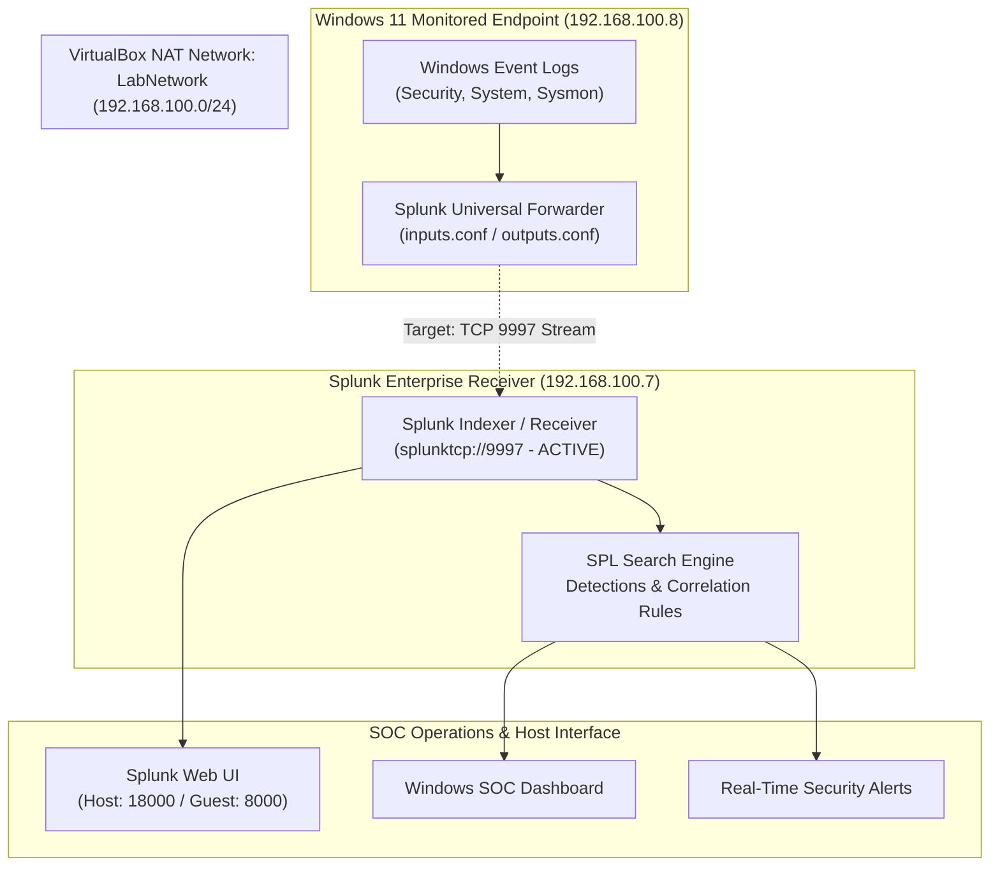

# 🏗️ P2 Architecture: Windows 11 to Splunk Pipeline

> **Document Status:** ✅ **VERIFIED & ACTIVE — Full Pipeline Operational**  
> **Component:** Telemetry & Networking Architecture  
> **Progress Log:** [P2 Integration Log](../../docs/P2-SPLUNK-SOC-INTEGRATION.md)  

---

## Architecture Overview

This document details the technical specifications, network flow, and port configurations connecting the Windows 11 endpoint to Splunk Enterprise.

```text
Windows 11 Endpoint (192.168.100.8)
        │
        │ Event Telemetry (Security, System, PowerShell, Sysmon)
        ▼
Splunk Universal Forwarder
        │
        │ Encrypted / Ingestion Stream (TCP 9997)
        ▼
Splunk Enterprise (Receiver / Indexer / Search Head - 192.168.100.7)
        │
        ├── SPL Analysis & Hunting
        ├── Detection Rules & Alerts
        └── Windows SOC Dashboard
                │
                ▼
        SOC Analyst Investigation (Triage & Incident Response)
```



---

## Technical Specifications & Verification Status

- **Endpoint Workstation:** Windows 11 (64-bit) — `192.168.100.8` (Verified)
- **Agent Service:** Splunk Universal Forwarder (MSI installed, outputs/inputs pending)
- **Central SIEM:** Splunk Enterprise 10.4.3 on Ubuntu 24.04 — `192.168.100.7` (Verified)
- **Ingestion Port:** TCP `9997` (`splunktcp://9997` listening on `0.0.0.0:9997` — Verified)
- **Web Interface:** Port `8000` mapped to host `18000` (`http://127.0.0.1:18000` — Verified)
- **Management Port:** TCP `8089` (Verified)
- **Network Segmentation:** VirtualBox NAT Network `LabNetwork` (`192.168.100.0/24`, Gateway `192.168.100.1` — Verified)
- **Target Indexes:** `index=windows` ✅ Active, `index=sysmon` ✅ Active — both verified with live data

---

## Verified Visual Exhibits

| Component | Exhibit | Verification Evidence |
|---|---|---|
| **VirtualBox Network** | [`p2-02-virtualbox-labnetwork-windows11-vm.png`](../screenshots/p2-02-virtualbox-labnetwork-windows11-vm.png) | VM assigned to `LabNetwork` |
| **Splunk Web** | [`p2-17-splunk-web-login-port-18000.png`](../screenshots/p2-17-splunk-web-login-port-18000.png) | Splunk Web accessed via host port 18000 |
| **Admin Home** | [`p2-18-splunk-web-admin-dashboard-home.png`](../screenshots/p2-18-splunk-web-admin-dashboard-home.png) | Splunk Enterprise Admin console operational |
| **Receiver & UFW** | [`p2-19-splunk-receiver-listen-9997-ufw-rules.png`](../screenshots/p2-19-splunk-receiver-listen-9997-ufw-rules.png) | Port 9997 listening and UFW allowed |
