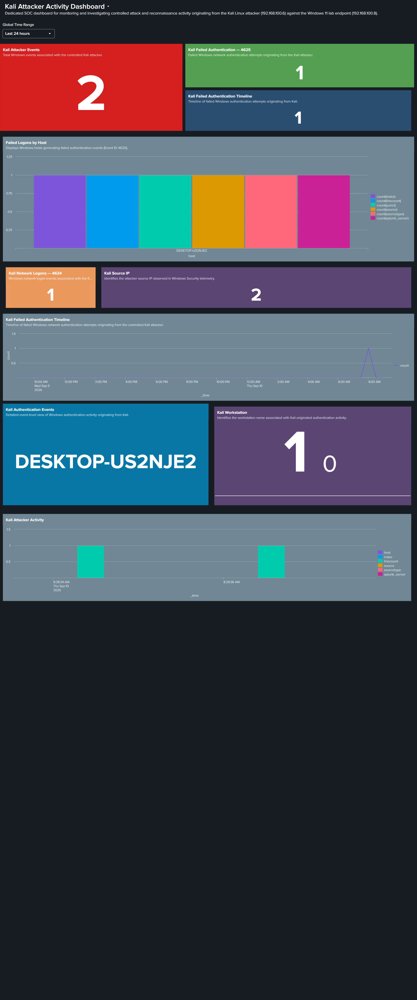

# Kali Attacker Activity Dashboard

> **Project:** Splunk SOC Threat Hunting Lab — P2: Windows Security Monitoring  
> **Dashboard Title:** Kali Attacker Activity Dashboard  
> **Created:** 2026-09-10  
> **Status:** ✅ Verified — operational in Splunk Enterprise

---

## Purpose

The **Kali Attacker Activity Dashboard** is a dedicated SOC analyst interface for monitoring and investigating controlled attack and reconnaissance activity originating from the Kali Linux attacker (`192.168.100.6`) against the Windows 11 lab endpoint (`192.168.100.8`).

The dashboard surfaces Windows Security telemetry generated by the Kali attacker's reconnaissance and SMB interaction activity, enabling analysts to:

- Detect failed authentication attempts (Event ID 4625) from the attacker IP
- Correlate network logon events (Event ID 4624) with the attacker source
- Identify the attacker workstation name (`KALI`) within Windows event data
- Visualize attacker activity over time using timechart panels
- Pivot between event-level detail and aggregate statistics

This dashboard is evidence of a complete SOC detection workflow: attacker action → Windows telemetry → Splunk ingestion → SOC visibility.



---

## Lab Architecture

```
Kali Linux Attacker
192.168.100.6
        |
        | Reconnaissance / SMB activity
        v
Windows 11 Victim
192.168.100.8
        |
        | Security Events (Event ID 4624, 4625, and others)
        v
Splunk Universal Forwarder (UF 10.4.3)
        |
        | TCP 9997
        v
Splunk Enterprise
192.168.100.7
        |
        v
Kali Attacker Activity Dashboard
```

---

## Attacker

| Parameter | Value |
|---|---|
| **Host** | Kali Linux |
| **IP Address** | `192.168.100.6` |
| **Workstation name (observed)** | `KALI` |
| **Role** | Controlled attacker for lab reconnaissance simulation |

---

## Victim

| Parameter | Value |
|---|---|
| **Host** | Windows 11 |
| **IP Address** | `192.168.100.8` |
| **Hostname (observed)** | `DESKTOP-US2NJE2` |
| **Role** | Monitored Windows endpoint / telemetry source |

---

## Splunk Server

| Parameter | Value |
|---|---|
| **OS** | Ubuntu 24.04 |
| **IP Address** | `192.168.100.7` |
| **Role** | Splunk Enterprise — central SIEM, indexer, search head |
| **Web UI** | `http://127.0.0.1:18000` (host-mapped port) |
| **Receiver Port** | TCP `9997` |

---

## Dashboard Panels

### Panel 1 — Kali Attacker Events

| Attribute | Detail |
|---|---|
| **Title** | Kali Attacker Events |
| **Description** | Displays all Windows Security events in `index=windows` that contain the Kali attacker IP address `192.168.100.6`. |
| **Visualization** | Single value (event count) |
| **SOC Purpose** | Provides an immediate high-level count of Windows telemetry associated with the Kali attacker. Confirms attacker activity is visible in Splunk and helps establish investigation scope. |

**Query:**

```spl
index=windows "192.168.100.6"
```

---

### Panel 2 — Kali Failed Authentication — 4625

| Attribute | Detail |
|---|---|
| **Title** | Kali Failed Authentication — 4625 |
| **Description** | Counts failed network authentication events (Event ID 4625) where the source IP is the Kali attacker. |
| **Visualization** | Single value (count) |
| **SOC Purpose** | Quantifies failed authentication attempts from the attacker IP. Event ID 4625 is a key indicator for brute-force activity, credential spraying, and unauthorized access attempts. In this lab, 4625 events were generated by the SMB anonymous session attempt (`smbclient -L //192.168.100.8 -N`) that was rejected by Windows. |

**Query:**

```spl
index=windows "192.168.100.6" "<EventID>4625</EventID>"
| stats count()
```

---

### Panel 3 — Kali Failed Authentication Timeline

| Attribute | Detail |
|---|---|
| **Title** | Kali Failed Authentication Timeline |
| **Description** | Plots the timeline of Event ID 4625 events associated with the Kali attacker IP, using a timechart. |
| **Visualization** | Line or area chart (timechart) |
| **SOC Purpose** | Enables analysts to identify burst patterns in failed authentication events. A sudden spike in 4625 events from a single source IP is a strong brute-force or credential spray indicator. |

**Query:**

```spl
index=windows "192.168.100.6" "<EventID>4625</EventID>"
| timechart count
```

---

### Panel 4 — Failed Logons by Host

| Attribute | Detail |
|---|---|
| **Title** | Failed Logons by Host |
| **Description** | Aggregates Event ID 4625 events across all Windows hosts in `index=windows`, grouped by host. |
| **Visualization** | Bar chart |
| **SOC Purpose** | Provides multi-host perspective on failed authentication activity. Allows analysts to determine whether authentication failures are isolated to one endpoint or spread across the environment — useful for identifying lateral movement or distributed credential attacks. |

**Query:**

```spl
index=windows "<EventID>4625</EventID>"
| stats count() by host
```

---

### Panel 5 — Kali Network Logons — 4624

| Attribute | Detail |
|---|---|
| **Title** | Kali Network Logons — 4624 |
| **Description** | Counts Event ID 4624 (successful network logon) events associated with the Kali attacker IP. |
| **Visualization** | Single value (count) |
| **SOC Purpose** | Surfaces any network logon events correlated with the Kali source IP. **Important:** The 4624 event observed in this lab contained `TargetUserName: ANONYMOUS LOGON`, `LogonType: 3`, and `AuthenticationPackage: NTLM`. This does NOT indicate a successful authenticated logon by the Kali user — it reflects the anonymous SMB negotiation that Windows processed before rejecting the session. See the Security Observation section below. |

**Query:**

```spl
index=windows "192.168.100.6" "<EventID>4624</EventID>"
| stats count()
```

---

### Panel 6 — Kali Source IP

| Attribute | Detail |
|---|---|
| **Title** | Kali Source IP |
| **Description** | Extracts the `IpAddress` field from raw Windows Security XML event data using `rex`, filters for the Kali attacker IP, and displays a count by source IP. |
| **Visualization** | Single value or table |
| **SOC Purpose** | Confirms the attacker source IP is present and correctly parsed from Windows Security event XML. Used to validate IP-based correlation and support attribution during investigations. |

**Query:**

```spl
index=windows "192.168.100.6"
| rex field=_raw "<Data Name='IpAddress'>(?<SourceIP>[^<]+)</Data>"
| search SourceIP="192.168.100.6"
| stats count by SourceIP
```

---

### Panel 7 — Kali Authentication Events

| Attribute | Detail |
|---|---|
| **Title** | Kali Authentication Events |
| **Description** | Returns a detailed event-level table of all Windows telemetry associated with the Kali attacker IP, sorted by most recent event first. |
| **Visualization** | Table (`_time`, `host`, `source`, `sourcetype`, `_raw`) |
| **SOC Purpose** | Supports event-level investigation and forensic review of Kali-originated authentication activity. Analysts can inspect raw XML event data to extract specific fields such as `LogonType`, `Status`, `SubStatus`, and `WorkstationName` for incident documentation. |

**Query:**

```spl
index=windows "192.168.100.6"
| table _time host source sourcetype _raw
| sort - _time
```

---

### Panel 8 — Kali Workstation

| Attribute | Detail |
|---|---|
| **Title** | Kali Workstation |
| **Description** | Extracts the `WorkstationName` field from raw Windows Security XML event data using `rex` and displays a count grouped by workstation name. |
| **Visualization** | Single value or table |
| **SOC Purpose** | Identifies the workstation name that the attacker presented during authentication attempts. In this lab, the observed value was `KALI` — confirming that the Windows Security log captured the attacker machine name during the SMB/authentication interaction. This information supports attacker attribution. |

**Observed workstation:**

```
KALI
```

**Query:**

```spl
index=windows "192.168.100.6"
| rex field=_raw "<Data Name='WorkstationName'>(?<Workstation>[^<]+)</Data>"
| search Workstation=*
| stats count by Workstation
```

---

### Panel 9 — Kali Attacker Activity

| Attribute | Detail |
|---|---|
| **Title** | Kali Attacker Activity |
| **Description** | Visualizes all Windows telemetry associated with the Kali attacker IP over time, at 1-minute granularity using `timechart`. |
| **Visualization** | Line or area chart (timechart, 1-minute span) |
| **SOC Purpose** | Provides a time-based view of the attacker's interaction with the Windows endpoint. Helps analysts correlate bursts of activity with specific attack commands executed on the Kali host. |

**Query:**

```spl
index=windows "192.168.100.6"
| timechart span=1m count
```

---

### Panel 10 — Kali Attacker Activity Timeline

| Attribute | Detail |
|---|---|
| **Title** | Kali Attacker Activity Timeline |
| **Description** | Extended timeline visualization of Kali-associated Windows telemetry, configured via the existing working dashboard definition. |
| **Visualization** | Timechart |
| **SOC Purpose** | Complements Panel 9 with an alternate timeline representation, supporting broader time-range investigation and pattern recognition. |

**Query:** Uses the existing working dashboard configuration. Refer to the live Splunk dashboard for the active query.

---

## Security Observation

### Event ID 4624 — ANONYMOUS LOGON (Not a Successful Attacker Logon)

The Event ID 4624 events observed in association with `192.168.100.6` contained the following fields:

| Field | Observed Value |
|---|---|
| `TargetUserName` | `ANONYMOUS LOGON` |
| `LogonType` | `3` (Network) |
| `AuthenticationPackage` | `NTLM` |
| `LmPackageName` | `NTLM V1` |
| `IpAddress` | `192.168.100.6` |

**Interpretation:**

- This event was generated by Windows when the Kali SMB client (`smbclient -L //192.168.100.8 -N`) initiated an unauthenticated SMB session attempt.
- The `ANONYMOUS LOGON` entry represents the anonymous authentication phase of the SMB negotiation — **not** a successful logon by the Kali attacker.
- The corresponding Event ID 4625 (failed logon) confirms the session was rejected with `NT_STATUS_ACCESS_DENIED`.
- This behavior is expected and correct: Windows rejected the anonymous SMB connection.

### NTLMv1 Observation

The `LmPackageName: NTLM V1` field indicates that NTLMv1 was presented during the anonymous authentication negotiation. NTLMv1 is a legacy authentication protocol and a known security hardening concern. This observation is noted for documentation purposes. **No changes to Windows authentication configuration were made as part of P2.**

---

## Attack Simulation

All tests documented below were conducted only against the controlled Windows lab endpoint (`192.168.100.8`). No unauthorized systems were scanned. No malware was deployed. No brute-force attack was performed. No denial-of-service activity was performed. No destructive exploitation was performed.

---

### Test 1 — Host Discovery

| Field | Detail |
|---|---|
| **Command** | `nmap -sn 192.168.100.8` |
| **Technique** | Ping sweep / ICMP host discovery |
| **Result** | Windows host discovered and confirmed UP |
| **MITRE Technique** | T1595.001 — Active Scanning: Scanning IP Blocks |

---

### Test 2 — TCP Connect Scan

| Field | Detail |
|---|---|
| **Command** | `nmap -sT 192.168.100.8` |
| **Technique** | TCP connect scan (full three-way handshake) |
| **Result** | Open ports discovered: `135/tcp msrpc`, `139/tcp netbios-ssn`, `445/tcp microsoft-ds` |
| **MITRE Technique** | T1046 — Network Service Discovery |

**Observed open ports:**

```
135/tcp   open   msrpc
139/tcp   open   netbios-ssn
445/tcp   open   microsoft-ds
```

---

### Test 3 — Service and Version Detection

| Field | Detail |
|---|---|
| **Command** | `nmap -sV --top-ports 20 192.168.100.8` |
| **Technique** | Service/version fingerprinting on top 20 ports |
| **Result** | RPC and SMB services confirmed. Target identified as Microsoft Windows. |
| **MITRE Technique** | T1046 — Network Service Discovery |

**Observed open ports:**

```
135/tcp   open   msrpc
139/tcp   open   netbios-ssn
445/tcp   open   microsoft-ds
```

---

### Test 4 — Targeted RPC/SMB Port Scan

| Field | Detail |
|---|---|
| **Command** | `nmap -sT -p 135,139,445 192.168.100.8` |
| **Technique** | Targeted TCP connect scan on specific RPC/SMB ports |
| **Result** | All three ports confirmed open |
| **MITRE Technique** | T1046 — Network Service Discovery |

**Observed open ports:**

```
135/tcp   open   msrpc
139/tcp   open   netbios-ssn
445/tcp   open   microsoft-ds
```

---

### Test 5 — SMB Protocol Enumeration

| Field | Detail |
|---|---|
| **Command** | `nmap -sT -p 445 --script smb-protocols 192.168.100.8` |
| **Technique** | SMB protocol dialect enumeration via NSE script |
| **Result** | SMBv2 and SMBv3 dialects detected. SMBv1 was **not** listed in the detected dialects. |
| **MITRE Technique** | T1046 — Network Service Discovery |

**Observed SMB dialects:**

```
2.0.2
2.1
3.0
3.0.2
3.1.1
```

> SMBv1 was not present in the detected dialects.

---

### Test 6 — Anonymous SMB Session Attempt

| Field | Detail |
|---|---|
| **Command** | `smbclient -L //192.168.100.8 -N` |
| **Technique** | Unauthenticated SMB share enumeration attempt (null session) |
| **Result** | Session rejected: `NT_STATUS_ACCESS_DENIED` |
| **MITRE Technique** | T1135 — Network Share Discovery |

**Observed output:**

```
session setup failed: NT_STATUS_ACCESS_DENIED
```

This demonstrates correct Windows security posture: anonymous SMB sessions are rejected. The attempt generated Event ID 4625 (failed logon) and an associated Event ID 4624 (ANONYMOUS LOGON — network negotiation) visible in Splunk.

---

### Test 7 — Splunk Investigation: Event ID 4625

| Field | Detail |
|---|---|
| **Splunk Query** | `index=windows "<EventID>4625</EventID>"` |
| **Result** | Windows Security Event ID 4625 detected in `index=windows` |
| **Meaning** | Failed network authentication events are being ingested and are searchable in Splunk |
| **SOC Relevance** | Confirms the SIEM is capturing authentication failure telemetry from the Windows endpoint |

---

### Test 8 — Attacker IP Correlation in Splunk

| Field | Detail |
|---|---|
| **Splunk Query** | `index=windows "192.168.100.6" "<EventID>4625</EventID>"` |
| **Result** | Event ID 4625 event correlated with the Kali attacker IP |
| **SOC Relevance** | Confirms IP-based attacker attribution in Splunk |

**Observed event fields:**

| Field | Value |
|---|---|
| `IpAddress` | `192.168.100.6` |
| `WorkstationName` | `KALI` |
| `LogonType` | `3` (Network) |
| `TargetUserName` | `kali` |
| `Status` | `0xc000006d` |
| `SubStatus` | `0xc0000064` |

**Status code interpretation:**

| Code | Meaning |
|---|---|
| `0xc000006d` | Logon failure — unknown username or bad password |
| `0xc0000064` | The username does not exist |

---

### Test 9 — SMB Signing Verification

| Field | Detail |
|---|---|
| **Command** | `nmap -sT -p 445 --script smb2-security-mode 192.168.100.8` |
| **Technique** | SMB security mode enumeration |
| **Result** | SMB 3.1.1 — message signing enabled and **required** |
| **MITRE Technique** | T1046 — Network Service Discovery |

**Observed result:**

```
SMB 3.1.1
Message signing enabled and required
```

This confirms the Windows endpoint enforces SMB signing — a recommended security hardening control that mitigates relay attacks.

---

### Test 10 — General Attacker IP Splunk Investigation

| Field | Detail |
|---|---|
| **Splunk Query** | `index=windows "192.168.100.6"` |
| **Result** | Windows telemetry associated with the Kali attacker IP successfully retrieved |
| **SOC Relevance** | Validates that the attacker IP is a reliable search anchor for pivoting across all Kali-related Windows events in the SIEM |

---

## Detection Flow

```
Kali Linux
192.168.100.6
        |
        | Reconnaissance / SMB activity
        | (nmap, smbclient)
        v
Windows 11
192.168.100.8
        |
        | Security Events (4624, 4625)
        | Generated by Windows Security log
        v
Splunk Universal Forwarder
        |
        | TCP 9997
        v
Splunk Enterprise
192.168.100.7
        |
        v
Kali Attacker Activity Dashboard
```

---

## Screenshot Reference

| Figure | File | Description |
|---|---|---|
| Figure 11 | [`11-kali-attacker-dashboard.png`](evidence/p2/11-kali-attacker-dashboard.png) | Kali Attacker Activity Dashboard — verified live session |

> **Note:** Copy `P2-Windows-Security-Monitoring/screenshots/Screenshot 2026-09-10 151257.png` to `docs/evidence/p2/11-kali-attacker-dashboard.png` to complete evidence filing.

---

## Security Scope Statement

All tests documented in this file were conducted exclusively against the controlled lab endpoint at `192.168.100.8` within an isolated VirtualBox NAT network. No production systems, public infrastructure, or systems outside the lab network were targeted.

- No unauthorized systems scanned
- No malware deployed
- No brute-force attack performed
- No denial-of-service activity performed
- No destructive exploitation performed

---

*Last updated: 2026-09-10 | Dashboard verified on Splunk Enterprise 10.4.3*
