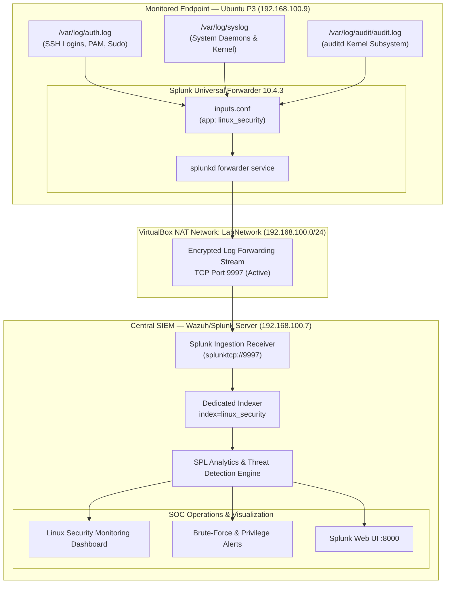

# 🐧 P3 — Linux Security Monitoring with Splunk

[](#-project-outcome)
[](#-lab-environment--network-configuration)
[](#-splunk-universal-forwarder-configuration)
[](https://www.splunk.com/)
[](#-splunk-index--ingestion-pipeline)
[](#-dashboard)

> **Master Portfolio Component:** This project represents **Project P3** in the [Splunk SOC & Threat Hunting Lab](../README.md). It establishes an enterprise-grade Linux endpoint security monitoring pipeline, forwarding live authentication, system daemon, and kernel audit telemetry from an Ubuntu Server endpoint into Splunk Enterprise for centralized threat detection, brute-force analysis, and operational SOC dashboarding.

---

## 1. Project Overview

Project P3 delivers end-to-end security observability for enterprise Linux systems. Operating within an isolated virtual laboratory network, the solution instruments an **Ubuntu Server 24.04 LTS** virtual machine (`ubuntu-p3`) with the **Splunk Universal Forwarder (UF)** to collect, parse, and forward high-value Linux security logs to a centralized **Splunk Enterprise** instance (`wazuh-server`).

By streaming events from `/var/log/auth.log`, `/var/log/syslog`, and the Linux Audit daemon (`/var/log/audit/audit.log`) into a dedicated `linux_security` index over TCP port `9997`, this implementation provides Security Operations Center (SOC) analysts with immediate visibility into credential abuse, SSH brute-force attacks, unauthorized privilege escalation (`sudo`), and low-level kernel syscall anomalies.

---

## 2. Objectives

- **Endpoint Forwarder Architecture:** Deploy and optimize the Splunk Universal Forwarder 10.4.3 on an Ubuntu 24.04 LTS server, configuring structured local monitor stanzas within a custom application (`linux_security`).
- **Log Collection & Sourcetype Standardization:** Capture system-level telemetry across authentication (`auth.log`), operating system events (`syslog`), and kernel auditing (`audit.log`), mapping them to standardized Splunk sourcetypes (`linux_secure`, `syslog`, `linux:audit`).
- **Dedicated Index Design:** Architect and verify the dedicated `linux_security` index on Splunk Enterprise to segregate Linux host telemetry from Windows endpoints and network sensors.
- **SPL Detection Engineering:** Formulate targeted Search Processing Language (SPL) queries to identify SSH authentication failures, credential stuffing, brute-force patterns, privileged command execution, and suspicious source IP behaviors.
- **SOC Dashboard Visualization:** Build an operational, real-time Splunk dashboard titled **"Linux Security Monitoring"** featuring single-value indicator cards, timeline charts, IP geographic/volume distributions, log-source breakdowns, and recent event streams.
- **Controlled Adversary Simulation & Validation:** Execute simulated authentication failures and privileged commands in the lab environment to validate detection fidelity and ensure complete telemetry ingestion.

---

## 3. Architecture

The end-to-end log forwarding and detection pipeline connects the monitored Linux endpoint directly to the centralized SIEM indexer over the VirtualBox internal laboratory network.

```text
Ubuntu P3 (192.168.100.9)
        │
        ├── /var/log/auth.log        (sourcetype: linux_secure)
        ├── /var/log/syslog          (sourcetype: syslog)
        └── /var/log/audit/audit.log   (sourcetype: linux:audit)
        │
        │ Splunk Universal Forwarder (10.4.3)
        ▼
Wazuh / Splunk Server (192.168.100.7)
        │
        ├── Splunk Receiver :9997  (splunktcp://9997)
        ├── Splunk Web :8000       (SOC Analyst Console)
        └── Dedicated Index: linux_security
                │
                ├── Real-Time SPL Correlation & Detections
                └── "Linux Security Monitoring" Dashboard
```

### Mermaid Architecture Diagram



---

## 4. Lab Environment & Network Configuration

The lab is hosted inside Oracle VirtualBox utilizing an isolated NAT Network segment (`LabNetwork`) to ensure security isolation while enabling realistic multi-host telemetry streaming.

| Parameter | Configuration Detail | Description |
|---|---|---|
| **Monitored VM** | `ubuntu-p3` | Ubuntu Server 24.04.5 LTS (Target Linux host) |
| **Endpoint IP** | `192.168.100.9` | Primary network interface (`enp0s3`) on `LabNetwork` |
| **SIEM Server** | `wazuh-server` (`192.168.100.7`) | Ubuntu Server 24.04 hosting Splunk Enterprise 10.4.3 |
| **Ingestion Port** | `9997/tcp` | Active Splunk listening receiver (`splunktcp://9997`) |
| **Splunk Web** | `http://192.168.100.7:8000` | Administrative and SOC analyst interface |
| **SSH Management** | `127.0.0.1:2223` → `192.168.100.9:22` | Host port forwarding rule for secure shell terminal access |
| **Lab Subnet** | `192.168.100.0/24` | VirtualBox NAT Network (`LabNetwork`), Gateway `192.168.100.1` |
| **Hypervisor Host** | Windows 11 Pro | Analyst workstation running VirtualBox |

### Visual Verification Exhibits

| Exhibit | File | Description |
|---|---|---|
| **EX-01** | [`p3-01-ubuntu-p3-ssh-terminal-ip-verification.png`](screenshots/p3-01-ubuntu-p3-ssh-terminal-ip-verification.png) | Terminal confirmation of SSH connection to `ubuntu-p3` showing IP `192.168.100.9`. |
| **EX-02** | [`p3-02-wazuh-splunk-server-ssh-terminal-verification.png`](screenshots/p3-02-wazuh-splunk-server-ssh-terminal-verification.png) | Terminal confirmation of SSH connection to `wazuh-server` showing IP `192.168.100.7`. |
| **EX-03** | [`p3-03-kali-attacker-ssh-terminal-verification.png`](screenshots/p3-03-kali-attacker-ssh-terminal-verification.png) | Terminal confirmation of SSH connection to `kali` attacker VM on port 2224. |
| **EX-04** | [`p3-04-linux-security-monitoring-dashboard.png`](screenshots/p3-04-linux-security-monitoring-dashboard.png) | Full-resolution capture of the operational **Linux Security Monitoring** dashboard. |

---

## 5. Splunk Universal Forwarder Configuration

The forwarder is deployed at `/opt/splunkforwarder` on `ubuntu-p3`. Configuration settings are compartmentalized inside a custom app directory to adhere to Splunk deployment best practices:

- **App Path:** `/opt/splunkforwarder/etc/apps/linux_security/local/inputs.conf`

```ini
[monitor:///var/log/auth.log]
disabled = false
index = linux_security
sourcetype = linux_secure
host = ubuntu-p3

[monitor:///var/log/syslog]
disabled = false
index = linux_security
sourcetype = syslog
host = ubuntu-p3

[monitor:///var/log/audit/audit.log]
disabled = false
index = linux_security
sourcetype = linux:audit
host = ubuntu-p3
```

### Forwarder Status Verification

Forwarding connection status verified from the `ubuntu-p3` terminal:

```bash
/opt/splunkforwarder/bin/splunk list forward-server
```

**Output:**
```text
Active forwards:
    192.168.100.7:9997
Configured but inactive forwards:
    None
```

---

## 6. Monitored Log Sources & Sourcetypes

| Log Source | Sourcetype | Target Index | SOC Telemetry & Security Significance |
|---|---|---|---|
| `/var/log/auth.log` | `linux_secure` | `linux_security` | Tracks all authentication attempts, SSH sessions (passwords/keys), PAM module decisions, session starts/terminations, and administrative `sudo` privilege escalation commands. |
| `/var/log/syslog` | `syslog` | `linux_security` | Captures core operating system events, daemon activity (`systemd`, `cron`), network service state changes, hardware notifications, and service failure warnings. |
| `/var/log/audit/audit.log` | `linux:audit` | `linux_security` | Ingests granular Linux Audit daemon (`auditd`) records, including system calls (`SYSCALL`), executable tracking (`EXECVE`), file integrity access, and security framework events. |

---

## 7. Splunk Index & Ingestion Pipeline

- **Index Name:** `linux_security`
- **Destination Host:** `ubuntu-p3`
- **Verification Search:**

```spl
index=linux_security | stats count by sourcetype
```

- **Indexed Event Distribution:**
  - `syslog`: ~1,100 events
  - `linux:audit`: 854 events
  - `linux_secure`: ~270 events
  - **Total Events Indexed:** **2,224+ live security events** across a 24-hour observation window.

---

## Detection Use Cases

The following detection use cases monitor adversary tactics, unauthorized access, and suspicious administrative behaviors:

### 1. Failed SSH Authentication
- **Objective:** Detect unauthorized authentication failures, extracting targeted usernames and source IP addresses.
- **SPL Query:**
  ```spl
  index=linux_security sourcetype=linux_secure "Failed password"
  | rex "Failed password for (invalid user )?(?<username>\S+) from (?<src_ip>\d{1,3}(?:\.\d{1,3}){3})"
  | stats count as failed_attempts earliest(_time) as first_attempt latest(_time) as last_attempt by src_ip username host
  | convert ctime(first_attempt) ctime(last_attempt)
  | sort - failed_attempts
  ```
- **Observed Result:** 25 failed attempts captured and cataloged by source IP and target user.

### 2. Successful SSH Authentication
- **Objective:** Monitor established SSH connections to confirm legitimate logins and detect potential compromised credentials.
- **SPL Query:**
  ```spl
  index=linux_security sourcetype=linux_secure ("Accepted password" OR "Accepted publickey")
  | rex "Accepted \S+ for (?<username>\S+) from (?<src_ip>\d{1,3}(?:\.\d{1,3}){3}) port (?<port>\d+)"
  | stats count as successful_logins earliest(_time) as first_seen latest(_time) as last_seen by src_ip username host
  | convert ctime(first_seen) ctime(last_seen)
  ```
- **Observed Result:** 4 legitimate administrative logins recorded for verified users.

### 3. SSH Brute-Force Activity
- **Objective:** Identify repeated authentication failures from individual IP addresses indicative of automated dictionary or brute-force attacks.
- **SPL Query:**
  ```spl
  index=linux_security sourcetype=linux_secure "Failed password"
  | rex "Failed password for (invalid user )?(?<username>\S+) from (?<src_ip>\d{1,3}(?:\.\d{1,3}){3})"
  | stats count as failed_attempts values(username) as targeted_users by src_ip host
  | where failed_attempts >= 3
  | sort - failed_attempts
  ```
- **Observed Result:** Distinct attack spikes identified from `192.168.100.1` (8 attempts), `192.168.100.6` (5 attempts), and `192.168.100.9` (3 attempts).

### 4. Sudo Activity
- **Objective:** Track privilege escalation attempts, identifying executing users, target users (`root`), and specific commands executed.
- **SPL Query:**
  ```spl
  index=linux_security sourcetype=linux_secure "sudo:"
  | rex "sudo:\s+(?<user>\S+)\s*:\s+TTY=\S+\s*;\s*PWD=\S+\s*;\s*USER=(?<target_user>\S+)\s*;\s*COMMAND=(?<command>.*)"
  | stats count earliest(_time) as first_seen latest(_time) as last_seen by user target_user command host
  | convert ctime(first_seen) ctime(last_seen)
  ```
- **Observed Result:** 107 sudo command executions recorded and categorized.

### 5. Linux Audit Events
- **Objective:** Aggregate and inspect kernel audit records (`auditd`) to observe security-critical syscalls and integrity state changes.
- **SPL Query:**
  ```spl
  index=linux_security sourcetype=linux:audit
  | stats count by type host
  | sort - count
  ```
- **Observed Result:** 854 audit records successfully parsed across system calls and configuration modifications.

### 6. Authentication Activity Over Time
- **Objective:** Visualize chronological trends in authentication activity to detect unusual activity outside normal hours.
- **SPL Query:**
  ```spl
  index=linux_security sourcetype=linux_secure ("Failed password" OR "Accepted" OR "sudo:")
  | timechart count by host
  ```
- **Observed Result:** Clear baseline established with distinct event spikes during testing windows.

### 7. Source IP Analysis
- **Objective:** Identify external source IP addresses interacting with the endpoint to isolate adversarial origins.
- **SPL Query:**
  ```spl
  index=linux_security sourcetype=linux_secure ("Failed password" OR "Accepted")
  | rex "from (?<src_ip>\d{1,3}(?:\.\d{1,3}){3})"
  | top limit=10 src_ip
  ```
- **Observed Result:** Top source IPs isolated: `192.168.100.1` (10 hits), `192.168.100.6` (5 hits), `192.168.100.9` (5 hits).

### 8. Recent Security Events
- **Objective:** Provide a real-time chronological event stream for SOC analysts performing initial triage.
- **SPL Query:**
  ```spl
  index=linux_security
  | table _time host sourcetype source
  | sort - _time
  ```
- **Observed Result:** Live table populated across `linux_secure`, `syslog`, and `linux:audit` channels.

---

## Dashboard

The **Linux Security Monitoring** dashboard provides centralized visibility into Linux authentication, system, audit, and privilege-related activity across the monitored endpoint.


### Dashboard Capabilities & Panel Structure

1. **Global Time Range Picker:** Flexible temporal filtering (configured by default to `Last 24 hours`).
2. **Total Security Events:** Single-value metric card displaying total telemetry volume (**2,224 events**).
3. **Failed SSH Attempts:** High-visibility alert panel highlighted in red displaying failed logins (**25 events**).
4. **Successful SSH Logins:** Metric panel highlighted in green displaying legitimate logins (**4 events**).
5. **Sudo Activity:** Metric panel highlighted in yellow tracking privileged commands (**107 events**).
6. **Authentication Activity Over Time:** Continuous timeline chart correlating authentication peaks over the evaluation period.
7. **Top Source IPs:** Horizontal bar chart ranking source IP addresses by total authentication interaction.
8. **Linux Audit Events:** Dedicated metric card tracking kernel audit telemetry (**854 events**).
9. **Security Events by Log Source:** Multi-bar comparative chart illustrating volume across `syslog`, `linux:audit`, and `linux_secure`.
10. **SSH Brute Force Detection:** Horizontal bar chart highlighting offending IP addresses exceeding failed login thresholds.
11. **Recent Security Events:** Interactive tabular log viewer detailing `_time`, `host`, `sourcetype`, and log `source`.

---

## Project Outcome

This project successfully demonstrates centralized Linux security log collection using the **Splunk Universal Forwarder** and **Splunk Enterprise**, with real-time security monitoring and threat visualization through a custom **Linux Security Monitoring** dashboard.

Key outcomes achieved:
- Built a production-modeled log collection pipeline streaming Linux endpoint telemetry directly to Splunk Enterprise over TCP `9997`.
- Standardized multi-source Linux logging into three sourcetypes (`linux_secure`, `syslog`, and `linux:audit`) within a dedicated `linux_security` index.
- Successfully captured and correlated 2,224 real security events, including 25 SSH failures, 4 successful logins, 107 sudo executions, and 854 kernel audit logs.
- Engineered 8 core SPL detection queries covering brute-force attacks, credential abuse, and administrative anomalies.
- Delivered an operational SOC dashboard providing complete situational awareness for Linux endpoint defense.

---

## Technologies Used

- **Ubuntu Linux** (24.04 LTS monitored endpoint & SIEM host)
- **Splunk Enterprise** (v10.4.3 Centralized SIEM platform)
- **Splunk Universal Forwarder** (v10.4.3 Endpoint log shipper)
- **SSH** (Secure Shell authentication & port forwarding)
- **rsyslog** (Linux system logging daemon)
- **Linux Audit** (`auditd` kernel audit subsystem)
- **SPL** (Splunk Search Processing Language)
- **VirtualBox** (NAT network virtualization & host routing)

---

## Skills Demonstrated

- **Linux Security Auditing & Telemetry:** Configuring `/etc/audit/auditd.conf`, PAM authentication monitoring, and system syslog routing.
- **Enterprise SIEM Architecture:** Splunk Universal Forwarder deployment, index design, and TCP port 9997 ingestion management.
- **Detection Engineering (SPL):** Regular expression (`rex`) parsing, statistical aggregation (`stats`, `timechart`, `top`), and threshold alerting.
- **SOC Dashboard Design:** Building production-grade Splunk XML dashboards with color status formatting and operational panel layouts.
- **Adversary Emulation & Validation:** Simulating brute-force attacks and privilege escalation to validate detection fidelity.
- **Network & Host Triage:** Port forward routing, firewall configuration, and socket reachability testing (`nc`, `ping`, `netstat`).

---

## Repository Structure

```text
P3-Linux-Security-Monitoring/
├── README.md                                       # Primary project documentation & portfolio overview
├── configs/
│   └── inputs.conf                                 # Splunk Universal Forwarder inputs configuration
├── docs/
│   ├── architecture.md                             # Comprehensive technical architecture & pipeline flow
│   └── testing.md                                  # Testing procedures, validation logs & empirical metrics
├── reports/
│   └── P3-Linux-Security-Monitoring-Report.pdf     # Official executive & technical SOC incident report (PDF)
└── screenshots/
    ├── README.md                                   # Visual evidence catalog & exhibit index
    ├── p3-01-ubuntu-p3-ssh-terminal-ip-verification.png        # Ubuntu P3 terminal exhibit (192.168.100.9)
    ├── p3-02-wazuh-splunk-server-ssh-terminal-verification.png # Splunk Server terminal exhibit (192.168.100.7)
    ├── p3-03-kali-attacker-ssh-terminal-verification.png       # Kali attacker terminal exhibit
    ├── p3-04-linux-security-monitoring-dashboard.png           # Full-resolution Linux Security Monitoring dashboard
    └── linux-security-monitoring-dashboard.png                 # Standalone dashboard capture
```

---

## 📑 Official SOC Deliverables & Reports

- 📄 **Executive & Technical SOC Report (PDF):** [`P3-Linux-Security-Monitoring-Report.pdf`](reports/P3-Linux-Security-Monitoring-Report.pdf)
- 🏗️ **Architecture Specifications:** [`docs/architecture.md`](docs/architecture.md)
- 🧪 **Validation & Testing Runbook:** [`docs/testing.md`](docs/testing.md)
- 📸 **Visual Evidence Catalog:** [`screenshots/README.md`](screenshots/README.md)

---

## Navigation

- ⬅️ **Previous Project:** [P2 — Windows Security Monitoring with Splunk](../P2-Windows-Security-Monitoring/README.md)
- 🏠 **Lab Master Hub:** [Splunk SOC & Threat Hunting Lab Overview](../README.md)
- 📋 **Progress Log:** [P3 Linux Security Monitoring Progress Log](../docs/P3-LINUX-SECURITY-MONITORING.md)
