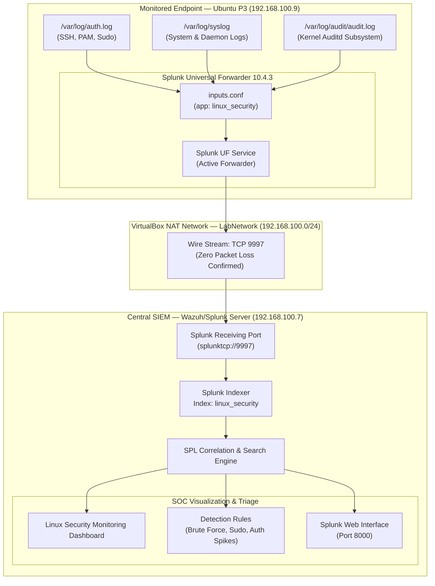

# 🏗️ P3 Architecture — Linux Security Telemetry & Forwarding Pipeline

> **Document Status:** ✅ **VERIFIED & OPERATIONAL**  
> **Component:** Linux Telemetry Collection & Forwarding Architecture  
> **Target Endpoint:** Ubuntu Server 24.04 LTS (`ubuntu-p3` — `192.168.100.9`)  
> **Central SIEM:** Splunk Enterprise 10.4.3 (`wazuh-server` — `192.168.100.7`)  

---

## 1. Architecture Overview

Project P3 establishes an enterprise Linux endpoint security monitoring architecture. Operating system, authentication, and kernel audit telemetry are collected in real time from **Ubuntu P3** via the **Splunk Universal Forwarder (UF)** and securely forwarded over TCP port `9997` to the centralized **Splunk Enterprise** instance.

The centralized SIEM indexes all events into a dedicated `linux_security` index, enabling SOC analysts to execute real-time SPL detection queries, track brute-force attacks, monitor privilege escalation (`sudo`), and visualize security metrics via the **Linux Security Monitoring** dashboard.

```text
Ubuntu P3 (192.168.100.9)
        │
        ├── /var/log/auth.log      (sourcetype: linux_secure)
        ├── /var/log/syslog        (sourcetype: syslog)
        └── /var/log/audit/audit.log (sourcetype: linux:audit)
        │
        │ Splunk Universal Forwarder 10.4.3
        ▼
Wazuh / Splunk Server (192.168.100.7)
        │
        ├── Splunk Receiver Port :9997
        ├── Index: linux_security
        └── Splunk Web :8000 (Linux Security Monitoring Dashboard)
```

---

## 2. Mermaid Pipeline Diagram



---

## 3. Network & System Specifications

| Host / Role | Operating System | IP Address | Ports / Services | Purpose |
|---|---|---|---|---|
| **`ubuntu-p3`** | Ubuntu Server 24.04.5 LTS | `192.168.100.9` | `22/tcp` (SSH), Local UF Client | Monitored Linux workstation / endpoint |
| **`wazuh-server`** | Ubuntu Server 24.04 LTS | `192.168.100.7` | `9997/tcp` (Receiver), `8000/tcp` (Web), `8089/tcp` (Mgmt) | Central Splunk Enterprise SIEM indexer & search head |
| **Windows Host** | Windows 11 Pro | Host Gateway (`192.168.100.1`) | `127.0.0.1:2223` (SSH Forwarding) | Hypervisor workstation & analyst access |
| **Network** | VirtualBox NAT Network | `192.168.100.0/24` | Gateway: `192.168.100.1` | Isolated laboratory telemetry network (`LabNetwork`) |

---

## 4. Log Source Mapping & Sourcetypes

The Universal Forwarder ingests three critical Linux log streams into the dedicated `linux_security` index:

| Log File Path | Sourcetype | Ingestion Mode | SOC Security Context |
|---|---|---|---|
| `/var/log/auth.log` | `linux_secure` | Continuous tail (`inputs.conf`) | Authentication events, SSH logins (successful/failed), PAM transactions, `sudo` execution records, session openings/closings. |
| `/var/log/syslog` | `syslog` | Continuous tail (`inputs.conf`) | System services, cron jobs, network daemons, system error and diagnostic messages. |
| `/var/log/audit/audit.log` | `linux:audit` | Continuous tail (`inputs.conf`) | Linux kernel audit daemon (`auditd`) records, syscall events, process execution, integrity monitoring, SELinux/AppArmor events. |

---

## 5. Forwarding Configuration Architecture

The Splunk Universal Forwarder configuration is modularized into a dedicated custom application on `ubuntu-p3`:

- **Path:** `/opt/splunkforwarder/etc/apps/linux_security/local/inputs.conf`

```ini
[monitor:///var/log/auth.log]
disabled = false
index = linux_security
sourcetype = linux_secure
host = ubuntu-p3

[monitor:///var/log/syslog]
disabled = false
index = linux_security
sourcetype = syslog
host = ubuntu-p3

[monitor:///var/log/audit/audit.log]
disabled = false
index = linux_security
sourcetype = linux:audit
host = ubuntu-p3
```

- **Forward Server Destination:** Configured via `outputs.conf` / CLI to ship all collected data streams directly to `192.168.100.7:9997`.

---

## 6. Security & Operational Considerations

1. **Least Privilege Ingestion:** The forwarder daemon runs as a dedicated non-root service with read permissions to `/var/log` log files via group membership (`adm` / `audit`).
2. **Dedicated Index Isolation:** Monitored events are segregated into `index=linux_security` to enforce role-based access control (RBAC) and tailored retention policies separate from Windows (`index=windows`, `index=sysmon`) and Wazuh telemetry.
3. **Bandwidth & Compression:** Splunk Universal Forwarder utilizes native compression over TCP port 9997, minimizing network overhead across the subnet.
4. **Credential Safety:** No sensitive credentials, private keys, or API tokens are hardcoded into forwarder configuration files.
