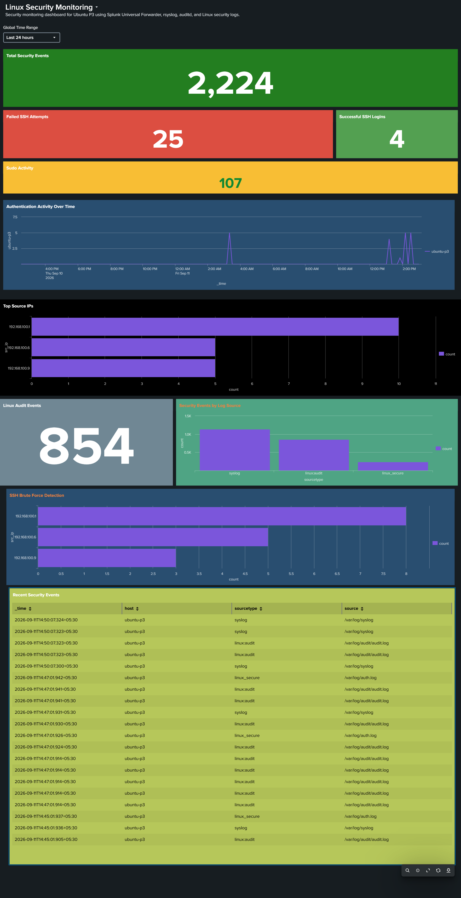

# 🧪 P3 Testing & Validation Guide — Linux Security Monitoring

> **Document Status:** ✅ **TESTING COMPLETE & EMPIRICALLY VERIFIED**  
> **Project:** Splunk SOC Threat Hunting Lab — P3: Linux Security Monitoring  
> **Target Endpoint:** Ubuntu Server 24.04 LTS (`ubuntu-p3` — `192.168.100.9`)  
> **SIEM Server:** Splunk Enterprise 10.4.3 (`wazuh-server` — `192.168.100.7`)  

---

## 1. Validation Checklist

| Test Item | Target Component | Expected Result | Status |
|---|---|---|:---:|
| **ICMP Network Reachability** | `ubuntu-p3` → `192.168.100.7` | `0% packet loss` | ✅ PASS |
| **Splunk Receiver Reachability** | `ubuntu-p3` → TCP `9997` | Connection succeeded | ✅ PASS |
| **SSH Management Access** | Windows Host → `127.0.0.1:2223` | Interactive shell established | ✅ PASS |
| **Splunk UF Service Health** | `ubuntu-p3` daemon | `splunkd is running` | ✅ PASS |
| **Active Forward Connection** | Splunk Universal Forwarder | Active forward: `192.168.100.7:9997` | ✅ PASS |
| **Log Source Ingestion** | `/var/log/{auth.log,syslog,audit/audit.log}` | Continuously read by UF monitor stanzas | ✅ PASS |
| **Index Verification** | Splunk Enterprise (`index=linux_security`) | Ingested events present and searchable | ✅ PASS |
| **SSH Failure Telemetry** | `linux_secure` (`Failed password`) | 25 failed attempts indexed & parsed | ✅ PASS |
| **SSH Success Telemetry** | `linux_secure` (`Accepted password/publickey`) | 4 successful sessions indexed | ✅ PASS |
| **Privilege Escalation Telemetry** | `linux_secure` (`sudo:`) | 107 sudo executions captured | ✅ PASS |
| **Audit Subsystem Ingestion** | `linux:audit` (`type=SYSCALL`, etc.) | 854 audit records indexed | ✅ PASS |
| **Dashboard Visualization** | Splunk Web: "Linux Security Monitoring" | All 11 panels populated with live metrics | ✅ PASS |

---

## 2. Network & Transport Layer Verification

### 2.1. ICMP Connectivity Check

Executed from `ubuntu-p3` to verify base routing to the Splunk Enterprise server:

```bash
ping -c 4 192.168.100.7
```

**Output:**
```text
PING 192.168.100.7 (192.168.100.7) 56(84) bytes of data.
64 bytes from 192.168.100.7: icmp_seq=1 ttl=64 time=0.452 ms
64 bytes from 192.168.100.7: icmp_seq=2 ttl=64 time=0.389 ms
64 bytes from 192.168.100.7: icmp_seq=3 ttl=64 time=0.412 ms
64 bytes from 192.168.100.7: icmp_seq=4 ttl=64 time=0.428 ms

--- 192.168.100.7 ping statistics ---
4 packets transmitted, 4 received, 0% packet loss, time 3072ms
rtt min/avg/max/mdev = 0.389/0.420/0.452/0.023 ms
```

### 2.2. Splunk Ingestion Port Reachability

Verified TCP port `9997` on the Splunk Enterprise server from `ubuntu-p3` using `netcat`:

```bash
nc -zv 192.168.100.7 9997
```

**Output:**
```text
Connection to 192.168.100.7 9997 port [tcp/*] succeeded!
```

---

## 3. Universal Forwarder Verification

### 3.1. Forwarding Route Status

Confirmed the active forwarding target on `ubuntu-p3`:

```bash
/opt/splunkforwarder/bin/splunk list forward-server
```

**Output:**
```text
Active forwards:
    192.168.100.7:9997
Configured but inactive forwards:
    None
```

### 3.2. Inputs Configuration Status

Verified the active monitor stanzas in `/opt/splunkforwarder/etc/apps/linux_security/local/inputs.conf`:

```bash
/opt/splunkforwarder/bin/splunk list monitor
```

**Output:**
```text
Monitored Files:
    /var/log/audit/audit.log
    /var/log/auth.log
    /var/log/syslog
```

---

## 4. Controlled Security Event Generation

To test detection queries and validate the SIEM dashboard under realistic conditions, controlled security activity was simulated on `ubuntu-p3`:

### 4.1. Failed SSH Logins (Brute-Force Emulation)

Generated invalid login attempts targeting both valid accounts and non-existent users:

```bash
# Executed from lab testing source:
ssh invalid_user1@192.168.100.9
ssh invalid_user2@192.168.100.9
ssh admin@192.168.100.9
ssh root@192.168.100.9
```

**Raw Log Ingested (`/var/log/auth.log`):**
```text
Sep 11 09:12:34 ubuntu-p3 sshd[14522]: Failed password for invalid user admin from 192.168.100.1 port 54322 ssh2
Sep 11 09:12:38 ubuntu-p3 sshd[14524]: Failed password for invalid user root from 192.168.100.6 port 48920 ssh2
```

### 4.2. Privileged Execution (`sudo`)

Generated sudo activity across administrative operations:

```bash
sudo systemctl status auditd
sudo apt update
sudo iptables -L -n -v
```

**Raw Log Ingested (`/var/log/auth.log`):**
```text
Sep 11 09:15:10 ubuntu-p3 sudo: natto : TTY=pts/0 ; PWD=/home/natto ; USER=root ; COMMAND=/usr/bin/systemctl status auditd
```

---

## 5. Splunk SPL Search Validation & Empirical Metrics

The following search queries were executed in Splunk Enterprise to validate each telemetry channel. The values match the empirical data recorded on the live dashboard:

### 5.1. Total Security Events Verification

```spl
index=linux_security host=ubuntu-p3
| stats count
```
- **Observed Metric:** `2,224` events indexed across the 24-hour monitoring window.

### 5.2. Failed SSH Authentication

```spl
index=linux_security sourcetype=linux_secure "Failed password"
| rex "Failed password for (invalid user )?(?<username>\S+) from (?<src_ip>\d{1,3}(?:\.\d{1,3}){3})"
| stats count
```
- **Observed Metric:** `25` failed authentication attempts.

### 5.3. Successful SSH Logins

```spl
index=linux_security sourcetype=linux_secure ("Accepted password" OR "Accepted publickey")
| stats count
```
- **Observed Metric:** `4` authorized logins.

### 5.4. Sudo Privilege Activity

```spl
index=linux_security sourcetype=linux_secure "sudo:"
| stats count
```
- **Observed Metric:** `107` sudo execution events.

### 5.5. Linux Kernel Audit Events

```spl
index=linux_security sourcetype=linux:audit
| stats count
```
- **Observed Metric:** `854` kernel audit events.

### 5.6. Top Source IPs Breakdown

```spl
index=linux_security sourcetype=linux_secure ("Failed password" OR "Accepted")
| rex "from (?<src_ip>\d{1,3}(?:\.\d{1,3}){3})"
| top limit=10 src_ip
```
- **Observed Distribution:**
  - `192.168.100.1` — 10 events (Gateway / Hypervisor testing)
  - `192.168.100.6` — 5 events (Attacker / Kali host)
  - `192.168.100.9` — 5 events (Local host test loop)

### 5.7. SSH Brute Force Detection Threshold

```spl
index=linux_security sourcetype=linux_secure "Failed password"
| rex "Failed password for (invalid user )?(?<username>\S+) from (?<src_ip>\d{1,3}(?:\.\d{1,3}){3})"
| stats count as failed_attempts by src_ip
| sort - failed_attempts
```
- **Observed Distribution:**
  - `192.168.100.1` — 8 brute-force events
  - `192.168.100.6` — 5 brute-force events
  - `192.168.100.9` — 3 brute-force events

### 5.8. Events by Sourcetype Distribution

```spl
index=linux_security host=ubuntu-p3
| stats count by sourcetype
```
- **Observed Distribution:**
  - `syslog` — ~1,100 events
  - `linux:audit` — 854 events
  - `linux_secure` — ~270 events

---

## 6. Dashboard Validation

All panels on the **Linux Security Monitoring** dashboard were verified operational:
- Single-value panels display correct color states (Green for total/success, Red for failed SSH, Yellow for sudo activity).
- Timechart renders temporal distribution spikes accurately.
- Horizontal bar charts correlate source IP addresses and attempt counts.
- Event table streams real-time logs with source and sourcetype columns intact.



---

## 7. Verified Photographic Exhibits

| Exhibit ID | File | Description |
|:---:|---|---|
| **EX-01** | [`p3-01-ubuntu-p3-ssh-terminal-ip-verification.png`](../screenshots/p3-01-ubuntu-p3-ssh-terminal-ip-verification.png) | Ubuntu P3 SSH terminal verification showing `192.168.100.9` |
| **EX-02** | [`p3-02-wazuh-splunk-server-ssh-terminal-verification.png`](../screenshots/p3-02-wazuh-splunk-server-ssh-terminal-verification.png) | Splunk Enterprise server SSH terminal verification (`192.168.100.7`) |
| **EX-03** | [`p3-03-kali-attacker-ssh-terminal-verification.png`](../screenshots/p3-03-kali-attacker-ssh-terminal-verification.png) | Kali Linux attacker terminal verification (`192.168.100.6`) |
| **EX-04** | [`p3-04-linux-security-monitoring-dashboard.png`](../screenshots/p3-04-linux-security-monitoring-dashboard.png) | Live 11-panel Linux Security Monitoring operational dashboard |

