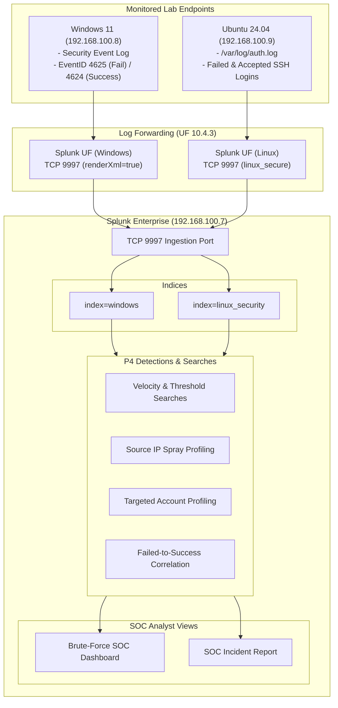

# 🛡️ P4 — Brute-Force Detection & Investigation

[](#14-project-status)
[](https://www.splunk.com/)
[](https://www.splunk.com/)
[](https://attack.mitre.org/)
[](https://github.com/NATTOMR/splunk-soc-threat-hunting-lab/issues/5)
[](https://github.com/users/NATTOMR/projects/5)

> **Author:** Natto Chakma  
> **Master Repository Component:** This project constitutes **Project P4** in the [Splunk SOC & Threat Hunting Lab](../README.md).  
> **Project Identity:** P4 — Brute-Force Detection & Investigation  
> **Core Purpose:** Develop and validate Splunk-based detections for identifying, investigating, correlating, and documenting brute-force authentication attacks against enterprise endpoints.

---

## Table of Contents

1. [Project Title & Overview](#1-project-title--overview)
2. [Objective](#2-objective)
3. [Security Problem](#3-security-problem)
4. [Scope](#4-scope)
5. [Lab Architecture](#5-lab-architecture)
6. [Detection Scenarios](#6-detection-scenarios)
7. [Investigation Methodology](#7-investigation-methodology)
8. [SPL Query Library](#8-spl-query-library)
9. [MITRE ATT&CK Mapping](#9-mitre-attck-mapping)
10. [Evidence](#10-evidence)
11. [Results](#11-results)
12. [Limitations](#12-limitations)
13. [Future Improvements](#13-future-improvements)
14. [Project Status](#14-project-status)
15. [Relationship to P1, P2, and P3](#15-relationship-to-p1-p2-and-p3)
16. [Master Repository Navigation](#16-master-repository-navigation)

---

## 1. Project Title & Overview

**P4 — Brute-Force Detection & Investigation**

In an enterprise IT infrastructure, authentication mechanisms (such as Windows Remote Desktop, SMB, Kerberos, and Linux SSH) represent primary attack surfaces. Threat actors systematically target these services using automated password guessing, credential stuffing, and password spraying to achieve initial access or move laterally.

This project delivers an end-to-end detection engineering and incident investigation capability within Splunk Enterprise. It establishes candidate and verified SPL searches, threshold-based alerts, failed-to-success correlation logic, and a SOC analyst triage playbook for defending Windows and Linux endpoints.

---

## 2. Objective

The strategic goals of Project P4 include:
- **Telemetry Verification:** Validate raw authentication log sources forwarded from Windows 11 (`index=windows`, EventID 4625/4624) and Ubuntu Server (`index=linux_security`, `auth.log`).
- **Detection Engineering:** Build robust, high-fidelity Splunk SPL queries capable of distinguishing between background noise, vertical password guessing, horizontal password spraying, and burst dictionary attacks.
- **Outcome Correlation:** Construct correlation queries that track authentication failures culminating in successful logins, detecting potential credential compromise in near real-time.
- **SOC Investigation Playbook:** Standardize investigation workflows for triage, scoping, post-compromise pivoting into Sysmon telemetry, and incident containment.
- **MITRE ATT&CK Alignment:** Formally map detection queries and observed adversary behavior to the ATT&CK knowledge base.

---

## 3. Security Problem

Authentication brute-force attacks present distinct detection and operational challenges:
- **Alert Fatigue vs. Under-Detection:** Static thresholds set too low flood SOC analysts with alerts from forgotten passwords or stale service account credentials; thresholds set too high fail to catch low-and-slow attacks.
- **Horizontal Password Spraying Evasion:** By trying a single common password across hundreds of usernames, attackers stay beneath single-account lockout thresholds.
- **Disjointed Outcome Tracking:** Many security monitoring environments log authentication failures but lack automated correlation to determine whether an attacker subsequently logged in successfully.
- **Format Inconsistencies:** Windows XML-rendered event logs (`renderXml = true`) require dedicated field parsing techniques compared to standard syslog authentication strings.

---

## 4. Scope

The scope of Project P4 covers eleven core operational domains:

1. **Failed Authentication Analysis:** Ingestion, parsing, and baseline profiling of failed logon events.
2. **Successful Authentication Analysis:** Monitoring logon events to establish legitimate access baselines.
3. **Repeated Authentication Failures:** Detecting elevated failure rates per host and user.
4. **Source IP Identification:** Identifying and categorizing external vs. internal offending IP addresses.
5. **Target Account Identification:** Isolating high-value administrative and user accounts under attack.
6. **Time-Based Attack Patterns:** Analyzing velocity, burst frequency, and inter-arrival intervals.
7. **Threshold-Based Brute-Force Detection:** Engineering tunable statistical thresholds across sliding time windows.
8. **Failed-to-Success Authentication Correlation:** Correlating failure bursts with subsequent successes within a bounded window.
9. **Attack Timeline Reconstruction:** Assembling chronological incident histories from initial probe to final outcome.
10. **SOC Investigation:** Executing structured analyst triage, evidence gathering, and containment recommendations.
11. **MITRE ATT&CK Mapping:** Classifying all detection use cases to MITRE ATT&CK techniques.

---

## 5. Lab Architecture

Project P4 utilizes the virtual lab environment established in previous projects, where endpoints forward live security events over TCP port 9997 to Splunk Enterprise.



Detailed architectural specifications and data flow documentation are maintained in [`docs/architecture.md`](docs/architecture.md).

---

## 6. Detection Scenarios

Project P4 analyzes and detects six core authentication attack scenarios:

| Scenario | Attack Description | Key Telemetry / Indicator | Tunable Parameter |
|---|---|---|---|
| **Scenario 1: High-Volume Failures** | Rapid automated dictionary attack or brute-force burst | High volume of EventID 4625 / `Failed password` in short intervals | `span=5m`, `threshold >= 10` |
| **Scenario 2: Single Target Account** | Targeted credential guessing against a single privileged account (e.g., Administrator, root) | High failure count focused on single `target_user` | `threshold >= 5` in 15m |
| **Scenario 3: Multiple Accounts (Spray)** | Horizontal password spray across multiple usernames from one origin | Low failures per user, but high `dc(target_user) >= 3` from single `src_ip` | `dc(target_user) >= 3` |
| **Scenario 4: Time-Windowed (Low & Slow)** | Throttled login attempts designed to evade simple rate threshold alarms | Sustained elevated failure counts over extended observation windows | Extended window (`-24h`) |
| **Scenario 5: Failed-to-Success Correlation** | Multiple failed attempts followed immediately by a successful login | Sequence of EventID 4625 followed by 4624 within max span | `failures >= 3`, `maxspan=15m` |
| **Scenario 6: Suspicious Logon Patterns** | Anomalous logon types (e.g. Type 3 SMB or Type 10 RDP) from untrusted segments | Unexpected `LogonType` from non-administrative IP | Subnet whitelist, LogonType filter |

Comprehensive scenario breakdowns are documented in [`docs/attack-scenarios.md`](docs/attack-scenarios.md).

---

## 7. Investigation Methodology

The SOC investigation workflow follows a disciplined four-stage triage and analysis process:

```
[Alert Fired] ──► 1. Triage Source IP ──► 2. Profile Targeted Accounts ──► 3. Check for Success ──► 4. Post-Logon Pivot (Sysmon)
```

1. **Source Triage:** Determine whether the attacking IP is internal (lateral movement) or external (perimeter threat).
2. **Account Profiling:** Check if targeted accounts are active, disabled, or locked out (`0xC0000234`).
3. **Outcome Correlation:** Execute failed-to-success correlation to verify if access was obtained.
4. **Endpoint Post-Compromise Pivot:** If successful authentication occurred, pivot into Sysmon (`index=sysmon`) to inspect process creation (Event ID 1), command-line activity, and outbound connections (Event ID 3).

Full investigation steps, checklists, and containment procedures are detailed in [`docs/investigation.md`](docs/investigation.md) and [`docs/detection-methodology.md`](docs/detection-methodology.md).

---

## 8. SPL Query Library

The queries directory houses candidate SPL detection templates that explicitly identify fields to be validated against active telemetry during sub-issues P4.1 and P4.2:

- [`queries/README.md`](queries/README.md): Query library index and usage instructions.
- [`queries/failed-authentication.spl`](queries/failed-authentication.spl): Base failure parsing and triage search.
- [`queries/high-volume-failures.spl`](queries/high-volume-failures.spl): Fixed-window threshold velocity detection.
- [`queries/source-ip-analysis.spl`](queries/source-ip-analysis.spl): Profiling source IPs to distinguish sprays from targeted guessing.
- [`queries/targeted-account-analysis.spl`](queries/targeted-account-analysis.spl): Monitoring specific accounts for lockout risk and focused attacks.
- [`queries/failed-to-success-correlation.spl`](queries/failed-to-success-correlation.spl): Transaction-based and statistical correlation for potential compromise.

---

## 9. MITRE ATT&CK Mapping

All P4 detection logic maps to adversary techniques in the MITRE ATT&CK Enterprise Matrix:

| Tactic | Technique ID | Technique Name | Detection Coverage |
|---|---|---|---|
| **Credential Access** | [T1110](https://attack.mitre.org/techniques/T1110/) | Brute Force | General high-volume authentication failure detection |
| **Credential Access** | [T1110.001](https://attack.mitre.org/techniques/T1110/001/) | Password Guessing | Single-account vertical brute-force detection |
| **Credential Access** | [T1110.003](https://attack.mitre.org/techniques/T1110/003/) | Password Spraying | Horizontal multi-account spray detection from single source |
| **Initial Access** | [T1078](https://attack.mitre.org/techniques/T1078/) | Valid Accounts | Failed-to-success authentication correlation |
| **Lateral Movement** | [T1021.001](https://attack.mitre.org/techniques/T1021/001/) | Remote Desktop Protocol | Windows Logon Type 10 failure/success monitoring |
| **Lateral Movement** | [T1021.002](https://attack.mitre.org/techniques/T1021/002/) | SMB/Windows Admin Shares | Windows Logon Type 3 failure/success monitoring |

---

## 10. Evidence

Visual proof and technical artifacts are organized in dedicated directories:
- **Screenshots:** [`screenshots/README.md`](screenshots/README.md) cataloging scheduled exhibits (`p4-01` through `p4-06`).
- **Reports:** [`reports/README.md`](reports/README.md) defining incident reporting templates.
- **Dashboards:** [`dashboards/README.md`](dashboards/README.md) outlining planned dashboard panels.
- **Detections:** [`detections/README.md`](detections/README.md) documenting candidate alerting rules.

> [!NOTE]
> In accordance with strict portfolio integrity standards, no fabricated screenshots, artificial log dumps, or staged evidence are committed. All evidence will be captured and documented during live lab validation.

---

## 11. Results

*Results will be populated upon completion of live lab testing and validation in sub-issues P4.1 through P4.5.*

| Phase | Metric / Deliverable | Status |
|---|---|:---:|
| Telemetry Ingestion Verification | Validated index, sourcetype, and event fields | Pending P4.1 |
| Attack Simulation | Controlled simulation executed and captured | Pending P4.1 |
| SPL Detection Validation | Tested searches against real failure events | Pending P4.2 |
| Failed-to-Success Correlation | Verified correlation against authentic sequence | Pending P4.3 |
| SOC Investigation Execution | Complete forensic analysis and timeline reconstruction | Pending P4.4 |
| Final Evidence & Report | Validated screenshots and technical case report | Pending P4.5 |

---

## 12. Limitations

1. **Static Threshold Sensitivity:** Fixed thresholds (e.g. 10 failures in 5 minutes) may miss highly throttled attacks (e.g., 1 attempt per hour).
2. **Encrypted Channel Visibility:** Splunk monitors logon event results via Windows Event Logs and Linux auth.log, but cannot inspect encrypted payload contents without deep packet inspection.
3. **XML Parsing Dependency:** Windows Security events ingested with `renderXml = true` require explicit regex extraction (`rex`) if XML field extraction transforms are not permanently deployed on the indexer.
4. **Lab Scope:** The lab operates within an isolated NAT network (`192.168.100.0/24`), requiring external threat intelligence enrichment to be simulated via lab-originating adversary IPs.

---

## 13. Future Improvements

- **Statistical Anomaly Detection:** Implement machine learning or `streamstats` dynamic baselining to replace static threshold numbers.
- **Automated Response Actions:** Integrate Splunk alert action scripts to automatically block repeat offender IPs via host firewalls.
- **Kerberos Pre-Authentication Monitoring:** Ingest and analyze EventID 4771 (Kerberos pre-authentication failed) for Active Directory environments.
- **Enterprise Security (ES) Correlation Searches:** Translate verified SPL queries into Splunk Enterprise Security Notable Events.

---

## 14. Project Status

The implementation state of Project P4 is strictly categorized into lifecycle stages:

```
[ Planned ] ──► [ In Progress ] ──► [ Implemented ] ──► [ Validated ]
```

### Current Status Overview: 🟡 In Progress (Scaffolded — Implementation Todo)

| Sub-Issue | Title | Scope / Focus | Status |
|:---:|---|---|:---:|
| **[P4.1](https://github.com/NATTOMR/splunk-soc-threat-hunting-lab/issues/16)** | Authentication Telemetry & Attack Simulation | Verify log sources, index, sourcetypes, fields, and controlled simulation | ⚪ Todo |
| **[P4.2](https://github.com/NATTOMR/splunk-soc-threat-hunting-lab/issues/17)** | Brute-Force SPL Detection | Develop & validate volume, spray, and targeted detection queries | ⚪ Todo |
| **[P4.3](https://github.com/NATTOMR/splunk-soc-threat-hunting-lab/issues/18)** | Failed-to-Success Correlation | Build correlation searches connecting failures to subsequent logins | ⚪ Todo |
| **[P4.4](https://github.com/NATTOMR/splunk-soc-threat-hunting-lab/issues/19)** | Investigation & MITRE ATT&CK Mapping | Conduct SOC-style investigation, pivot to Sysmon, map ATT&CK | ⚪ Todo |
| **[P4.5](https://github.com/NATTOMR/splunk-soc-threat-hunting-lab/issues/20)** | Evidence, Report & Validation | Capture authentic screenshots, compile final report, run security scan | ⚪ Todo |

---

## 15. Relationship to P1, P2, and P3

Project P4 directly extends the telemetry pipeline established across previous projects without altering their configurations:

- **[P1 — Splunk SOC Home Lab & Log Analysis](../../splunk-p1-soc-home-lab):** Established foundational Splunk deployment, basic event ingestion, and search methodology.
- **[P2 — Windows Security Monitoring with Splunk](../P2-Windows-Security-Monitoring/README.md):** Deployed the Windows 11 Universal Forwarder ingesting `WinEventLog://Security` into `index=windows` with `renderXml = true` and Sysmon into `index=sysmon`. P4 consumes this exact security log feed for EventID 4625 and 4624 detection.
- **[P3 — Linux Security Monitoring with Splunk](../P3-Linux-Security-Monitoring/README.md):** Deployed the Ubuntu Universal Forwarder streaming `/var/log/auth.log` into `index=linux_security` under sourcetype `linux_secure`. P4 leverages this stream for SSH brute-force analysis.

---

## 16. Master Repository Navigation

- 🏠 **[Master Repository Root](../README.md)**
- 📁 **[Project P2: Windows Security Monitoring](../P2-Windows-Security-Monitoring/README.md)**
- 📁 **[Project P3: Linux Security Monitoring](../P3-Linux-Security-Monitoring/README.md)**
- 📁 **[Project P4: Brute-Force Detection & Investigation](README.md)** (Current)
- 📋 **[GitHub Project Board](https://github.com/users/NATTOMR/projects/5)**
- 🎯 **[Parent Tracking Issue #5](https://github.com/NATTOMR/splunk-soc-threat-hunting-lab/issues/5)**
