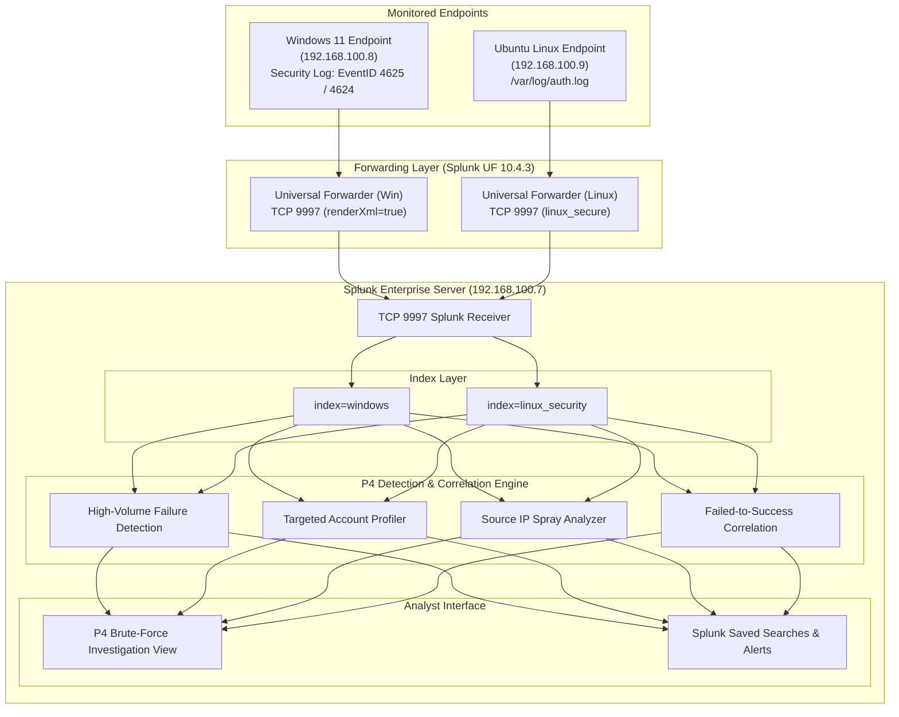

# P4 Architecture — Authentication Telemetry & Detection Pipeline

> **Project:** P4 — Brute-Force Detection & Investigation  
> **Status:** Architecture Designed (Telemetry Ingestion Verification Pending in P4.1)

---

## 1. Pipeline Overview

Project P4 leverages the telemetry infrastructure established across the lab endpoints to feed centralized authentication events into Splunk Enterprise for real-time analysis, alerting, and forensic correlation.



---

## 2. Telemetry Ingestion Layer

### Windows Telemetry (P2 Integration)
- **Log Channel:** `WinEventLog://Security`
- **Destination Index:** `index=windows`
- **Forwarding Protocol:** TCP 9997 via Splunk Universal Forwarder
- **Format:** Ingested with `renderXml = true`
- **Key Event IDs:**
  - **4625:** An account failed to log on. Provides target username, domain, caller process, source IP address, workstation name, and failure reason codes (Status / SubStatus).
  - **4624:** An account was successfully logged on. Provides logon type, target user, target domain, and source IP address.

### Linux Telemetry (P3 Integration)
- **Log Source:** `/var/log/auth.log`
- **Destination Index:** `index=linux_security`
- **Sourcetype:** `linux_secure`
- **Key Patterns:**
  - `Failed password for [invalid user] <user> from <ip> port <port> ssh2`
  - `Accepted password for <user> from <ip> port <port> ssh2`

---

## 3. Data Processing & Parsing Considerations

### Windows XML Event Parsing
Because Windows events are streamed with `renderXml = true`, raw events contain structured XML data. If index-time or search-time XML extraction is not fully expanded into field aliases, regular expression extraction via `rex` must be applied in SPL searches:

```spl
| rex field=_raw "<EventID>(?<EventID>\d+)</EventID>"
| rex field=_raw "TargetUserName\">(?<target_user>[^<]+)</Data>"
| rex field=_raw "IpAddress\">(?<src_ip>[^<]+)</Data>"
| rex field=_raw "LogonType\">(?<logon_type>\d+)</Data>"
| rex field=_raw "Status\">(?<status_code>[^<]+)</Data>"
| rex field=_raw "SubStatus\">(?<sub_status_code>[^<]+)</Data>"
```

### Normalization & Field Aliasing
During sub-issue **P4.1**, active fields will be verified to determine whether field extraction should be handled via search-time `rex` or dedicated `props.conf`/`transforms.conf` definitions.

---

## 4. Environment Parameters

| Component | Target IP / Host | Port / Protocol | Telemetry Role |
|---|---|---|---|
| **Splunk Enterprise** | `192.168.100.7` | TCP 9997 (Receiver), 18000 (Web) | SIEM Indexer & Search Head |
| **Windows 11 Endpoint** | `192.168.100.8` | TCP 9997 (Outbound to SIEM) | Windows Security Event Provider |
| **Ubuntu Linux Endpoint** | `192.168.100.9` | TCP 9997 (Outbound to SIEM) | Linux auth.log Provider |
| **Lab Network** | `192.168.100.0/24` | Isolated NAT Network | Closed Lab Testing Boundary |
