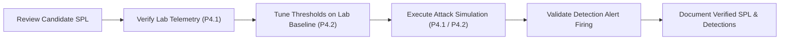

# P4 Detection Methodology — Engineering & Tuning Framework

> **Project:** P4 — Brute-Force Detection & Investigation  
> **Status:** Framework Documented (Validation and Tuning Scheduled in P4.2 & P4.3)

---

## 1. Detection Engineering Principles

Detection of brute-force authentication activity must strike a balance between detection fidelity (catching real attacks) and alert noise reduction (minimizing false positives from benign user error or misconfigured services).

### Core Principles:
1. **Telemetry-First Validation:** Never deploy static detection rules without confirming the exact field extractions, indexing behavior, and baseline noise in the monitored environment.
2. **Tunable Thresholds:** Do not hardcode arbitrary threshold numbers without understanding normal operational baselines. Thresholds must be adjustable parameters based on environment size and threat model.
3. **Multi-Dimensional Correlation:** Single-factor detections (e.g., raw count of failed logins) are prone to false positives. Correlating user identity, source IP, logon type, and temporal proximity drastically improves detection confidence.

---

## 2. Detection Logic Archetypes

| Archetype | Technique | SPL Operator / Approach | Target Threat Scenario |
|---|---|---|---|
| **Threshold Velocity** | Fixed time-bucket event counts | `bin _time span=X` + `stats count` + `where count >= Y` | Burst / Dictionary Attacks |
| **Horizontal Spray** | Distinct target account count per source | `stats dc(target_user) by src_ip` | Password Spraying (T1110.003) |
| **Vertical Targeted** | Failure count per individual target account | `stats count by target_user` + `where count >= Y` | Targeted Guessing (T1110.001) |
| **Transaction Correlation** | Event sequencing (Failure $\to$ Success) | `transaction` or `stats sum(is_fail) sum(is_succ)` | Compromised Account Identification |
| **Statistical Outlier** | Standard deviation above moving baseline | `streamstats` / `timewrap` | Evasive / Low-and-Slow Attacks |

---

## 3. False Positive Mitigation Strategies

Brute-force detections frequently trigger on benign activity if not properly tuned. The following benign triggers must be accounted for during sub-issue **P4.2**:

1. **Expired User / Service Account Passwords:**
   - *Symptom:* Scheduled tasks or background services attempting to authenticate with stale cached credentials generate constant failures.
   - *Tuning Action:* Filter out known service accounts with established failure baselines, or investigate Windows SubStatus code `0xC0000071` (password expired).
2. **Disconnected RDP Sessions / Stale Mapped Network Drives:**
   - *Symptom:* Workstations attempting reconnection in the background every few minutes.
   - *Tuning Action:* Examine `LogonType` and caller process; exclude internal management automation servers if documented.
3. **Local Loopback / Host Noise:**
   - *Symptom:* Internal host processes generating local failure artifacts against `127.0.0.1` or `::1`.
   - *Tuning Action:* Explicitly filter `src_ip!="127.0.0.1"`, `src_ip!="::1"`, and `src_ip!="-"` unless investigating local privilege escalation.

---

## 4. Alert Severity Matrix

| Detection Rule | Criteria | Severity | Actionable Response |
|---|---|:---:|---|
| **High-Volume Brute-Force** | $\ge 20$ failures in 5m from single IP | **HIGH** | Review source IP, isolate host if internal, block on firewall if external. |
| **Password Spray** | $\ge 5$ distinct user targets from single IP | **HIGH** | Audit targeted accounts, force password reset if any succeeded. |
| **Targeted Account Brute-Force** | $\ge 5$ failures against single privileged user | **MEDIUM** | Contact user, verify legitimacy, check lockout status. |
| **Failed-to-Success Correlation** | $\ge 3$ failures followed by success within 15m | **CRITICAL** | Treat as active compromise; inspect post-logon activity, revoke session, reset credentials immediately. |

---

## 5. Verification Workflow

