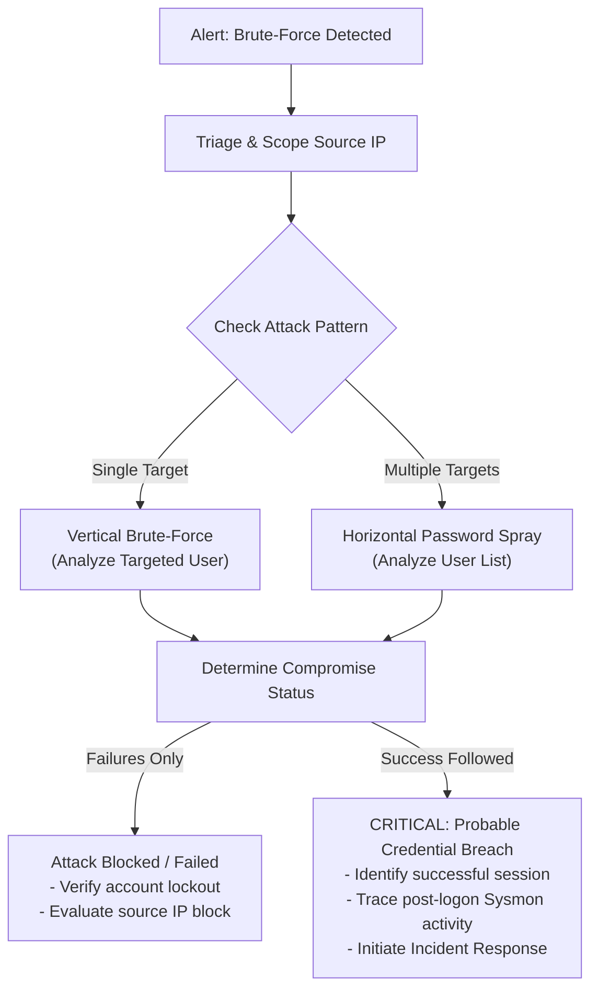

# P4 SOC Investigation Playbook & MITRE ATT&CK Mapping

> **Project:** P4 — Brute-Force Detection & Investigation  
> **Status:** Playbook Established (Live Incident Investigation Scheduled in P4.4)

---

## 1. SOC Analyst Investigation Workflow

When a brute-force or authentication anomaly alert triggers, the SOC analyst must execute a structured investigation to answer four critical questions:
1. **Who is attacking?** (Source IP, geolocation, workstation name, threat actor context)
2. **Who is targeted?** (Single account, multiple users, privileged or non-privileged accounts)
3. **Was the attack successful?** (Did any authentication event succeed following failures?)
4. **What happened after authentication?** (Post-compromise activity, lateral movement, persistence)



---

## 2. Step-by-Step Investigation Procedure

### Step 1: Initial Triage & Source IP Profiling
- Query Splunk for all activity originating from the offending source IP within `earliest=-24h`:
  ```spl
  index=windows (EventID=4625 OR EventID=4624) src_ip="<OFFENDING_IP>"
  ```
- Determine whether the source IP is:
  - An internal workstation/server (potential lateral movement or compromised host)
  - An external IP (perimeter attack via exposed RDP/SSH/VPN)
- Verify if the IP has triggered previous alerts in Splunk.

### Step 2: Target Account Assessment
- List all accounts targeted by the offending source IP.
- Categorize targets:
  - Built-in administrative accounts (`Administrator`, `root`)
  - Standard user accounts
  - Non-existent or dummy accounts (indicates dictionary wordlist spray)
- Check account status: Is the account enabled? Did it get locked out?

### Step 3: Success Verification (The Pivot)
- Execute the failed-to-success correlation query:
  ```spl
  index=windows (EventID=4625 OR EventID=4624) src_ip="<OFFENDING_IP>"
  | table _time EventID target_user src_ip logon_type
  | sort _time
  ```
- If a successful logon (`EventID=4624` or `"Accepted password"`) is detected following failures, mark the incident as **CRITICAL P1 - Active Account Compromise**.

### Step 4: Post-Authentication Activity Analysis (Cross-Index Pivot)
If authentication succeeded, immediately pivot into endpoint telemetry (Sysmon and Windows System logs) using the timestamp and username:
- **Sysmon Event ID 1 (Process Creation):** Did the attacker launch `cmd.exe`, `powershell.exe`, `whoami`, `net user`, or download tools?
- **Sysmon Event ID 3 (Network Connection):** Did the host establish outbound connections to unknown external IPs?
- **Windows Event ID 4672 (Special Privileges Assigned):** Were administrator rights granted to the session?

---

## 3. MITRE ATT&CK Mapping

Project P4 aligns observed attack techniques directly with the MITRE ATT&CK framework:

| Tactic | Technique ID | Technique Name | Detection Scenario / Mechanism |
|---|---|---|---|
| **Credential Access** | [T1110](https://attack.mitre.org/techniques/T1110/) | Brute Force | General repeated authentication failures over time |
| **Credential Access** | [T1110.001](https://attack.mitre.org/techniques/T1110/001/) | Password Guessing | Multiple failures targeting a single username |
| **Credential Access** | [T1110.003](https://attack.mitre.org/techniques/T1110/003/) | Password Spraying | Low failure rate per account across numerous distinct accounts |
| **Initial Access** | [T1078](https://attack.mitre.org/techniques/T1078/) | Valid Accounts | Successful logon after multiple failures |
| **Lateral Movement** | [T1021.001](https://attack.mitre.org/techniques/T1021/001/) | Remote Desktop Protocol | Windows Logon Type 10 failure/success sequences |
| **Lateral Movement** | [T1021.002](https://attack.mitre.org/techniques/T1021/002/) | SMB/Windows Admin Shares | Windows Logon Type 3 failure sequences |

---

## 4. Remediation & Incident Containment

1. **Immediate Session Termination:** Revoke active logon tokens and terminate remote sessions for affected accounts.
2. **Credential Reset:** Force a password reset on compromised accounts and revoke existing Kerberos tickets.
3. **Firewall / Network Isolation:** Add the attacking source IP to host firewall (e.g. UFW, Windows Defender Firewall) or network edge ACLs.
4. **Forensic Preservation:** Export Splunk search results, raw events, and timeline exhibits into the case file.
