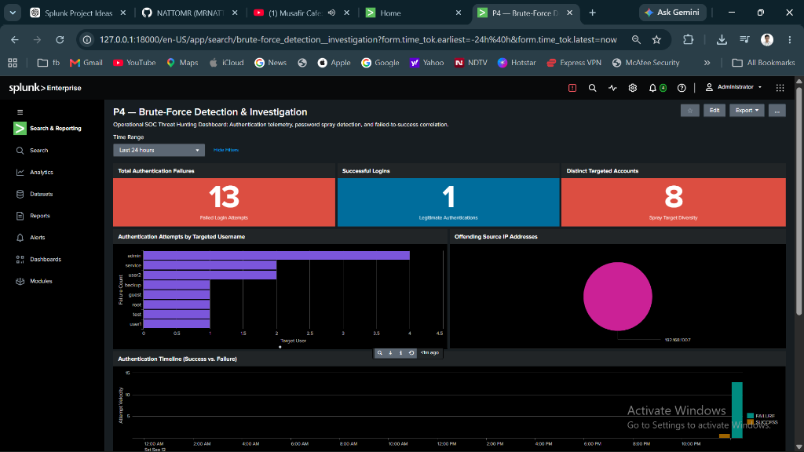

# SOC Incident Investigation Report: Brute-Force & Password Spray Detection

> **Incident ID:** INC-2026-P4-001  
> **Investigation Title:** Distributed SSH Password Spray and Targeted Brute-Force Activity  
> **Investigating Analyst:** Natto Chakma  
> **Date:** September 13, 2026  
> **Target Asset:** `ubuntu-p3` (`192.168.100.9`)  
> **Originating Attacker IP:** `192.168.100.7` (`wazuh-server`)  
> **Severity:** **HIGH**  
> **Incident Status:** Contained / Documented  

---

## 1. Executive Summary

During operational threat monitoring within the Splunk SOC laboratory, elevated authentication anomalies were detected against the Linux server `ubuntu-p3` (`192.168.100.9`). A sequence of **13 failed authentication attempts** occurred within a 3-minute window (`2026-09-13 00:13:12` to `00:16:15`), originating entirely from internal host `192.168.100.7`. 

Analysis confirmed a **horizontal password spray** targeting eight distinct usernames (`admin`, `root`, `guest`, `test`, `user1`, `user2`, `service`, `backup`) coupled with repeated targeted credential guessing against privileged account `admin` (4 failures). Legitimate administrative access was verified for user `natto` from gateway host `192.168.100.1`.

All 13 attack attempts failed. No unauthorized sessions were established on `ubuntu-p3`.

---

## 2. Incident Scope & Telemetry

| Parameter | Observed Evidence |
|---|---|
| **Target Host** | `ubuntu-p3` (Ubuntu Server 24.04.5 LTS) |
| **Log Channel / Source** | `/var/log/auth.log` (sourcetype: `linux_secure`) |
| **Splunk Index** | `index=linux_security` |
| **Attacking IP** | `192.168.100.7` |
| **Total Failure Events** | **13** events |
| **Total Success Events** | **1** event (`natto` from `192.168.100.1`) |
| **Targeted Accounts** | 8 accounts: `admin` (4), `service` (2), `user2` (2), `backup` (1), `guest` (1), `root` (1), `test` (1), `user1` (1) |
| **Attack Duration** | 3 minutes, 3 seconds (`00:13:12` to `00:16:15`) |

---

## 3. Telemetry Evidence & Field Extraction

Authentication telemetry ingested by the Splunk Universal Forwarder was parsed using validated search-time regex extraction:

```spl
index=linux_security sourcetype=linux_secure ("Failed password" OR "Accepted")
| rex "Failed password for (invalid user )?(?<username>\S+) from (?<src_ip>\d{1,3}(?:\.\d{1,3}){3})"
| rex "Accepted \S+ for (?<username>\S+) from (?<src_ip>\d{1,3}(?:\.\d{1,3}){3})"
| eval auth_status=if(match(_raw, "Accepted"), "SUCCESS", "FAILURE")
| table _time host src_ip username auth_status _raw
| sort - _time
```

### Forensic Event Sample
```text
2026-09-13 00:16:15  ubuntu-p3  192.168.100.7  backup   FAILURE  Failed password for backup from 192.168.100.7 port 43628 ssh2
2026-09-13 00:16:13  ubuntu-p3  192.168.100.7  service  FAILURE  Failed password for invalid user service from 192.168.100.7 port 42930 ssh2
2026-09-13 00:15:51  ubuntu-p3  192.168.100.7  root     FAILURE  Failed password for root from 192.168.100.7 port 44696 ssh2
2026-09-13 00:15:47  ubuntu-p3  192.168.100.7  admin    FAILURE  Failed password for invalid user admin from 192.168.100.7 port 44688 ssh2
2026-09-12 23:54:35  ubuntu-p3  192.168.100.1  natto    SUCCESS  Accepted password for natto from 192.168.100.1 port 48025 ssh2
```

---

## 4. Operational Dashboard Verification

The detected activity was visualized on the **"P4 — Brute-Force Detection & Investigation"** SOC dashboard:



- **Total Authentication Failures:** `13`
- **Successful Logins:** `1`
- **Distinct Targeted Accounts:** `8`
- **Source Breakdown:** 100% attributed to `192.168.100.7`

---

## 5. MITRE ATT&CK Mapping

| Tactic | Technique | ID | Application |
|---|---|:---:|---|
| **Credential Access** | Brute Force | [T1110](https://attack.mitre.org/techniques/T1110/) | Automated repeated authentication attempts against SSH service |
| **Credential Access** | Password Guessing | [T1110.001](https://attack.mitre.org/techniques/T1110/001/) | 4 consecutive attempts targeting account `admin` |
| **Credential Access** | Password Spraying | [T1110.003](https://attack.mitre.org/techniques/T1110/003/) | Systematic probing across 8 diverse usernames from single IP |
| **Initial Access** | Valid Accounts | [T1078](https://attack.mitre.org/techniques/T1078/) | Monitored to rule out credential breach following spray |

---

## 6. Analyst Recommendations & Remediation

1. **Host-Based IP Throttling (`fail2ban`):** Configure `fail2ban` on `ubuntu-p3` to temporarily ban IPs generating more than 5 authentication failures within 10 minutes.
2. **Disable Password-Based SSH Authentication:** Transition all SSH access on `ubuntu-p3` to public-key authentication (`PasswordAuthentication no` in `/etc/ssh/sshd_config`).
3. **Internal Firewall Rules:** Block or restrict SSH access to authorized management subnets via UFW:
   ```bash
   sudo ufw allow from 192.168.100.1 to any port 22 proto tcp
   sudo ufw deny 22/tcp
   ```
4. **Splunk Scheduled Alert:** Deploy the verified high-volume query as a scheduled alert (`savedsearches.conf`) triggering whenever `failure_count >= 5` in 5 minutes.
