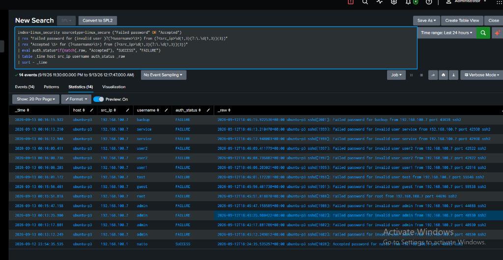

# Lab Evidence & Screenshots — Brute-Force Detection

> **Project:** P4 — Brute-Force Detection & Investigation  
> **Status:** Evidence Collection Scheduled (To Be Captured During P4.1–P4.5 Execution)  
> **Rule:** No fabricated, staged, or placeholder images are permitted. All visual evidence must originate from live Splunk Web and lab virtual machines.

---

## Overview

This directory preserves authentic photographic evidence and screenshots supporting the detection, investigation, and dashboarding deliverables for Project P4.

---

## Evidence Capture Standards

All screenshots added to this directory must satisfy the following criteria:
1. **Unambiguous Telemetry:** Include the complete Splunk search bar, executed SPL query, time picker, and event counts.
2. **Authentic Timestamps:** Timestamps in events and Splunk UI must align with the active lab simulation timeline.
3. **High Resolution:** Clean, uncompressed captures showing readable text and visualizations.
4. **No Sensitive Data:** Exclude production passwords, private keys, or extraneous personal identifiers (lab IP ranges `192.168.100.0/24` are permitted).

---

## Verified Evidence Inventory

| Exhibit ID | File Reference | Description | Status |
|:---:|---|---|:---:|
| **EX-P4-01** | [`p4-02-splunk-search-telemetry.png`](p4-02-splunk-search-telemetry.png) | Splunk Search & Reporting showing parsed authentication failure events and legitimate login from `index=linux_security` (14 events matched). | ✅ Verified |
| **EX-P4-02** | [`p4-03-brute-force-dashboard.png`](p4-03-brute-force-dashboard.png) *(also [`brute-force-dashboard.png`](brute-force-dashboard.png))* | Full-screen view of the operational dark-mode **P4 — Brute-Force Detection & Investigation** SOC dashboard with all 7 panels populated. | ✅ Verified |

---

## Visual Exhibits

### Exhibit 1: Live Splunk Search & Field Extraction

### Exhibit 2: Operational SOC Threat Hunting Dashboard

