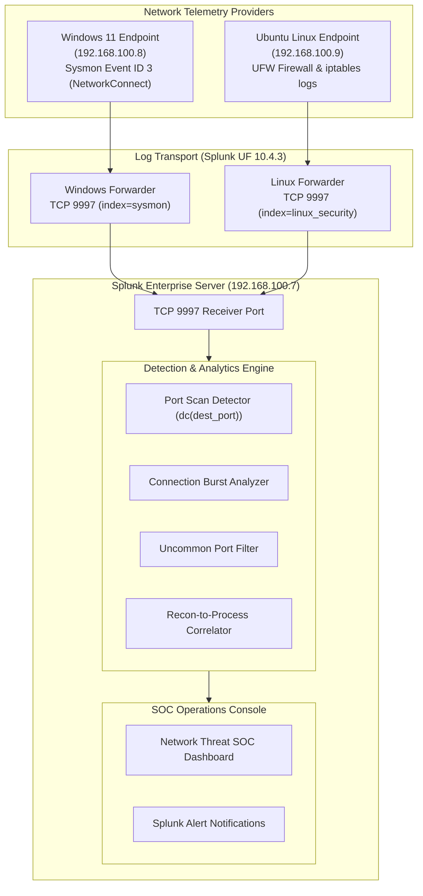

# P5 Architecture — Network Security Telemetry Pipeline

> **Project:** P5 — Network Threat Detection with Splunk  
> **Status:** Architecture Defined (Ingestion Verification Scheduled in P5.1)

---

## 1. Network Telemetry Architecture

Project P5 instruments endpoint and perimeter network sensors across the virtual lab to capture and analyze connection attempts, port probes, and traffic anomalies.

---

## 2. Key Data Sources & Schemas

### Windows Sysmon Event ID 3 (NetworkConnect)
- **Index:** `sysmon`
- **Sourcetype:** `XmlWinEventLog:Microsoft-Windows-Sysmon/Operational`
- **Fields:** `SourceIp`, `DestinationIp`, `DestinationPort`, `Protocol`, `Image` (Process), `User`

### Linux Firewall Logs (UFW / iptables)
- **Index:** `linux_security`
- **Sourcetype:** `syslog` / `ufw`
- **Fields:** `SRC`, `DST`, `DPT` (Destination Port), `PROTO`
