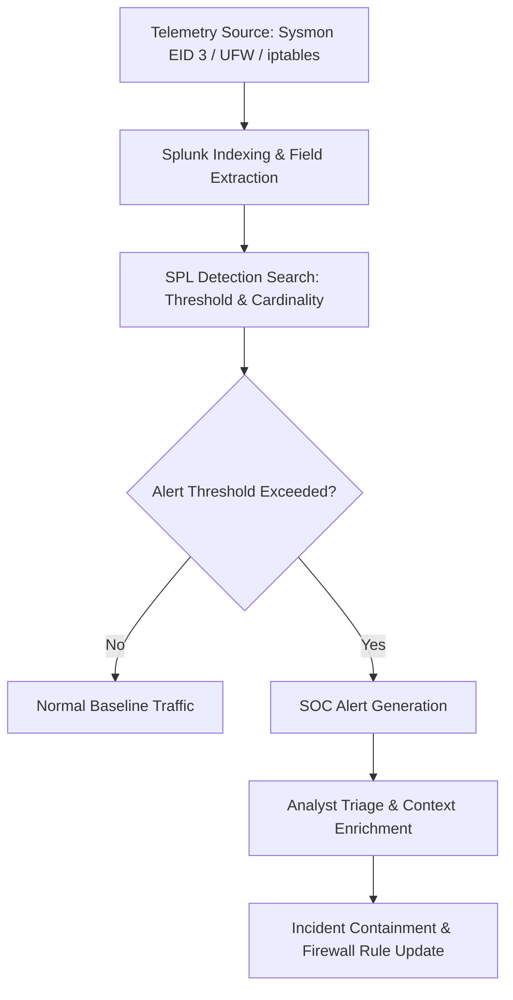

# P5 Detection Methodology — Network Threat Engineering & Tuning Framework

> **Project:** P5 — Network Threat Detection with Splunk  
> **Status:** Framework Documented (Validation and Tuning in P5.2 & P5.3)

---

## 1. Detection Engineering Principles

Network threat detection identifies adversarial reconnaissance, lateral movement probing, and command-and-control (C2) communications before compromise or data exfiltration escalates. Network detection must balance fidelity (catching unauthorized scans and anomalous connections) and noise reduction (filtering out normal network services, DNS resolution, and legitimate administrative operations).

### Core Principles:
1. **Telemetry-First Validation:** Confirm network telemetry sources (e.g., Sysmon Event ID 3 NetworkConnect, Linux firewall/iptables/UFW, Zeek/Suricata, or router logs) and their field extractions (`src_ip`, `dest_ip`, `dest_port`, `Image`, `Protocol`).
2. **Behavioral Cardinality & Velocity:** Attackers probing networks exhibit high distinct port/host counts or extreme connection rates per unit time compared to benign workstation or server traffic.
3. **Multi-Vector Correlation:** Correlate external or suspicious internal source IPs across destination ports, protocol standards, and connection states to distinguish automated scanners from targeted adversary actions.

---

## 2. Detection Logic Archetypes

| Archetype | Technique | SPL Operator / Approach | Target Threat Scenario | MITRE ATT&CK |
|---|---|---|---|:---:|
| **Vertical Port Scan** | Distinct destination port count per target | `stats dc(dest_port) as target_ports count by src_ip, dest_ip` + `where target_ports >= 5` | Single host service enumeration | T1046 |
| **Horizontal Sweep** | Distinct destination IP count for single port | `stats dc(dest_ip) as scanned_hosts by src_ip, dest_port` + `where scanned_hosts >= 3` | Network host discovery & sweep | T1046, T1018 |
| **High-Volume Velocity** | Connection spike in short time window | `bin _time span=1m` + `stats count as conn_count by src_ip, dest_ip` + `where conn_count > 30` | SYN flooding, fast automated scanning, DoS | T1498, T1046 |
| **Uncommon / Backdoor Ports** | Filter on non-standard service ports | `where NOT (dest_port IN (80,443,53,123,8000,9997,8089,22,3389))` | Reverse shells, C2 beacons, backdoor listeners | T1571, T1071 |
| **Reconnaissance Correlation** | Multi-phase scan-to-exploit sequencing | `stats min(_time) as first_seen max(_time) as last_seen dc(dest_port) values(dest_port) count by src_ip, dest_ip` | Full reconnaissance campaign analysis | T1046, T1595 |

---

## 3. False Positive Mitigation Strategies

Network monitoring rules frequently encounter benign operational spikes if thresholds are overly sensitive:

1. **Vulnerability Scanners & Asset Discovery Tools:**
   - *Symptom:* Authorized scanners (e.g., Nessus, Qualys, Wazuh vulnerability detector) scanning enterprise subnets.
   - *Tuning Action:* Whitelist authorized vulnerability scanner IPs in a lookup table or macro (`lookup authorized_scanners.csv`).
2. **Ephemeral Client Ports & Dynamic Range:**
   - *Symptom:* Detections mistakenly alerting on client source ports (`src_port > 49151`).
   - *Tuning Action:* Ensure queries explicitly evaluate target service ports (`dest_port`) rather than ephemeral source ports.
3. **Legitimate Network Broadcast & Multicast:**
   - *Symptom:* Local subnet discovery protocols (SSDP `1900`, mDNS `5353`, NetBIOS `137-138`, LLMNR `5355`).
   - *Tuning Action:* Exclude multicast (`224.0.0.0/4`) and broadcast (`255.255.255.255`, `*.255`) destinations for port scan alerts unless detecting local poisoned name resolution (LLMNR/NBT-NS spoofing).

---

## 4. Alert Severity Matrix

| Detection Rule | Criteria | Severity | Actionable Response |
|---|---|:---:|---|
| **High-Velocity Vertical Port Scan** | $\ge 15$ distinct ports probed within 1m | **HIGH** | Inspect source IP, review targeted host services, apply firewall drop rule. |
| **Horizontal Network Sweep** | $\ge 5$ distinct hosts probed on same port in 2m | **HIGH** | Trace source workstation for signs of lateral compromise. |
| **Suspicious Backdoor Port Connection** | Established session to uncommon ports (e.g., 4444, 1337, 31337) | **CRITICAL** | Immediate host isolation; review initiating process execution path and command line. |
| **Low-and-Slow Reconnaissance** | $\ge 5$ distinct ports over extended 30m window | **MEDIUM** | Add source IP to dynamic watch list; correlate with subsequent authentication or exploitation logs. |

---

## 5. Verification & Validation Workflow

