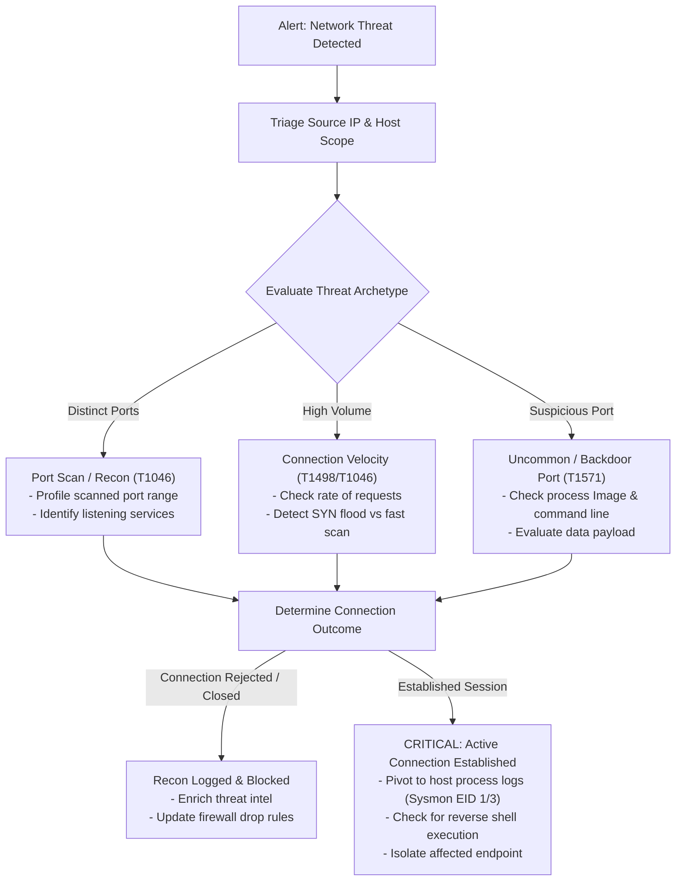

# P5 SOC Investigation Playbook & MITRE ATT&CK Mapping

> **Project:** P5 — Network Threat Detection with Splunk  
> **Status:** Playbook Established (Live Incident Investigation in P5.4)

---

## 1. SOC Analyst Network Investigation Workflow

When a network threat detection alert triggers (e.g., port scan, connection velocity spike, or backdoor port connection), the SOC analyst must follow a structured playbook to answer four key questions:
1. **Source Identification:** Who is initiating the traffic? (Internal host, external IP, subnet, MAC, host identity)
2. **Target Scope:** What destination hosts and ports are being probed or accessed?
3. **Intent & State:** Was this passive recon, active service probing, unauthorized access, or a completed TCP handshake?
4. **Follow-on Activity:** Did the scan lead to exploitation attempts, brute-force attacks, or payload delivery?



---

## 2. Step-by-Step Network Investigation Procedure

### Step 1: Initial Triage & Source Attribution
- Query Splunk for all connections originating from the suspect IP across the environment:
  ```spl
  (index=sysmon EventCode=3) OR (index=linux_security) src_ip="<SUSPECT_IP>"
  | stats count min(_time) as first_seen max(_time) as last_seen dc(dest_ip) as distinct_targets dc(dest_port) as distinct_ports by src_ip
  ```
- Classify the source:
  - Internal IP: Potential compromised endpoint acting as a pivot point (lateral reconnaissance).
  - External IP: Perimeter reconnaissance or direct external exploitation attempt.

### Step 2: Reconnaissance Scoping & Target Profiling
- Assess the scan breadth and depth:
  - **Horizontal:** Single or few ports across many internal hosts (e.g., searching for SMB `445` or SSH `22`).
  - **Vertical:** Comprehensive scan of many ports on a single critical server or domain controller.
- List the ports probed and cross-reference with known services running on the target.

### Step 3: Pivot to Endpoint Telemetry (Host Correlation)
- If Sysmon Event Code 3 is available, inspect the initiating or receiving binary:
  - `Image` (e.g., `C:\Windows\System32\cmd.exe`, `powershell.exe`, or unknown executable in `AppData\Local\Temp`).
  - `ProcessId` and parent process (`ParentImage`).
- Correlate with Sysmon Event ID 1 (Process Creation) to determine how the connection was initiated.

### Step 4: Containment & Remediation Actions
1. **Network Containment:** Block the malicious IP at perimeter firewalls or host iptables/UFW.
2. **Host Isolation:** If an internal host is generating malicious scans, isolate the endpoint from the network.
3. **Vulnerability Assessment:** Verify that none of the targeted listening services on scanned hosts were unpatched or vulnerable.

---

## 3. MITRE ATT&CK Mapping

| Tactic | Technique ID | Technique Name | Detection Scenario in P5 |
|---|---|---|---|
| **Reconnaissance** | **T1595.001** | Active Scanning: Scanning IP Blocks | Horizontal subnet sweeps across enterprise IPs |
| **Reconnaissance** | **T1595.002** | Active Scanning: Vulnerability / Port Scanning | Probing multiple ports on target hosts |
| **Discovery** | **T1046** | Network Service Discovery | Adversary enumerating listening services on endpoints |
| **Discovery** | **T1018** | Remote System Discovery | Discovery of other systems on the local network |
| **Command & Control** | **T1571** | Non-Standard Port | Communication using non-default ports (e.g., reverse shells) |
| **Command & Control** | **T1071** | Application Layer Protocol | Network communication over web or generic protocols |
| **Impact** | **T1498** | Network Denial of Service | High-volume connection flooding targeting services |
