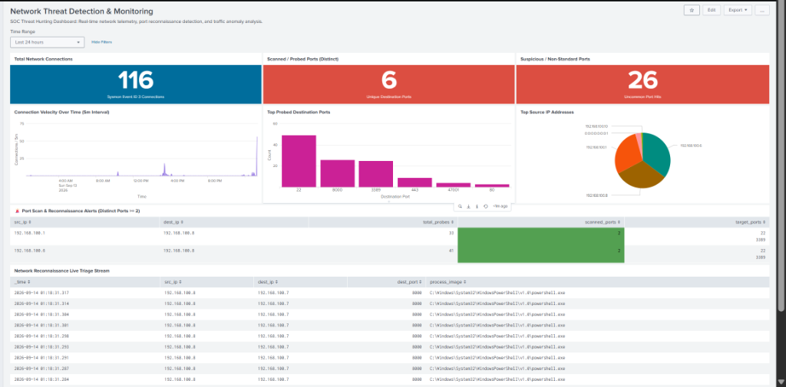
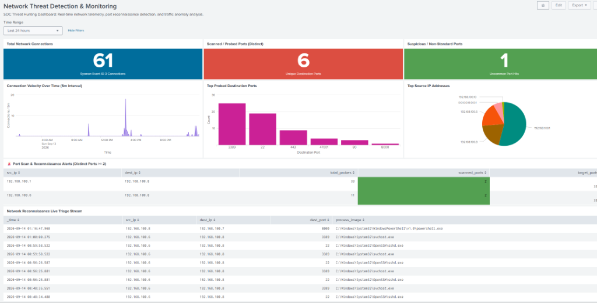
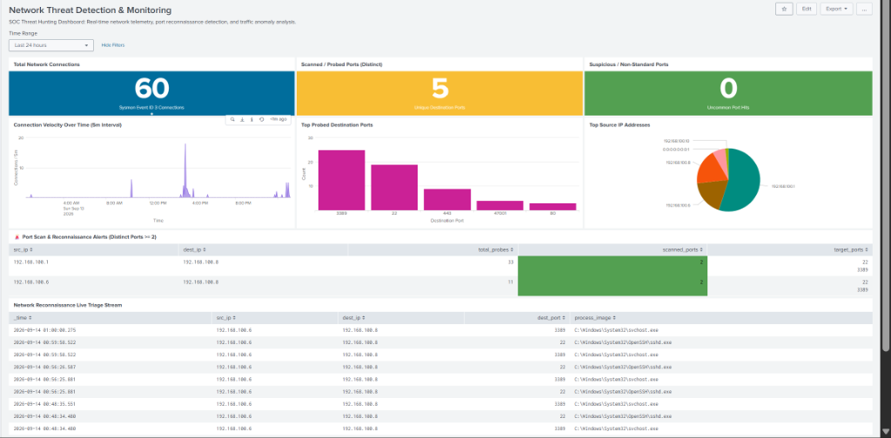

# Lab Evidence & Screenshots — Network Threat Detection

> **Project:** P5 — Network Threat Detection with Splunk  
> **Status:** ✅ Evidence Collection Active & Verified  
> **Rule:** No fabricated, staged, or placeholder images are permitted. All visual evidence originates from live Splunk Web and lab virtual machines.

---

## Overview

This directory preserves authentic photographic evidence and screenshots supporting the network threat detection, port scan telemetry, investigation, and dashboarding deliverables for Project P5.

---

## Evidence Capture Standards

All screenshots added to this directory satisfy the following criteria:
1. **Unambiguous Telemetry:** Include the complete Splunk search bar, executed SPL query, time picker, and event counts.
2. **Authentic Timestamps:** Timestamps in events and Splunk UI align with the active lab simulation timeline (`2026-09-14`).
3. **High Resolution:** Clean, uncompressed captures showing readable text and visualizations.
4. **No Sensitive Data:** Exclude production passwords, private keys, or extraneous personal identifiers (lab IP ranges `192.168.100.0/24` are permitted).

---

## Evidence Inventory

| Exhibit ID | File Reference | Description | Status |
|:---:|---|---|:---:|
| **EX-P5-01** | [`p5-01-network-threat-monitoring-dashboard.png`](p5-01-network-threat-monitoring-dashboard.png) | Full-screen view of the operational dark-mode **P5 — Network Threat Detection & Monitoring** SOC dashboard showing 116 events, connection velocity spike, port distribution, and triage stream. | ✅ Verified |
| **EX-P5-02** | [`p5-02-port-scan-detection-search.png`](p5-02-port-scan-detection-search.png) | SPL detection query identifying port scan activity with distinct port counts (`scanned_ports >= 2`) and attacker attribution (`192.168.100.6`). | ✅ Verified |
| **EX-P5-03** | [`p5-03-sysmon-eid3-telemetry-extraction.png`](p5-03-sysmon-eid3-telemetry-extraction.png) | Splunk Search & Reporting showing ingested and extracted Sysmon Event ID 3 network connection telemetry (`src_ip`, `dest_ip`, `dest_port`, `process_image`). | ✅ Verified |

---

## Visual Exhibits

### Exhibit EX-P5-01: Operational Network Threat Detection Dashboard

*Figure 1: Operational dark-mode SOC dashboard displaying live connection velocity spike, active port scan reconnaissance alerts, uncommon port detection, and real-time triage event stream.*

---

### Exhibit EX-P5-02: Port Scan Detection SPL Execution

*Figure 2: Production SPL query identifying multi-port reconnaissance from Kali Linux (`192.168.100.6`) and gateway (`192.168.100.1`) targeting Windows 11 endpoint.*

---

### Exhibit EX-P5-03: Sysmon Event ID 3 Telemetry Field Extraction

*Figure 3: Regular expression extraction of Sysmon Event ID 3 XML attributes, surfacing socket endpoints, destination ports, and initiating executable binaries.*
