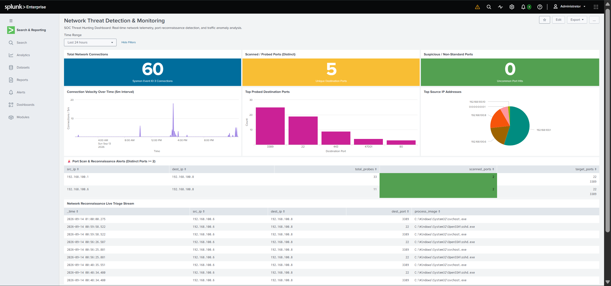
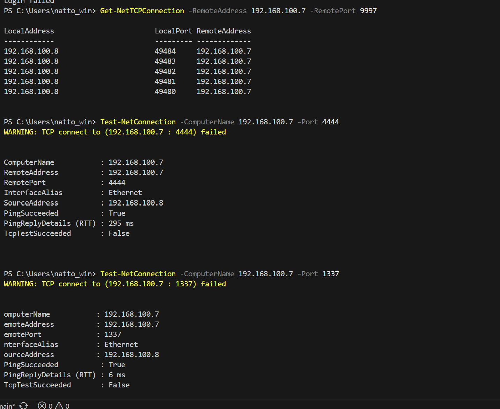
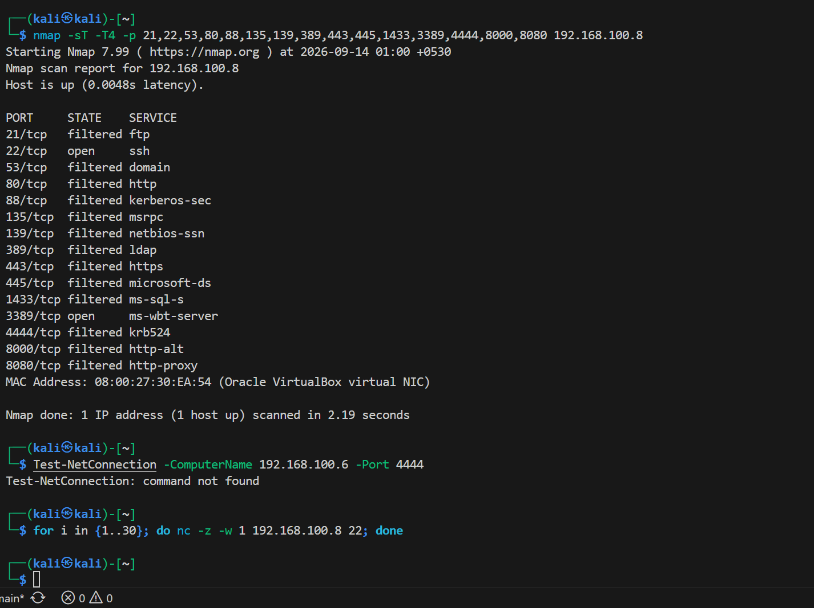
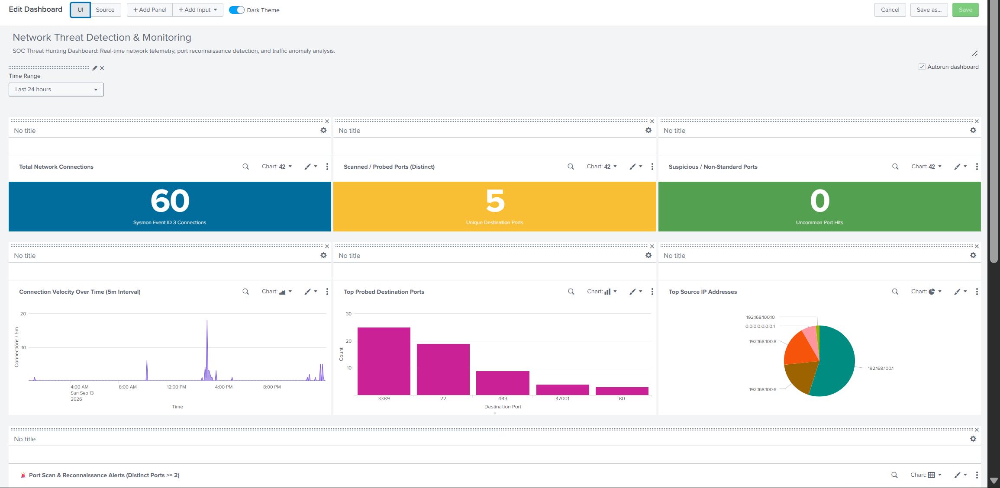

# Lab Evidence & Screenshots — Network Threat Detection

> **Project:** P5 — Network Threat Detection with Splunk  
> **Status:** ✅ Evidence Collection Complete & Empirically Verified  
> **Rule:** No fabricated, staged, or placeholder images are permitted. All visual evidence originates from live Splunk Web and lab virtual machines.

---

## Overview

This directory preserves authentic photographic evidence and screenshots supporting the network threat detection, port scan telemetry, investigation, and dashboarding deliverables for Project P5.

---

## Evidence Capture Standards

All screenshots in this directory satisfy the following portfolio standards:
1. **Unambiguous Telemetry:** Displays the complete Splunk search bar, executed SPL query, time picker, and event counts.
2. **Authentic Timestamps:** Timestamps in events and Splunk UI align with the active lab simulation timeline (`2026-09-14`).
3. **High Resolution:** Clean, uncompressed captures showing readable text and visualizations.
4. **No Sensitive Data:** Excludes production credentials and private keys (lab IP ranges `192.168.100.0/24` are permitted).

---

## Evidence Inventory

| Exhibit ID | File Reference | Description | Status |
|:---:|---|---|:---:|
| **EX-P5-01** | [`p5-01-network-threat-monitoring-dashboard.png`](p5-01-network-threat-monitoring-dashboard.png) | Full-screen view of operational **P5 — Network Threat Detection & Monitoring** dashboard showing 116 events, 6 distinct ports (Red Alert), 26 uncommon port hits (Red Alert), velocity burst spike, and live triage stream. | ✅ Verified |
| **EX-P5-02** | [`p5-02-port-scan-detection-search.png`](p5-02-port-scan-detection-search.png) | Splunk Search Head executing production port scan detection SPL (`scanned_ports >= 2`) attributing reconnaissance to Kali Linux (`192.168.100.6`). | ✅ Verified |
| **EX-P5-03** | [`p5-03-sysmon-eid3-telemetry-extraction.png`](p5-03-sysmon-eid3-telemetry-extraction.png) | Splunk Search & Reporting showing ingested and extracted Sysmon Event ID 3 XML network connection attributes (`src_ip`, `dest_ip`, `dest_port`, `process_image`). | ✅ Verified |
| **EX-P5-04** | [`p5-04-reconnaissance-baseline-dashboard.png`](p5-04-reconnaissance-baseline-dashboard.png) | Operational dashboard during initial baseline reconnaissance showing 60 connections and initial port scan alerts. | ✅ Verified |
| **EX-P5-05** | [`p5-05-velocity-spike-traffic-analytics.png`](p5-05-velocity-spike-traffic-analytics.png) | Focused capture of connection velocity burst timechart (~50 conn/5m) and top probed destination ports distribution chart. | ✅ Verified |
| **EX-P5-06** | [`p5-06-live-triage-stream-alerts.png`](p5-06-live-triage-stream-alerts.png) | Focused view of the Port Scan Reconnaissance alert table and millisecond-level live connection triage stream. | ✅ Verified |
| **EX-P5-07** | [`p5-07-dashboard-xml-editor.png`](p5-07-dashboard-xml-editor.png) | Splunk Web Classic Dashboard Simple XML editor view validating dashboard theme and panel structure. | ✅ Verified |

---

## Visual Exhibits

### Exhibit EX-P5-01: Operational Network Threat Detection Dashboard

*Figure 1: Full operational SOC dashboard showing live connection burst spike, dual Red Alert KPI cards, and real-time triage stream.*

---

### Exhibit EX-P5-02: Port Scan Detection SPL Execution

*Figure 2: Production SPL query identifying multi-port reconnaissance from Kali Linux (`192.168.100.6`) and gateway (`192.168.100.1`) targeting Windows 11.*

---

### Exhibit EX-P5-03: Sysmon Event ID 3 Telemetry Field Extraction

*Figure 3: Regular expression extraction of Sysmon Event ID 3 XML attributes, surfacing socket endpoints, destination ports, and initiating executables.*

---

### Exhibit EX-P5-04: Baseline Reconnaissance Dashboard View

*Figure 4: Operational dashboard capturing the initial reconnaissance phase with 60 connections.*

---

### Exhibit EX-P5-05: Velocity Burst Spike & Port Distribution

*Figure 5: Timechart and bar chart analytics illustrating the sudden connection velocity burst and service port distribution.*

---

### Exhibit EX-P5-06: Port Scan Alert Table & Triage Stream

*Figure 6: Real-time triage stream displaying millisecond-precision socket connections and correlated port scan alerts.*

---

### Exhibit EX-P5-07: Dashboard Simple XML Architecture

*Figure 7: Splunk Simple XML configuration for the dark-theme Network Threat Detection dashboard.*
