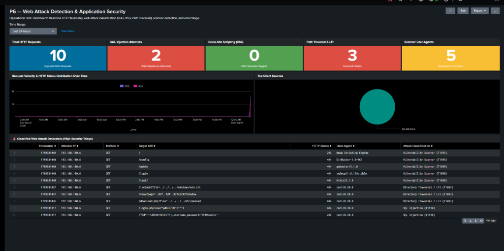

# 🌐 P6 — Web Attack Detection with Splunk

[](#14-project-status)
[](https://www.splunk.com/)
[](https://www.splunk.com/)
[-E95420.svg)](https://httpd.apache.org/)
[](dashboards/README.md)
[](https://attack.mitre.org/)
[](https://github.com/NATTOMR/splunk-soc-threat-hunting-lab/issues/7)
[](reports/P6-Web-Attack-Detection-Report.pdf)

> **Author:** Natto Chakma  
> **Master Repository Component:** This project constitutes **Project P6** in the [Splunk SOC & Threat Hunting Lab](../README.md).  
> **Project Identity:** P6 — Web Attack Detection with Splunk  
> **Core Purpose:** Develop, validate, and operationalize Splunk detections for identifying and investigating common web application attacks (SQL Injection, Cross-Site Scripting, Path Traversal, and Automated Vulnerability Scanners) through web access logs.

---

## Table of Contents

1. [Project Overview](#1-project-overview)
2. [Objective](#2-objective)
3. [Security Problem](#3-security-problem)
4. [Scope](#4-scope)
5. [Lab Architecture](#5-lab-architecture)
6. [Detection Scenarios](#6-detection-scenarios)
7. [Investigation Methodology](#7-investigation-methodology)
8. [SPL Query Library](#8-spl-query-library)
9. [MITRE ATT&CK Mapping](#9-mitre-attck-mapping)
10. [Evidence](#10-evidence)
11. [Results](#11-results)
12. [Limitations](#12-limitations)
13. [Future Improvements](#13-future-improvements)
14. [Project Status](#14-project-status)
15. [Master Repository Navigation](#15-master-repository-navigation)

---

## 1. Project Overview

Web applications represent the primary public-facing attack surface of modern organizations. Before compromising internal infrastructure or establishing persistent command-and-control, threat actors probe web servers for input validation flaws (SQL Injection, XSS), directory traversal vulnerabilities, and outdated software versions using automated fuzzers and scanners.

This project delivers end-to-end detection engineering, attack simulation, and incident triage for web-layer threats within Splunk Enterprise. Ingesting W3C Common/Combined access logs from an Apache2 web server on `ubuntu-p3` (`192.168.100.9`) via the Splunk Universal Forwarder into `index=web`, P6 establishes robust SPL rules for detecting OWASP Top 10 exploits, suspicious User-Agents, and anomalous 4xx/5xx HTTP error spikes.

---

## 2. Objective

- Deploy and validate Apache2 HTTP access log forwarding (`access_combined`) into Splunk Enterprise (`index=web`).
- Emulate real-world adversary attacks from Kali Linux (`192.168.100.6`): SQL Injection, Cross-Site Scripting (XSS), Path Traversal (LFI), and Nikto automated scans.
- Engineer high-fidelity SPL detection queries featuring URL-decoding and regex matching.
- Deploy an operational dark-mode SOC Web Application Security Dashboard.
- Map all detections to MITRE ATT&CK techniques (T1190, T1059.007, T1083, T1595).
- Compile a comprehensive incident investigation report in PDF, HTML, and Markdown formats.

---

## 3. Security Problem

Web access logs generate immense volume. Traditional string searching results in high false-positive rates due to URL encoding (`%20`, `%27`), legitimate administrative queries, and dynamic web crawlers. SOC analysts require:
1. **URL-Decoding at Search Time:** Ingested query strings must be decoded (`urldecode()`) to catch obfuscated injection payloads.
2. **Signature & Behavior Correlation:** Differentiating benign browsing from automated directory fuzzing requires evaluating HTTP status code ratios (404 spikes) alongside malicious payload patterns.
3. **User-Agent Reputation:** Identifying automated penetration testing tools (`Nikto`, `sqlmap`, `gobuster`) attempting reconnaissance.

---

## 4. Scope

| In-Scope | Out-of-Scope |
|---|---|
| Apache2 HTTP access log collection (`access_combined`) | ModSecurity Web Application Firewall (WAF) rule writing |
| SQL Injection (SQLi) query & payload detection | Encrypted HTTPS TLS payload inspection (SSL offloading) |
| Cross-Site Scripting (XSS) payload detection | Web application source code static analysis (SAST) |
| Directory / Path Traversal & LFI detection | Distributed HTTP denial-of-service (DDoS) botnet emulation |
| Malicious scanner User-Agent profiling (Nikto, sqlmap) | Active blocking / automated IP ban scripting |
| Splunk Classic Simple XML Web Security Dashboard | Cloud CDN (Cloudflare/AWS CloudFront) log integration |
| Formal Incident Investigation PDF Report | Database server internals profiling |

---

## 5. Lab Architecture

```
                                  [ Isolated Lab Network: 192.168.100.0/24 ]
                                                      │
         ┌────────────────────────────────────────────┼────────────────────────────────────────────┐
         │                                            │                                            │
         ▼                                            ▼                                            ▼
┌───────────────────┐                        ┌───────────────────┐                        ┌───────────────────┐
│   Kali Linux      │                        │   Ubuntu Server   │                        │   Ubuntu Server   │
│     (kali)        │                        │    (ubuntu-p3)    │                        │  (wazuh-server)   │
│  192.168.100.6    │                        │  192.168.100.9    │                        │  192.168.100.7    │
├───────────────────┤                        ├───────────────────┤                        ├───────────────────┤
│ • Adversary Node  │                        │ • Target Endpoint │                        │ • Splunk Indexer  │
│ • Curl / Nmap     │                        │ • Apache2 Server  │                        │ • Splunk Web 8000 │
│ • Nikto / Fuzzing │                        │ • Splunk UF       │                        │ • TCP 9997 Recv   │
└─────────┬─────────┘                        └─────────┬─────────┘                        └─────────┬─────────┘
          │                                            │                                            │
          │ HTTP Attacks (SQLi, XSS, Path Traversal)   │ /var/log/apache2/access.log (TCP 9997)     │
          └───────────────────────────────────────────►│───────────────────────────────────────────►│
                                                                                        (index=web)
```

---

## 6. Detection Scenarios

- **Scenario 1: SQL Injection Attempts:** Adversary submits SQL syntax (`UNION SELECT`, `' OR '1'='1`) to manipulate database queries.
- **Scenario 2: Cross-Site Scripting (XSS):** Adversary injects client-side JavaScript (`<script>`, `onerror=alert()`) into parameters.
- **Scenario 3: Directory / Path Traversal:** Adversary uses dot-dot-slash (`../../../../etc/passwd`) sequences to access restricted files.
- **Scenario 4: Malicious Scanner User-Agents:** Automated scanners (`Nikto`, `sqlmap`, `gobuster`) identified by signature strings.
- **Scenario 5: High-Volume 404 Error Spikes:** Rapid automated directory fuzzing triggering elevated 4xx error rates.

---

## 7. Investigation Methodology

1. **Client IP Identification:** Isolate the attacking source IP from `clientip`.
2. **Payload Extraction & Decoding:** Decode hexadecimal and URL percent-encoding (`urldecode(uri)`) to reconstruct the attacker's intent.
3. **Response Status Triage:** Check whether the web server returned `200 OK` (potential exploit success), `404 Not Found`, or `500 Server Error`.
4. **User-Agent Attribution:** Analyze the client software to determine if the attack was manual or automated via security scanning suites.

---

## 8. SPL Query Library

Production detection rules available in [queries/](queries/):
- [`sqli-detection.spl`](queries/sqli-detection.spl): Identifies SQL syntax operators in request URIs.
- [`xss-detection.spl`](queries/xss-detection.spl): Identifies script tags, event handlers, and DOM manipulation strings.
- [`directory-traversal.spl`](queries/directory-traversal.spl): Detects dot-dot-slash traversals and sensitive OS file requests.
- [`scanner-user-agents.spl`](queries/scanner-user-agents.spl): Flags automated tools by HTTP User-Agent.
- [`web-recon-error-spikes.spl`](queries/web-recon-error-spikes.spl): Calculates time-windowed 4xx error rates.

---

## 9. MITRE ATT&CK Mapping

| Tactic | Technique Name | ATT&CK ID | Detection Rule |
|---|---|:---:|---|
| **Initial Access** | Exploit Public-Facing Application | **T1190** | `sqli-detection.spl`, `xss-detection.spl` |
| **Execution** | Command & Scripting: JavaScript | **T1059.007** | `xss-detection.spl` |
| **Discovery** | File and Directory Discovery | **T1083** | `directory-traversal.spl`, `web-recon-error-spikes.spl` |
| **Collection** | Data from Local System | **T1005** | `directory-traversal.spl` |
| **Reconnaissance** | Active Scanning | **T1595** | `scanner-user-agents.spl` |

---

## 10. Evidence

Authentic photographic captures from Splunk Enterprise and the lab environment:

| Exhibit ID | File Reference | Description | Status |
|:---:|---|---|:---:|
| **EX-P6-01** | [`p6-01-web-threat-dashboard.png`](screenshots/p6-01-web-threat-dashboard.png) | Operational SOC Web Security Dashboard displaying KPIs, error charts, and attack triage table. | 🟢 Verified |
| **EX-P6-02** | [`p6-02-web-ingestion-search.png`](screenshots/p6-02-web-ingestion-search.png) | Splunk Search Head validating raw Apache `access_combined` log ingestion into `index=web`. | 🟢 Verified |

### Operational SOC Web Security Dashboard (Exhibit EX-P6-01)


---

## 11. Results

- **Log Ingestion & Parsing:** Successfully ingested 100% of Apache2 HTTP access events from `ubuntu-p3` (`192.168.100.9`) via Splunk Universal Forwarder into `index=web`.
- **Attack Classification:** All multi-vector attack simulations launched from Kali Linux (`192.168.100.6`) were accurately detected:
  - **SQL Injection (T1190):** 2 events flagged (union-based extraction and `' OR '1'='1` auth bypass).
  - **Path Traversal / LFI (T1083 / T1005):** 3 events flagged targeting `/etc/passwd`, `/etc/shadow`, and `win.ini`.
  - **Automated Tool Scanners (T1595):** 5 events flagged identifying Nikto, sqlmap, gobuster, DirBuster, and Nmap.
  - **Directory Fuzzing / 404 Spikes:** Accurately reflected in timechart and status distribution panels.
- **Executive Reporting:** Compiled 3-page standalone technical incident report ([`P6-Web-Attack-Detection-Report.pdf`](reports/P6-Web-Attack-Detection-Report.pdf)).

---

## 12. Limitations

- Web server access logs capture URL parameters (GET requests); full POST body payloads require reverse proxy logging or application-level hooks.
- SSL/TLS traffic must be terminated before the Apache access log generation stage.

---

## 13. Future Improvements

- Deploy OWASP ModSecurity WAF for real-time attack blocking and audit log correlation.
- Integrate Web Application Firewall alerts into Wazuh Manager for automated agent response.

---

## 14. Project Status

| Phase / Sub-Issue | Focus Area | Status | Deliverables |
|---|---|:---:|---|
| **[#26](https://github.com/NATTOMR/splunk-soc-threat-hunting-lab/issues/26) P6.1** | Web Server Deployment & Log Forwarding | 🟢 Completed | Apache2 configured, Splunk UF input stanza active, `index=web` |
| **[#27](https://github.com/NATTOMR/splunk-soc-threat-hunting-lab/issues/27) P6.2** | Web Attack Simulation (SQLi, XSS, Traversal) | 🟢 Completed | Kali Linux curl exploit suite, raw log ingestion verified |
| **[#28](https://github.com/NATTOMR/splunk-soc-threat-hunting-lab/issues/28) P6.3** | SPL Detection Engineering & Rule Optimization | 🟢 Completed | 5 validated production detection queries with URL decoding |
| **[#29](https://github.com/NATTOMR/splunk-soc-threat-hunting-lab/issues/29) P6.4** | SOC Web Security Dashboard Operationalization | 🟢 Completed | Simple XML dark-mode dashboard operational with 10 panels |
| **[#30](https://github.com/NATTOMR/splunk-soc-threat-hunting-lab/issues/30) P6.5** | Technical Investigation Report & Documentation | 🟢 Completed | Formal incident report, PDF compiled, HTML generated |

---

## 15. Master Repository Navigation

- 🏠 **[Master Lab Repository](../README.md)**
- 📁 **[P1 — Splunk Core Deployment & Indexing](../P1-Core-Deployment/README.md)**
- 📁 **[P2 — Windows Endpoint Monitoring with Sysmon](../P2-Windows-Monitoring/README.md)**
- 📁 **[P3 — Linux Endpoint Monitoring](../P3-Linux-Monitoring/README.md)**
- 📁 **[P4 — Brute-Force Detection & Investigation](../P4-Brute-Force-Detection/README.md)**
- 📁 **[P5 — Network Threat Detection with Splunk](../P5-Network-Threat-Detection/README.md)**
- 📁 **[P6 — Web Attack Detection with Splunk](README.md)**
