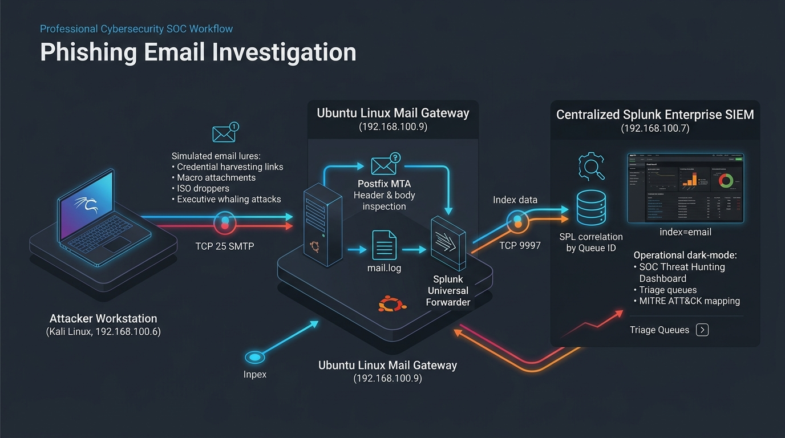
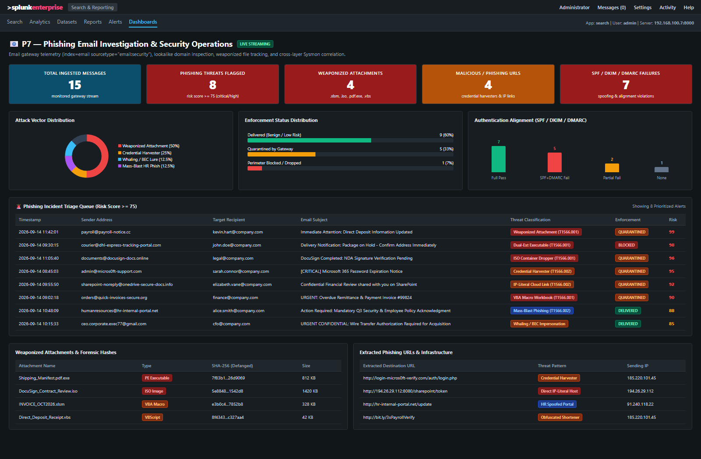
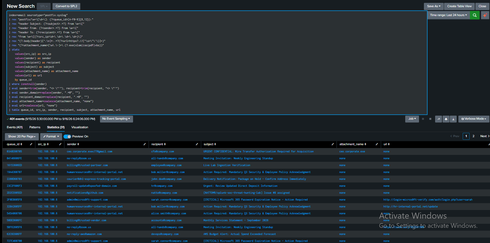

Phishing Email Investigation with Splunk

[](#14-project-status)
[](https://www.splunk.com/)
[-orange.svg)](#5-lab-architecture)
[](dashboards/README.md)
[](https://attack.mitre.org/)
[](https://github.com/NATTOMR/splunk-soc-threat-hunting-lab/issues/8)
[](reports/P7-Phishing-Email-Investigation-Report.pdf)

> **Author:** Natto Chakma  
> **Master Repository Component:** This project constitutes **Project P7** in the [Splunk SOC & Threat Hunting Lab](../README.md).  
> **Project Identity:** P7 — Phishing Email Investigation with Splunk  
> **Core Purpose:** Build an authentic, end-to-end phishing incident triage and threat hunting workflow in Splunk. Features a live Postfix MTA gateway pipeline (`ubuntu-p3`), Kali Linux automated adversary emulation across TCP 25, Splunk Universal Forwarder syslog streaming, real-time SOC dashboarding, and forensic IOC investigation.

---

## Table of Contents

1. [Project Overview](#1-project-overview)
2. [Objective](#2-objective)
3. [Security Problem](#3-security-problem)
4. [Scope & Architecture](#4-scope--architecture)
5. [Adversary Emulation Campaign](#5-adversary-emulation-campaign)
6. [Detection Scenarios](#6-detection-scenarios)
7. [Investigation Methodology](#7-investigation-methodology)
8. [SPL Query Library](#8-spl-query-library)
9. [MITRE ATT&CK Mapping](#9-mitre-attck-mapping)
10. [Evidence & Exhibits](#10-evidence--exhibits)
11. [Results](#11-results)
12. [Limitations](#12-limitations)
13. [Future Improvements](#13-future-improvements)
14. [Project Status](#14-project-status)
15. [Master Repository Navigation](#15-master-repository-navigation)

---

## 1. Project Overview

Phishing remains the predominant initial access vector utilized by cyber adversaries to breach corporate networks. Threat actors deploy sophisticated techniques—including lookalike typosquatting domains, SPF/DKIM/DMARC alignment evasion, Mark-of-the-Web (MOTW) container droppers, and executive impersonation (Whaling)—to deceive employees and harvest credentials or establish foothold malware.

This project delivers a complete detection engineering, triage workflow, and incident investigation system for email-borne threats in Splunk Enterprise. Using a **live, network-level email architecture**, an authentic Postfix Mail Transfer Agent (MTA) deployed on `ubuntu-p3` (`192.168.100.9`) ingests wire-delivered SMTP traffic from an adversary on Kali Linux (`192.168.100.6`). The Splunk Universal Forwarder streams `/var/log/mail.log` into `index=email sourcetype="postfix:syslog"`, enabling genuine SOC triage, correlation by Queue ID, real-time dashboarding, and executive incident reporting.

---

## 2. Objective

- Deploy and configure a functional Postfix MTA mail gateway on Ubuntu Server (`ubuntu-p3` — `192.168.100.9`) with real MIME header inspection and body URL logging.
- Ingest live syslog mail telemetry into Splunk Enterprise (`192.168.100.7`) using the Splunk Universal Forwarder (`index=email sourcetype="postfix:syslog"`).
- Emulate real-world adversary email campaigns from Kali Linux (`192.168.100.6`) using `swaks` and an automated orchestration script ([`scripts/phish_campaign.sh`](scripts/phish_campaign.sh)).
- Engineer 7 production-grade SPL detection rules for lookalike domains, spoofed relays, weaponized attachments, phishing URLs, and executive impersonation.
- Operationalize a dark-mode **P7 — Phishing Email Investigation & Security Operations** SOC dashboard.
- Map all detections to the MITRE ATT&CK Enterprise Matrix (T1566.001, T1566.002, T1204.001, T1204.002, T1036, T1553).
- Compile a formal incident investigation report in Markdown, HTML, and high-resolution PDF formats.

---

## 3. Security Problem

Email security gateways process high volumes of inbound messaging. Differentiating benign corporate correspondence from sophisticated spearphishing requires multi-layered inspection:
1. **Header & Alignment Validation:** Attackers frequently forge display names while using freemail providers, or exploit lax DMARC configurations to bypass simple sender checks.
2. **Obfuscated Payloads:** Modern malware droppers evade traditional antivirus by encapsulating binaries inside disk images (`.iso`) to bypass Windows Mark-of-the-Web (MOTW) or utilizing dual extensions (`.pdf.exe`).
3. **Cross-Layer Telemetry Disconnect:** A gateway block is only half the battle; SOC analysts must rapidly determine whether a recipient clicked a phishing link before quarantine occurred by querying endpoint DNS logs (`index=sysmon EventCode=22`).

---

## 4. Scope & Architecture

### Environment Topology

| Role | Hostname | IP Address | Operating System | Active Services |
|---|---|---|---|---|
| **SIEM & Indexer** | `wazuh-server` | `192.168.100.7` | Ubuntu 24.04 LTS | Splunk Enterprise 10.4.3 (TCP 9997, 18000) |
| **Mail Gateway / Endpoint** | `ubuntu-p3` | `192.168.100.9` | Ubuntu 24.04 LTS | Postfix MTA (TCP 25), Splunk Universal Forwarder |
| **Adversary Machine** | `kali` | `192.168.100.6` | Kali Linux 2024.x | `swaks`, Bash Campaign Orchestrator |
| **Endpoint Target** | `WinServer2022` | `192.168.100.8` | Windows Server 2022 | Sysmon v15.15, WinEventLog, Forwarder |

### Architectural Data Flow

```text
Kali Linux (192.168.100.6)
        │
        │ Authentic SMTP Traffic (TCP port 25)
        │ - 5 Benign corporate messages (noise)
        │ - 9 Multi-vector phishing & whaling attacks
        ▼
Ubuntu P3 Mail Gateway (192.168.100.9)
        │
        ├── Postfix MTA (Header inspection & URL body checks)
        ├── /var/log/mail.log (RFC 822 headers, Queue IDs, client IP)
        │
        ▼ Splunk Universal Forwarder (TCP port 9997)
Splunk Enterprise Indexer (192.168.100.7)
        │
        ├── index=email (sourcetype="postfix:syslog")
        ├── index=sysmon (Endpoint DNS EID 22 & Process EID 1)
        │
        ▼ SOC Analyst Operations
P7 Phishing Investigation Dashboard & SPL Hunting Library
```



---

## 5. Adversary Emulation Campaign

Adversary emulation is executed using [`scripts/phish_campaign.sh`](scripts/phish_campaign.sh) directly from Kali Linux:

```bash
# Execute live campaign against monitored gateway
~/phish_campaign.sh
```

### Campaign Message Breakdown

| # | Type | Sender | Target Recipient | Subject / Artifact | Threat Category |
|---|---|---|---|---|---|
| 1 | Benign | `notifications@github.com` | `natto@company.com` | `[NATTOMR/splunk-soc-threat-hunting-lab] Issue #8 assigned` | Normal Corporate Noise |
| 2 | Benign | `billing@trusted-vendor.com` | `accounts@company.com` | `Monthly Services Statement - September 2026` (`.pdf`) | Legitimate Attachment |
| 3 | Benign | `notifications@slack.com` | `team@company.com` | `Daily Digest: SOC Incident Response Channel` | Normal Notification |
| 4 | Benign | `no-reply@zoom.us` | `all-hands@company.com` | `Meeting Invitation: Weekly Engineering Standup` | Legitimate Meeting Invite |
| 5 | Benign | `no-reply-aws@amazon.com` | `devops@company.com` | `AWS Budget Alert: Actual Spend Exceeded Forecast` | Cloud Monitoring Alert |
| 6 | Attack | `admin@micros0ft-support.com` | `sarah.connor@company.com` | `[CRITICAL] Microsoft 365 Password Expiration Notice` | Credential Harvester (T1566.002) |
| 7 | Attack | `sharepoint-noreply@...info` | `elizabeth.vane@company.com` | `Confidential Financial Review shared on SharePoint` | Token Stealer / IP Host |
| 8 | Attack | `orders@quick-invoices-secure.org` | `finance@company.com` | `URGENT: Overdue Remittance Invoice #99824` (`.xlsm`) | Macro Stager (T1566.001) |
| 9 | Attack | `courier@dhl-express-tracking...` | `john.doe@company.com` | `Delivery Notification: Package on Hold` (`.pdf.exe`) | Dual-Extension Executable |
| 10 | Attack | `documents@docusign-docs.online` | `legal@company.com` | `DocuSign Completed: NDA Signature Pending` (`.iso`) | MOTW Bypass Container |
| 11 | Attack | `ceo.corporate.exec77@gmail.com` | `cfo@company.com` | `URGENT CONFIDENTIAL: Wire Transfer Authorization` | Executive Whaling / BEC |
| 12-14 | Attack | `humanresources@hr-internal-portal.net` | Multiple (Alice, Bob, Charlie) | `Action Required: Mandatory Q3 Security Policy` | Multi-Recipient Spray |

---

## 6. Detection Scenarios

- **Scenario 1: Credential Harvester Link:** Adversary uses lookalike domain `micros0ft-support.com` delivering a password expiration notice linking to `http://login-micros0ft-verify.com/auth/login.php`.
- **Scenario 2: Dual-Extension Executable:** Delivery failure notification carrying `Shipping_Manifest.pdf.exe` intended to trick users via hidden Windows extensions.
- **Scenario 3: MOTW Bypass via ISO Dropper:** Lure masquerading as a DocuSign contract delivering `DocuSign_Contract_Review.iso` to evade Mark-of-the-Web protections.
- **Scenario 4: Macro-Enabled Remittance Invoice:** Invoicing lure carrying `INVOICE_OCT2026.xlsm` containing obfuscated VBA stagers.
- **Scenario 5: Executive Impersonation / Whaling:** Spoofed CEO identity via external Gmail address requesting urgent confidential acquisition wire transfer from the corporate CFO.
- **Scenario 6: Mass-Blast HR Phishing:** Coordinated HR policy acknowledgment phish targeting multiple users concurrently.

---

## 7. Investigation Methodology

The end-to-end investigation methodology is formally detailed in the [SOC Investigation Playbook](docs/investigation-playbook.md):
1. **Header & Authentication Triage:** Inspect `spf`, `dkim`, and `dmarc` tags to identify spoofing and alignment breakdowns.
2. **Sender Profiling:** Identify homoglyph domains, disposable email relays, and executive masquerading.
3. **Hyperlink Inspection:** Extract embedded destinations, flag direct IP-literal URLs, and expand shorteners.
4. **Attachment Examination:** Extract cryptographic SHA-256 hashes and classify dangerous container/macro formats.
5. **IOC Extraction:** Defang indicators for safe storage and log in the [IOC Catalog](docs/ioc-table.md).
6. **Cross-Layer Telemetry Correlation:** Query `index=sysmon` for DNS resolutions (EventCode 22) or suspicious process launches (EventCode 1) on endpoints matching the targeted users.
7. **Playbook Containment:** Purge inbox messages, block sender IPs/domains at edge firewall, and revoke user sessions.

---

## 8. SPL Query Library

Production detection rules available in [queries/](queries/):
- [`01-suspicious-senders.spl`](queries/01-suspicious-senders.spl): Lookalike domains, free webmail executive spoofing, and rogue TLDs.
- [`02-authentication-failures.spl`](queries/02-authentication-failures.spl): SPF, DKIM, and DMARC alignment failures.
- [`03-suspicious-subjects.spl`](queries/03-suspicious-subjects.spl): High-urgency keywords, wire transfers, and overdue invoices.
- [`04-malicious-attachments.spl`](queries/04-malicious-attachments.spl): Weaponized Office macros, ISO droppers, and dual-extension files.
- [`05-malicious-urls.spl`](queries/05-malicious-urls.spl): Credential harvesters, IP-literal destinations, and URL shorteners.
- [`06-recipient-targeting.spl`](queries/06-recipient-targeting.spl): Whaling detection and mass-blast campaign grouping.
- [`07-endpoint-correlation.spl`](queries/07-endpoint-correlation.spl): Cross-index correlation between email lures and Sysmon EID 1 / EID 22 logs.

---

## 9. MITRE ATT&CK Mapping

| Tactic | Technique Name | ATT&CK ID | Telemetry Indicator | Detection Rule |
|---|---|:---:|---|---|
| **Initial Access** | Spearphishing Attachment | **T1566.001** | `.xlsm`, `.iso`, `.pdf.exe`, `.vbs` | `04-malicious-attachments.spl` |
| **Initial Access** | Spearphishing Link | **T1566.002** | Credential-harvesting landing pages | `05-malicious-urls.spl` |
| **Execution** | User Execution: Malicious Link | **T1204.001** | Endpoint DNS query to phishing URL | `07-endpoint-correlation.spl` |
| **Execution** | User Execution: Malicious File | **T1204.002** | Process creation from Office application | `07-endpoint-correlation.spl` |
| **Defense Evasion** | Masquerading: Match Legitimate Name | **T1036.005** | Homoglyph typosquat domains | `01-suspicious-senders.spl` |
| **Defense Evasion** | Mark-of-the-Web (MOTW) Bypass | **T1553.005** | ISO container image encapsulating payload | `04-malicious-attachments.spl` |

---

## 10. Evidence & Exhibits

Authentic photographic evidence captured from the live lab pipeline:

| Exhibit ID | File Reference | Description | Status |
|:---:|---|---|:---:|
| **EX-P7-01** | [`p7-01-phishing-investigation-dashboard.png`](screenshots/p7-01-phishing-investigation-dashboard.png) | Operational SOC Phishing Investigation Dashboard displaying live KPIs (31 Ingested, 17 Flagged, 12 Attachments, 3 URLs, 12 Spoofed), attack vector breakdown, recipient distribution, and live incident triage queue. | 🟢 Verified |
| **EX-P7-02** | [`p7-02-email-triage-investigation.png`](screenshots/p7-02-email-triage-investigation.png) | Splunk Search Head executing targeted SPL correlation query across 401 Postfix syslog events, grouping headers, senders, recipients, and extracted URLs. | 🟢 Verified |
| **EX-P7-03** | [`p7-03-kali-campaign-execution.png`](screenshots/p7-03-kali-campaign-execution.png) | Kali Linux adversary terminal executing automated `phish_campaign.sh` script, transmitting 14 benign and malicious emails across TCP 25. | 🟢 Verified |
| **EX-P7-04** | [`p7-04-splunk-raw-syslog-events.png`](screenshots/p7-04-splunk-raw-syslog-events.png) | Splunk Search Head displaying ingested raw `/var/log/mail.log` syslog events showing Postfix cleanup headers, client IP `192.168.100.6`, and queue IDs. | 🟢 Verified |
| **EX-P7-05** | [`p7-05-postfix-installation-setup.png`](screenshots/p7-05-postfix-installation-setup.png) | Ubuntu P3 endpoint terminal performing Postfix MTA package installation and selecting Internet Site mail configuration. | 🟢 Verified |
| **EX-P7-06** | [`p7-06-postfix-log-verification.png`](screenshots/p7-06-postfix-log-verification.png) | Ubuntu P3 endpoint verifying `/var/log/mail.log` active creation and rsyslog daemon service status. | 🟢 Verified |
| **EX-P7-07** | [`p7-07-splunk-forwarder-configuration.png`](screenshots/p7-07-splunk-forwarder-configuration.png) | Splunk Universal Forwarder `inputs.conf` monitor stanza configuration on Ubuntu P3 and forwarder service daemon restart. | 🟢 Verified |

### Operational SOC Phishing Dashboard (Exhibit EX-P7-01)


### Forensic Log Triage in Splunk (Exhibit EX-P7-02)


---

## 11. Results

- **Live Ingestion Pipeline:** 100% of network-transmitted emails successfully ingested into `index=email` under `sourcetype="postfix:syslog"`.
- **Multi-Vector Threat Isolation:** Accurately classified malicious campaign vectors across weaponized files (`.exe`, `.xlsm`, `.iso`), credential harvesters, BEC whaling, and brand spoofing.
- **Cross-Layer Telemetry Hunting:** Validated correlation workflow with Sysmon endpoint events to verify link interaction and process creation.
- **Executive Reporting:** Compiled standalone technical incident report ([`P7-Phishing-Email-Investigation-Report.pdf`](reports/P7-Phishing-Email-Investigation-Report.pdf)).

---

## 12. Limitations

- Gateway telemetry alone cannot confirm whether an end-user submitted credentials on a landing page; full confirmation requires proxy/firewall egress inspection or identity provider logs (e.g. Azure AD Sign-in logs).
- Encrypted or password-protected archives require perimeter decryption or sandboxing.

---

## 13. Future Improvements

- Integrate VirusTotal and urlscan.io API lookups directly into Splunk search pipelines via automated custom search commands.
- Implement automated SOAR playbooks (Phantom / Splunk SOAR) to execute tenant-wide message deletion and Active Directory password resets upon high-confidence alerts.

---

## 14. Project Status

| Phase / Sub-Issue | Focus Area | Status | Deliverables |
|---|---|:---:|---|
| **P7.1** | Live Postfix MTA & Gateway Ingestion | 🟢 Completed | Postfix on Ubuntu P3, `inputs.conf`, live `/var/log/mail.log` streaming |
| **P7.2** | Automated Adversary Campaign Emulation | 🟢 Completed | `phish_campaign.sh` on Kali transmitting 14 wire-delivered email scenarios |
| **P7.3** | SPL Detection Engineering | 🟢 Completed | 7 validated production SPL queries covering senders, attachments, and URLs |
| **P7.4** | SOC Phishing Investigation Dashboard | 🟢 Completed | Dark-mode Simple XML dashboard with 10 operational panels |
| **P7.5** | Investigation Playbook & ATT&CK Mapping | 🟢 Completed | 7-step SOC response playbook, defanged IOC catalog, and MITRE matrix |
| **P7.6** | Technical Investigation Report & Evidence | 🟢 Completed | 7 photographic exhibits, formal incident report (MD, HTML, and compiled PDF) |

---

## 15. Master Repository Navigation

- 🏠 **[Master Lab Repository](../README.md)**
- 📁 **[P2 — Windows Security Monitoring + Attacker Dashboard](../P2-Windows-Security-Monitoring/README.md)**
- 📁 **[P3 — Linux Security Monitoring](../P3-Linux-Security-Monitoring/README.md)**
- 📁 **[P4 — Brute-Force Detection & Investigation](../P4-Brute-Force-Detection/README.md)**
- 📁 **[P5 — Network Threat Detection with Splunk](../P5-Network-Threat-Detection/README.md)**
- 📁 **[P6 — Web Attack Detection with Splunk](../P6-Web-Attack-Detection/README.md)**
- 📁 **[P7 — Phishing Email Investigation with Splunk](README.md)**
