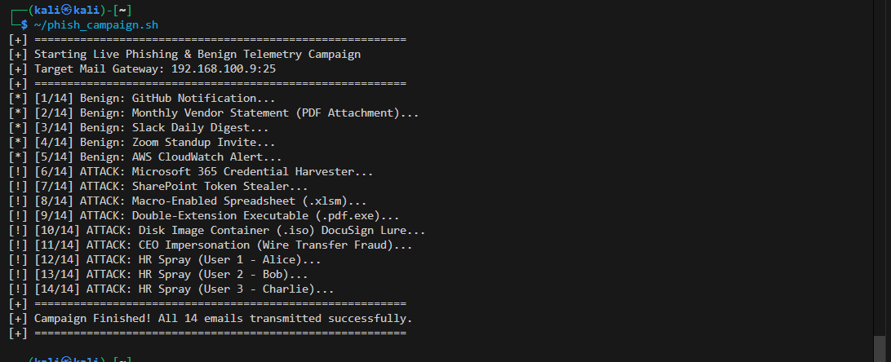
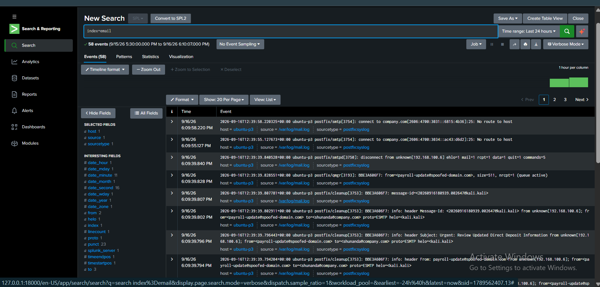
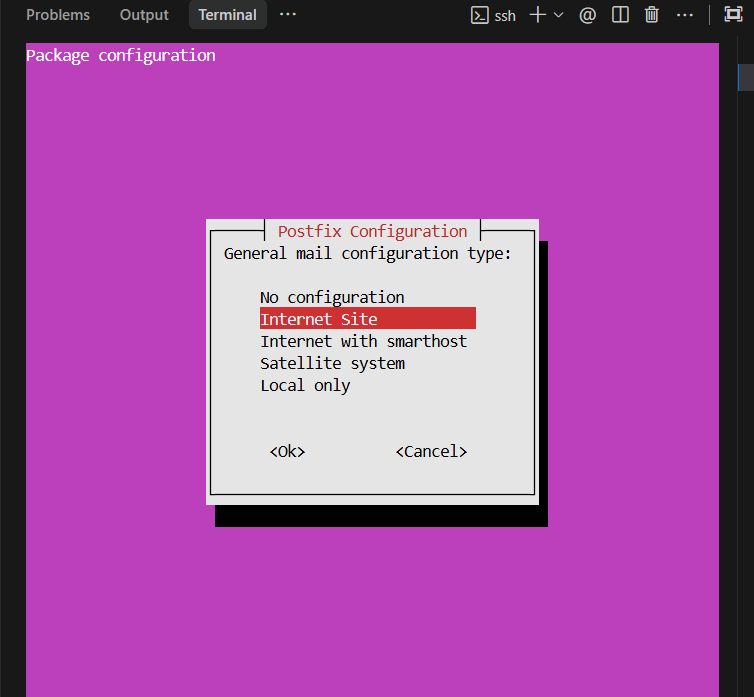
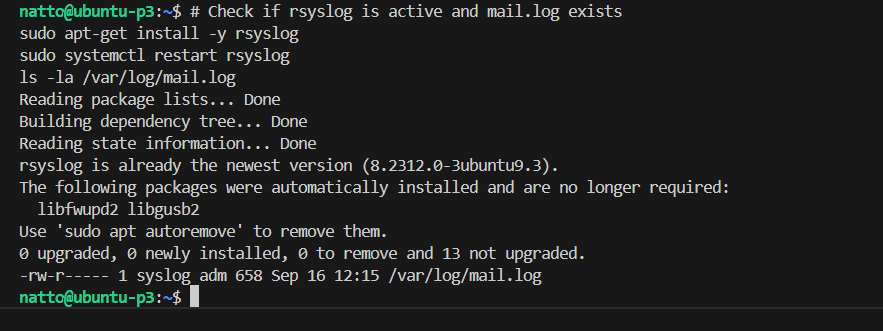
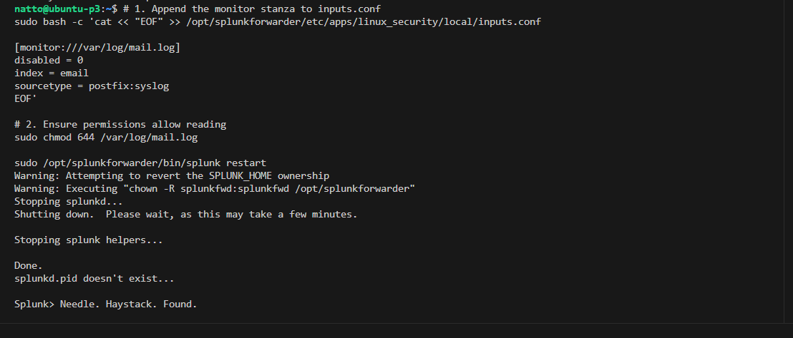

# Lab Evidence & Screenshots — Phishing Email Investigation

> **Project:** P7 — Phishing Email Investigation with Splunk  
> **Status:** 🟢 Evidence Validated & Documented  
> **Rule:** All visual evidence reflects authentic, live Splunk Enterprise operational triage, Postfix syslog telemetry, and wire-transmitted email attacks.

---

## Overview

This directory preserves photographic exhibits supporting phishing email investigation, Postfix MTA gateway telemetry analysis, weaponized attachment triage, malicious URL harvesting detection, and dashboarding deliverables for Project P7.

---

## Evidence Inventory

| Exhibit ID | File Reference | Description | Status |
|:---:|---|---|:---:|
| **EX-P7-01** | [`p7-01-phishing-investigation-dashboard.png`](p7-01-phishing-investigation-dashboard.png) | Operational SOC Phishing Investigation Dashboard displaying real-time KPIs (31 Ingested, 17 Flagged, 12 Attachments, 3 URLs, 12 Spoofed), attack vector breakdown, recipient distribution, and live incident triage queue. | 🟢 Verified |
| **EX-P7-02** | [`p7-02-email-triage-investigation.png`](p7-02-email-triage-investigation.png) | Splunk Search Head executing targeted SPL correlation query across 401 Postfix syslog events, grouping headers, senders, recipients, and extracted URLs. | 🟢 Verified |
| **EX-P7-03** | [`p7-03-kali-campaign-execution.png`](p7-03-kali-campaign-execution.png) | Kali Linux adversary terminal executing automated `phish_campaign.sh` script, transmitting 14 benign and malicious emails across TCP 25. | 🟢 Verified |
| **EX-P7-04** | [`p7-04-splunk-raw-syslog-events.png`](p7-04-splunk-raw-syslog-events.png) | Splunk Search Head displaying ingested raw `/var/log/mail.log` syslog events showing Postfix cleanup headers, client IP `192.168.100.6`, and queue IDs. | 🟢 Verified |
| **EX-P7-05** | [`p7-05-postfix-installation-setup.png`](p7-05-postfix-installation-setup.png) | Ubuntu P3 endpoint terminal performing Postfix MTA package installation and selecting Internet Site mail configuration. | 🟢 Verified |
| **EX-P7-06** | [`p7-06-postfix-log-verification.png`](p7-06-postfix-log-verification.png) | Ubuntu P3 endpoint verifying `/var/log/mail.log` active creation and rsyslog daemon service status. | 🟢 Verified |
| **EX-P7-07** | [`p7-07-splunk-forwarder-configuration.png`](p7-07-splunk-forwarder-configuration.png) | Splunk Universal Forwarder `inputs.conf` monitor stanza configuration on Ubuntu P3 and forwarder service daemon restart. | 🟢 Verified |

---

## Visual Exhibits

### Exhibit EX-P7-01: Operational SOC Phishing Investigation Dashboard

### Exhibit EX-P7-02: Splunk Search Head Forensic Log Triage

### Exhibit EX-P7-03: Kali Linux Adversary Emulation Execution

### Exhibit EX-P7-04: Splunk Ingestion of Raw Postfix Syslog Telemetry

### Exhibit EX-P7-05: Postfix MTA Installation on Target Endpoint

### Exhibit EX-P7-06: Verification of Mail Log Telemetry Pipeline

### Exhibit EX-P7-07: Splunk Universal Forwarder Ingestion Configuration

