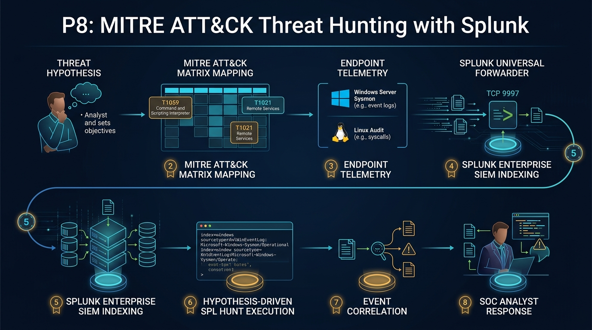

# 📸 P8 Threat Hunting Screenshots & Evidence Exhibits

This directory stores visual exhibits, architecture infographics, and live hunt screenshots captured during the **Project P8 — MITRE ATT&CK Threat Hunting with Splunk** engagement.

---

## Architecture & Workflow Infographic

*Figure 1: Complete 8-stage hypothesis-driven threat hunting methodology and multi-source telemetry pipeline across Windows Server Sysmon, Linux audit streams, and Splunk Enterprise SIEM.*

---

## Live Hunt Forensic Exhibits

| Exhibit Image | Description | Target Telemetry | Verification Status |
|---|---|---|---|
| [Figure 2: PowerShell Threat Score 70](p8-01-powershell-hunt-score-70.png) | Splunk live hunt detecting Base64-obfuscated PowerShell execution (`-ep bypass -w hidden -nop -enc ...`) with empirical **Threat Score 70**. | `index=sysmon` EventID 1 | ✅ Live Verified |
| [Figure 3: Dynamic DNS C2 Beacon](p8-02-dynamic-dns-c2-beacon.png) | Sysmon EventID 22 DNS query capturing outbound resolution request for `beacon-p8-test.duckdns.org` originating from `powershell.exe`. | `index=sysmon` EventID 22 | ✅ Live Verified |
| [Figure 4: Persistence Hunt](p8-03-persistence-registry-and-tasks.png) | Live hunt capturing both `schtasks.exe /create` (EventID 1) and `HKCU:\...\Run\P8_ThreatHunt_Persistence` autostart write (EventID 13). | `index=sysmon` EventID 1 & 13 | ✅ Live Verified |
| [Figure 5: LOLBin Investigation](p8-04-certutil-investigation.png) | Forensic hunt investigating Living-Off-The-Land binary execution and AMSI policy enforcement. | `index=sysmon` EventID 1 | ✅ Live Verified |
| [Figure 6: Live Validation Session](p8-05-live-hunt-validation-session.png) | Full terminal and Splunk console workflow demonstrating adversary emulation and triage. | Windows Server / SIEM | ✅ Live Verified |
