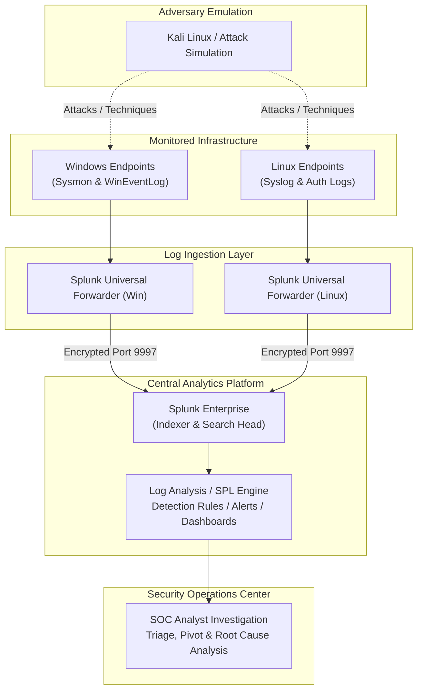
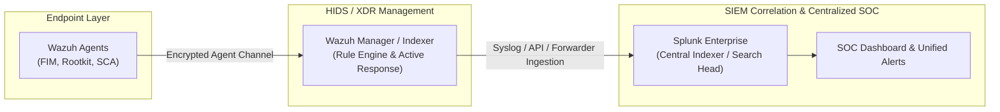

# 🛡️ Splunk SOC & Threat Hunting Lab

A comprehensive hands-on Splunk SOC and threat hunting laboratory covering security monitoring, centralized log analysis, SPL, detection engineering, incident investigation, MITRE ATT&CK threat hunting, SOC dashboards, and Wazuh-Splunk integration.

---

---

## 1. Project Overview

This repository serves as the **Master Hub and Central Portfolio** for an enterprise-modeled Splunk Security Operations Center (SOC) and Threat Hunting laboratory. 

Security telemetry in modern environments spans multiple operating systems, network perimeters, endpoints, and application stacks. Building, operating, and defending such an ecosystem requires an end-to-end understanding of how logs are generated, securely transported, parsed, correlated, and investigated under realistic threat scenarios.

### Master Repository Purpose
- **Central Portfolio Directory**: Outlines the overarching SOC architecture, technology stack, and engineering roadmap across 10 specialized projects (P1–P10).
- **Decoupled Project Design**: To maintain production-grade standards, the actual hands-on implementations, raw configuration files, SPL queries, alerts, dashboards, and investigation reports are maintained within dedicated standalone repositories for each project.
- **Architectural Reference**: Provides a single source of truth for threat models, telemetry data flow, and detection engineering coverage across all connected projects.

---

## 2. Objectives

- **Telemetry Pipeline Engineering**: Deploy and configure Splunk Universal Forwarders across heterogeneous endpoints (Windows, Linux) to establish reliable, tamper-resistant log forwarding into Splunk Enterprise.
- **Advanced SPL Development**: Master Splunk Search Processing Language (SPL) for exploratory search, statistical data aggregation, event correlation, and anomaly discovery.
- **Detection Engineering**: Design, tune, and operationalize high-fidelity alert rules mapped to specific adversary techniques to detect malicious behavior while minimizing false positives.
- **Incident Investigation & Triage**: Conduct structured security investigations simulating Tier 1–Tier 3 SOC workflows, performing timeline reconstruction, pivot analysis, and root-cause identification.
- **Threat Hunting**: Formulate threat hypotheses based on the **MITRE ATT&CK** framework, proactively searching baseline data for advanced persistence, defense evasion, and credential access techniques.
- **SOC Visualization & Reporting**: Build modular, operational dashboards tailored for security analysts and SOC management to monitor real-time security posture.
- **Hybrid SIEM/XDR Integration**: Architect a correlated monitoring pipeline uniting host-level intrusion detection and file integrity monitoring (Wazuh) with centralized log analytics (Splunk).

---

## 3. SOC Lab Architecture

The lab simulates a segmented enterprise environment consisting of victim endpoints, attack simulation systems, log collection forwarders, a centralized Splunk indexer/search head, and an integrated open-source XDR manager.

### Telemetry & Investigation Data Flow

### Hybrid Wazuh + Splunk Integration Concept (Planned)

In the advanced phase of the lab architecture (Project P10), endpoint telemetry will be augmented with host-based intrusion detection (HIDS/XDR):

---

## 4. Technology Stack

The lab incorporates industry-standard security tools, virtualization infrastructure, and threat modeling frameworks. 

| Technology / Component | Role in Lab | Implementation Status |
|---|---|---|
| **Splunk Enterprise** | Central SIEM platform, indexing engine, search processing, alerting, and visualization | 🟡 Active (In Progress) |
| **Splunk Universal Forwarder** | Lightweight endpoint log collection and secure transport agent | 🟡 Active (In Progress) |
| **SPL (Search Processing Language)** | Query syntax for data exploration, statistical analysis, and detection logic | 🟡 Active (In Progress) |
| **Windows** | Windows Server & Workstation targets generating Security Event Logs and Sysmon telemetry | 🟡 Active (In Progress) |
| **Linux** | Ubuntu/Debian server endpoints generating `auth.log`, `syslog`, and audit records | ⚪ Planned |
| **Kali Linux** | Dedicated attack platform for adversary emulation, payload testing, and brute-force simulation | ⚪ Planned |
| **Wazuh** | Open-source XDR/SIEM for host-based intrusion detection, FIM, and vulnerability scanning | ⚪ Planned |
| **MITRE ATT&CK** | Standard framework used to categorize detection engineering rules and threat hunting hypotheses | 🟡 Active / Ongoing |
| **VirtualBox** | Hypervisor hosting isolated virtual network segments (Host-Only / NAT Network) | 🟡 Active (In Progress) |

> **Note on Implementation Status**: Technologies marked **Active (In Progress)** are currently utilized in the foundational lab pipeline. Technologies marked **Planned** will be deployed during their respective project milestones as indicated in the roadmap.

---

## 5. Project Roadmap

The complete portfolio spans 10 structured projects demonstrating sequential progression from core lab engineering to advanced threat detection, dashboard development, and cross-platform SIEM integration.

| ID | Project Name | Scope & Core Focus | Status |
|:---:|---|---|:---:|
| **P1** | **Splunk SOC Home Lab & Log Analysis** | Foundational VirtualBox lab setup, Splunk Enterprise installation, Universal Forwarder deployment, basic log ingestion, and SPL baseline exploration. | 🟡 In Progress |
| **P2** | **[Windows Security Monitoring](P2-Windows-Security-Monitoring/)** | Windows Event Log auditing, Sysmon telemetry ingestion, process creation tracking, and account logon anomaly detection. | 🟡 In Progress |
| **P3** | **Linux Security Monitoring** | Ubuntu/Debian logging (`/var/log/auth.log`, `syslog`), sudo abuse tracking, SSH session auditing, and service monitoring. | ⚪ Planned |
| **P4** | **Brute-Force Detection & Investigation** | Detecting failed logon spikes, credential stuffing, account lockout patterns, and automated Kali Linux Hydra/Medusa simulations. | ⚪ Planned |
| **P5** | **Network Threat Detection** | Firewall and network log analysis, port scanning identification, beaconing detection, and unusual outbound connections. | ⚪ Planned |
| **P6** | **Web Attack Detection** | Web server access/error log analysis, detecting SQL Injection (SQLi), Cross-Site Scripting (XSS), directory traversal, and scanner fingerprints. | ⚪ Planned |
| **P7** | **Phishing Email Investigation** | Email header analysis, malicious link and attachment triage, delivery tracking, and correlated endpoint execution traces. | ⚪ Planned |
| **P8** | **MITRE ATT&CK Threat Hunting** | Hypothesis-driven hunting across Initial Access, Persistence, Privilege Escalation, and Defense Evasion tactics. | ⚪ Planned |
| **P9** | **Splunk SOC Dashboard** | Design and implementation of operational analyst dashboards, executive KPI visualizers, and interactive triage workflows. | ⚪ Planned |
| **P10** | **Wazuh + Splunk SIEM Integration** | End-to-end integration streaming Wazuh manager alerts and agent telemetry into Splunk for unified SOC correlation. | ⚪ Planned |

---

## 6. Skills Demonstrated

Through this laboratory portfolio, the following technical and operational competencies are demonstrated:

- **SIEM Administration & Architecture**: Installing, configuring, and tuning Splunk Enterprise instances, managing indexes, sourcetypes, inputs, and outputs.
- **Endpoint Agent Deployment**: Configuring `inputs.conf` and `outputs.conf` on Windows and Linux Universal Forwarders.
- **Search Processing Language (SPL)**: Writing robust queries using commands such as `stats`, `eval`, `rex`, `lookup`, `transaction`, `timechart`, `chart`, and `bin`.
- **Detection Engineering**: Building alert triggers, setting threshold sensitivity, suppressing noise, and validating alert fidelity against simulated attacks.
- **Incident Investigation & Root Cause Analysis**: Conducting structured log investigations, reconstructing multi-stage attack timelines, and attributing findings to threat sources.
- **Threat Hunting**: Applying the hypothesis-driven hunting methodology mapped to MITRE ATT&CK Tactics, Techniques, and Procedures (TTPs).
- **SOC Operations & Dashboard Engineering**: Constructing real-time monitoring panels with dynamic drill-downs and key performance indicators (KPIs).

---

## 7. Project Repository Links

Each project in the portfolio maintains its own dedicated repository containing detailed configuration instructions, raw dataset samples, SPL queries, alert configurations, dashboards, screenshots, and investigation walkthroughs.

| Project ID | Project Title | Dedicated Repository Link |
|:---:|---|:---:|
| **P1** | Splunk SOC Home Lab & Log Analysis | [NATTOMR/Log-Monitoring-Analysis-by-using-splunk](https://github.com/NATTOMR/Log-Monitoring-Analysis-by-using-splunk) |
| **P2** | Windows Security Monitoring | [P2-Windows-Security-Monitoring/](P2-Windows-Security-Monitoring/) |
| **P3** | Linux Security Monitoring | *Planned repository* |
| **P4** | Brute-Force Detection & Investigation | *Planned repository* |
| **P5** | Network Threat Detection | *Planned repository* |
| **P6** | Web Attack Detection | *Planned repository* |
| **P7** | Phishing Email Investigation | *Planned repository* |
| **P8** | MITRE ATT&CK Threat Hunting | *Planned repository* |
| **P9** | Splunk SOC Dashboard | *Planned repository* |
| **P10** | Wazuh + Splunk SIEM Integration | *Planned repository* |

---

## 8. Future Enhancements

- **Threat Intelligence Enrichment**: Integrate threat feeds (VirusTotal, AbuseIPDB, AlienVault OTX) into Splunk search workflows via automated lookups and API queries.
- **Automated Adversary Emulation**: Utilize Atomic Red Team execution frameworks on endpoints to automate repeatable testing of detection rules.
- **Sigma Rule Conversion**: Implement automated pipelines translating generic Sigma detection rules into optimized Splunk SPL queries.
- **SOAR Capabilities**: Explore orchestration actions to automate containment (e.g., firewall blocklist updates, account disablement) upon critical detection triggers.

---

## 📄 License

This repository and its documentation are open-source and licensed under the [MIT License](LICENSE).
