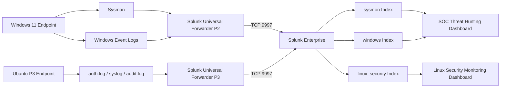
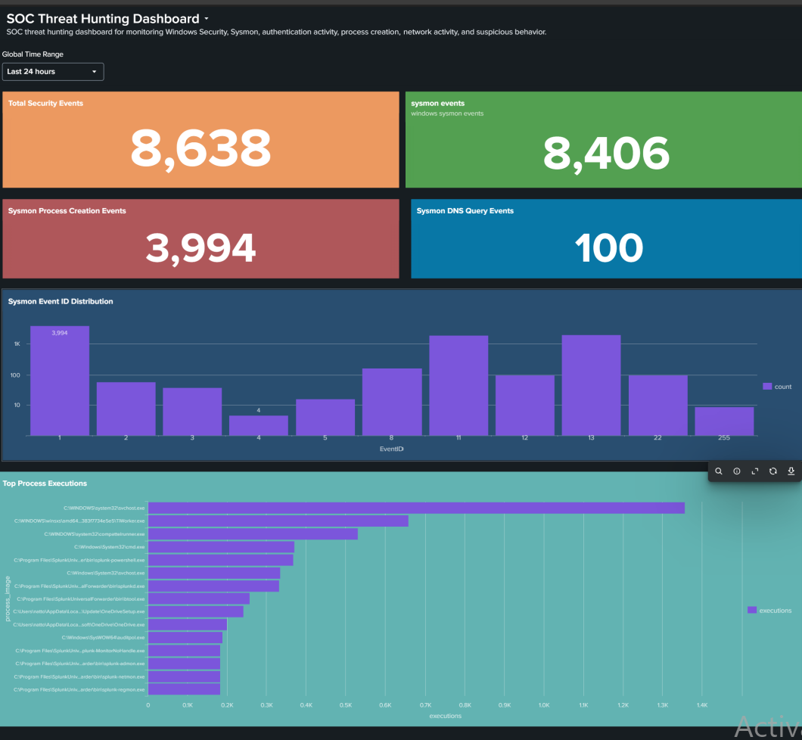

# Splunk SOC Threat Hunting Lab

[](#environment)
[](https://www.splunk.com/)
[](https://www.splunk.com/)
[](https://attack.mitre.org/)
[](#environment)
[](#p3--linux-security-monitoring)
[](#sysmon-integration)
[](LICENSE)

---

## Overview

A hands-on Security Operations Center (SOC) threat-hunting environment built using **Splunk Enterprise**, **Splunk Universal Forwarder**, **Sysmon**, and **Windows 11**. The lab demonstrates centralized Windows telemetry collection, Sysmon-based process and network monitoring, event analysis, and SOC dashboard visualization — covering a complete data pipeline from endpoint to analyst.

This project is portfolio-ready and reflects practical SOC analyst skills including telemetry pipeline engineering, SPL development, detection use-case design, and incident investigation workflows.

---

## Objectives

- Deploy and configure a functional Splunk data pipeline from Windows endpoint to Splunk Enterprise
- Collect high-fidelity telemetry using Sysmon and Windows Event Logs
- Develop verified SPL queries for threat hunting across process, DNS, and authentication data
- Build and document an operational SOC Threat Hunting Dashboard
- Demonstrate structured SOC analyst workflows: baseline profiling, anomaly identification, and investigation

---

## Architecture



**Data Flow:**

```
Windows 11 Endpoint (192.168.100.8)          Ubuntu P3 (192.168.100.9)
        │                                              │
        │  Sysmon telemetry + Windows Event Logs       │  auth.log / syslog / audit.log
        ▼                                              ▼
Splunk Universal Forwarder (UF 10.4.3)    Splunk Universal Forwarder (UF 10.4.3)
        │                                              │
        └───────────────┬───────────────────────────────┘
                        │  TCP 9997
                        ▼
              Splunk Enterprise (192.168.100.7)
                        │
                        ├──► index=windows        (Security, System, Application logs)
                        ├──► index=sysmon         (Sysmon process, network, registry, DNS)
                        │           │
                        │           └──► SOC Threat Hunting Dashboard
                        │
                        └──► index=linux_security (auth.log, syslog, audit.log)
                                        │
                                        └──► Linux Security Monitoring Dashboard
```

---

## Technologies

| Technology | Version | Role |
|---|---|---|
| **Splunk Enterprise** | 10.4.3 | Central SIEM — indexer, search head, dashboard |
| **Splunk Universal Forwarder** | 10.4.3 | Endpoint log collection and transport agent |
| **Sysmon** | v15.15 | Kernel-level Windows telemetry provider |
| **Windows 11** | 64-bit | Monitored endpoint / telemetry source |
| **SPL** | — | Search Processing Language for queries and detections |
| **Linux (Ubuntu Server)** | 24.04 (Splunk host) | Splunk Enterprise host OS |
| **Linux (Ubuntu Server 24.04.5 LTS)** | 24.04.5 (P3 endpoint) | Monitored Linux endpoint — `ubuntu-p3` |
| **PowerShell** | 5.1+ | Automation and validation scripts |
| **VirtualBox** | — | Hypervisor for isolated lab network |
| **MITRE ATT&CK** | — | Threat model and detection classification framework |

---

## Environment

| Parameter | Windows 11 Endpoint | Splunk Enterprise Server |
|---|---|---|
| **IP Address** | `192.168.100.8` | `192.168.100.7` |
| **Role** | Monitored endpoint / telemetry source | Central SIEM / indexer / search head |
| **Services** | `SplunkForwarder`, `Sysmon64` | `splunkd` |
| **Service Account** | `NT SERVICE\SplunkForwarder` | `splunk` (dedicated system user) |
| **Active Ports** | TCP `9997` (outbound) | TCP `9997` (receiver), `18000` (web), `8089` (mgmt) |
| **Network** | VirtualBox NAT Network `LabNetwork` — `192.168.100.0/24` | — |
| **Splunk Web** | — | `http://127.0.0.1:18000` (host-mapped) |

---

## Data Collection

The Splunk Universal Forwarder is configured with `renderXml = true`, ingesting all event channels as structured XML for high-fidelity field preservation.

### inputs.conf (Active Configuration)

```ini
[WinEventLog://Security]
disabled = 0
index = windows
renderXml = true

[WinEventLog://System]
disabled = 0
index = windows
renderXml = true

[WinEventLog://Application]
disabled = 0
index = windows
renderXml = true

[WinEventLog://Microsoft-Windows-Sysmon/Operational]
disabled = 0
index = sysmon
renderXml = true
```

### Index Mapping

| Event Source | Splunk Index |
|---|---|
| Windows Security Event Log | `index=windows` |
| Windows System Event Log | `index=windows` |
| Windows Application Event Log | `index=windows` |
| Microsoft-Windows-Sysmon/Operational | `index=sysmon` |

### Important: XML EventID Extraction

Because events are stored as raw XML, Sysmon EventID values are embedded as `<EventID>...</EventID>`. Use `rex` to extract them before filtering:

```spl
| rex field=_raw "<EventID>(?<EventID>\d+)</EventID>"
| search EventID=1
```

Do not use `EventCode=1` directly in `index=sysmon` — it returns zero results.

---

## Sysmon Integration

Sysmon (System Monitor) is installed and running on the Windows 11 endpoint as `Sysmon64`. It generates kernel-level telemetry forwarded to `index=sysmon`.

### Observed Sysmon Event IDs

| Event ID | Description | Threat Relevance |
|:---:|---|---|
| 1 | Process Create | Execution monitoring |
| 2 | File Creation Time Changed | Anti-forensic activity |
| 3 | Network Connection | C2 / lateral movement |
| 4 | Sysmon Service State Changed | Tampering detection |
| 5 | Process Terminated | Lifecycle tracking |
| 8 | CreateRemoteThread | Process injection |
| 11 | FileCreate | Dropper / persistence |
| 12 | Registry Object Added/Deleted | Registry persistence |
| 13 | Registry Value Set | Configuration tampering |
| 22 | DNS Query | Beaconing / DGA detection |
| 255 | Sysmon Error/Status | Operational monitoring |

> Event IDs listed reflect those observed in current lab data. Not all types are continuously generated; occurrence depends on endpoint activity.

---

## Splunk Universal Forwarder

The Splunk Universal Forwarder (UF 10.4.3) is installed on Windows 11 and configured to forward to Splunk Enterprise.

**Forwarding configuration (`outputs.conf`):**

```
[tcpout]
defaultGroup = splunk-enterprise

[tcpout:splunk-enterprise]
server = 192.168.100.7:9997
```

**Verified active connection:**

```
Active forwards:
        192.168.100.7:9997
```

The SplunkForwarder service account (`NT SERVICE\SplunkForwarder`) is a member of the local `Event Log Readers` group, granting access to the Sysmon operational log channel.

---

## SPL Threat Hunting

All verified SPL queries are documented in [`docs/spl-queries.md`](P2-Windows-Security-Monitoring/docs/spl-queries.md).

### Key Queries

**Sysmon Event ID Distribution:**

```spl
index=sysmon earliest=-24h
| rex field=_raw "<EventID>(?<EventID>\d+)</EventID>"
| stats count by EventID
| sort EventID
```

**Top Process Executions:**

```spl
index=sysmon earliest=-24h
| rex field=_raw "<EventID>(?<EventID>\d+)</EventID>"
| search EventID=1
| rex field=_raw "<Data Name='Image'>(?<process_image>[^<]+)</Data>"
| stats count as executions by process_image
| sort - executions
| head 15
```

**PowerShell Activity:**

```spl
index=sysmon earliest=-24h
| rex field=_raw "<EventID>(?<EventID>\d+)</EventID>"
| search EventID=1
| rex field=_raw "<Data Name='Image'>(?<Image>[^<]+)</Data>"
| rex field=_raw "<Data Name='CommandLine'>(?<CommandLine>[^<]*)</Data>"
| search Image="*powershell.exe"
| stats count by Image CommandLine
| sort -count
```

---

## SOC Threat Hunting Dashboard

The **SOC Threat Hunting Dashboard** provides real-time visibility into Sysmon and Windows Security telemetry. All panels use the global time range picker — values change dynamically based on the selected window.

Full dashboard documentation: [`docs/dashboard.md`](P2-Windows-Security-Monitoring/docs/dashboard.md)

### Dashboard Panels

| Panel | Query Basis | Visualization |
|---|---|---|
| Total Security Events | `index=windows \| stats count` | Single value |
| Sysmon Events | `index=sysmon` | Single value |
| Sysmon Process Creation Events | EventID=1 extraction + count | Single value |
| Sysmon DNS Query Events | EventID=22 extraction + count | Single value |
| Sysmon Event ID Distribution | `stats count by EventID` | Bar chart |
| Top Process Executions | EventID=1 + `rex Image` + `stats` | Bar chart |

### Dashboard Screenshot



*Figure 1 — Splunk SOC Threat Hunting Dashboard (live lab session)*

---

## P2 — Kali Attacker Activity Dashboard

P2 extends the lab with a dedicated attacker-focused SOC dashboard — **Kali Attacker Activity Dashboard** — built to monitor and investigate controlled Kali Linux reconnaissance and SMB activity against the Windows 11 endpoint.

### Lab Roles

| Role | Host | IP Address |
|---|---|---|
| **Attacker** | Kali Linux | `192.168.100.6` |
| **Victim** | Windows 11 | `192.168.100.8` |
| **SIEM** | Splunk Enterprise | `192.168.100.7` |

### Attack Simulation — Actual Tests Performed

| # | Test | Command / Query | Result |
|:---:|---|---|---|
| 1 | Host discovery | `nmap -sn 192.168.100.8` | Windows host confirmed UP |
| 2 | TCP reconnaissance | `nmap -sT 192.168.100.8` | Ports 135, 139, 445 open |
| 3 | Service enumeration | `nmap -sV --top-ports 20 192.168.100.8` | RPC/SMB confirmed, target identified as Windows |
| 4 | RPC/SMB scan | `nmap -sT -p 135,139,445 192.168.100.8` | All three ports confirmed open |
| 5 | SMB protocol enumeration | `nmap -sT -p 445 --script smb-protocols 192.168.100.8` | SMBv2/v3 detected; SMBv1 absent |
| 6 | Anonymous SMB attempt | `smbclient -L //192.168.100.8 -N` | `NT_STATUS_ACCESS_DENIED` — rejected |
| 7 | Event ID 4625 detection | `index=windows "<EventID>4625</EventID>"` | Failed network authentication confirmed in Splunk |
| 8 | Attacker IP correlation | `index=windows "192.168.100.6" "<EventID>4625</EventID>"` | Source IP, workstation `KALI`, and logon failure fields extracted |
| 9 | SMB security-mode validation | `nmap -sT -p 445 --script smb2-security-mode 192.168.100.8` | SMB 3.1.1 — signing enabled and required |
| 10 | Splunk investigation | `index=windows "192.168.100.6"` | All attacker-associated Windows telemetry retrieved |

### Key Security Observations

- **Event ID 4625** — Failed network logon from Kali (`192.168.100.6`), `LogonType: 3`, `WorkstationName: KALI`
- **Event ID 4624** — ANONYMOUS LOGON event correlated with the SMB interaction. `TargetUserName: ANONYMOUS LOGON` — this does **not** indicate a successful authenticated logon; it reflects Windows processing the anonymous SMB negotiation phase before rejection.
- **NTLMv1 observation** — `LmPackageName: NTLM V1` noted in the 4624 event; documented as a legacy authentication hardening observation. No Windows authentication configuration changes made in P2.
- **SMB signing required** — Windows endpoint enforces SMB message signing, mitigating relay attacks.

### Dashboard Panels

| Panel | Title | Purpose |
|:---:|---|---|
| 1 | Kali Attacker Events | All Windows events from `192.168.100.6` |
| 2 | Kali Failed Authentication — 4625 | Count of failed auth attempts |
| 3 | Kali Failed Authentication Timeline | Timechart of Event ID 4625 |
| 4 | Failed Logons by Host | 4625 events grouped by Windows host |
| 5 | Kali Network Logons — 4624 | Network logon events from Kali IP |
| 6 | Kali Source IP | Extracted and confirmed attacker IP |
| 7 | Kali Authentication Events | Event-level investigation table |
| 8 | Kali Workstation | Workstation name extracted from events |
| 9 | Kali Attacker Activity | 1-minute timechart of all Kali telemetry |
| 10 | Kali Attacker Activity Timeline | Extended timeline visualization |

Full dashboard documentation: [`docs/kali-attacker-dashboard.md`](P2-Windows-Security-Monitoring/docs/kali-attacker-dashboard.md)

P2 completion checklist: [`docs/p2-completion-checklist.md`](docs/p2-completion-checklist.md)

---

## Detection Use Cases

This project demonstrates the following defensive SOC monitoring use cases:

| Use Case | Data Source | EventID / Log |
|---|---|---|
| Process creation monitoring | Sysmon | EventID 1 |
| DNS query monitoring | Sysmon | EventID 22 |
| PowerShell execution analysis | Sysmon | EventID 1 (`powershell.exe`) |
| Process injection detection | Sysmon | EventID 8 (CreateRemoteThread) |
| Network activity investigation | Sysmon | EventID 3 |
| File drop / dropper detection | Sysmon | EventID 11 |
| Registry persistence monitoring | Sysmon | EventID 12, 13 |
| Windows authentication monitoring | Security Log | EventID 4624, 4625 |
| Account management monitoring | Security Log | EventID 4720, 4726 |
| Timeline-based threat hunting | Sysmon + Windows | `timechart` queries |
| Failed SSH authentication detection | `auth.log` | `linux_secure` — "Failed password" |

---

## P3 — Linux Security Monitoring

P3 extends the lab to a dedicated Ubuntu Server 24.04.5 LTS endpoint (`ubuntu-p3`, `192.168.100.6`), running a Splunk Universal Forwarder to stream Linux authentication, system, and audit logs into Splunk Enterprise.

Full P3 documentation: [`P3-Linux-Security-Monitoring/README.md`](P3-Linux-Security-Monitoring/README.md)

P3 progress log: [`docs/P3-LINUX-SECURITY-MONITORING.md`](docs/P3-LINUX-SECURITY-MONITORING.md)

### P3 — Lab Roles

| Role | Host | IP Address |
|---|---|---|
| **Linux Endpoint** | `ubuntu-p3` (Ubuntu Server 24.04.5 LTS) | `192.168.100.6` |
| **SIEM** | Splunk Enterprise | `192.168.100.7` |

### P3 — Log Collection

| Log File | Sourcetype | Index |
|---|---|---|
| `/var/log/auth.log` | `linux_secure` | `linux_security` |
| `/var/log/syslog` | `syslog` | `linux_security` |
| `/var/log/audit/audit.log` | `linux:audit` | `linux_security` |

### P3 — UC-01: Failed SSH Authentication Detection

```spl
index=linux_security sourcetype=linux_secure "Failed password"
| rex "Failed password for (invalid user )?(?<username>\S+) from (?<src_ip>\d{1,3}(?:\.\d{1,3}){3})"
| stats count as failed_attempts earliest(_time) as first_attempt latest(_time) as last_attempt by src_ip username host
| convert ctime(first_attempt) ctime(last_attempt)
| sort - failed_attempts
```

Extracts: source IP, targeted username, destination host, failure count, and first/last attempt timestamps. Verified against real events from `ubuntu-p3`.

### P3 — Completed Work

| Item | Status |
|---|---|
| Network connectivity (`ping`, `nc -zv 9997`) | ✅ Verified |
| SSH access (`127.0.0.1:2223 → 192.168.100.6:22`) | ✅ Verified |
| Splunk Universal Forwarder installed | ✅ Done |
| Forwarder → Splunk connection (`192.168.100.7:9997`) | ✅ Active |
| Linux log collection (`inputs.conf`) | ✅ Done |
| `linux_security` index | ✅ Created and verified |
| Event ingestion verification | ✅ Real events confirmed |
| UC-01 Failed SSH Authentication SPL | ✅ Implemented |

---

## Validation

Full validation commands documented in [`docs/validation.md`](P2-Windows-Security-Monitoring/docs/validation.md).

### Quick Checks

**Windows endpoint:**

```powershell
Get-Service SplunkForwarder       # Must be Running
Get-Service Sysmon*               # Must be Running
Get-WinEvent -LogName "Microsoft-Windows-Sysmon/Operational" -MaxEvents 5
```

**Splunk Enterprise (Ubuntu):**

```bash
sudo ss -lntp | grep ':9997'                              # TCP 9997 must be LISTEN
sudo -u splunk /opt/splunk/bin/splunk list index          # sysmon, windows must be listed
```

**SPL verification:**

```spl
index=sysmon earliest=-7d | head 10
index=windows earliest=-7d | head 10
```

---

## Troubleshooting

Full troubleshooting guide: [`docs/troubleshooting.md`](P2-Windows-Security-Monitoring/docs/troubleshooting.md)

| Issue | Cause | Solution |
|---|---|---|
| `EventCode=1` returns zero results | XML rendering — EventCode not auto-extracted | Use `rex field=_raw "<EventID>(?<EventID>\d+)</EventID>"` |
| Sysmon subscription `errorCode=5` | `NT SERVICE\SplunkForwarder` lacks log read permission | `net localgroup "Event Log Readers" "NT SERVICE\SplunkForwarder" /add` |
| Forwarder shows "Configured but inactive" | Splunk Enterprise unreachable / not running | Verify TCP 9997, restart Splunk Enterprise and forwarder |
| Dashboard panels show no data | Time range too narrow / index empty | Test `index=sysmon earliest=-7d` to confirm data exists |

---

## Project Structure

```
splunk-soc-threat-hunting-lab/
│
├── README.md                                   # This file — project overview
├── LICENSE
├── .gitignore                                  # Security-sensitive file exclusions
│
├── docs/
│   ├── P2-SPLUNK-SOC-INTEGRATION.md           # P2 progress and milestone log
│   ├── P3-LINUX-SECURITY-MONITORING.md        # P3 progress and milestone log
│   └── evidence/                               # Supporting evidence files
│
├── P2-Windows-Security-Monitoring/
│   │
│   ├── README.md                               # P2 project detail
│   │
│   ├── config/                                 # Forwarder configuration templates
│   │   ├── inputs.conf                         # Event channel definitions
│   │   ├── outputs.conf                        # Forward server configuration
│   │   ├── indexes.conf                        # Index definitions for Splunk Enterprise
│   │   └── windows/
│   │       └── sysmonconfig.xml                # Sysmon XML configuration
│   │
│   ├── docs/                                   # Technical documentation
│   │   ├── architecture.md                     # Network and data flow architecture
│   │   ├── dashboard.md                        # Dashboard panel documentation
│   │   ├── spl-queries.md                      # Verified SPL threat-hunting queries
│   │   ├── validation.md                       # Validation and testing commands
│   │   ├── troubleshooting.md                  # Known issues and solutions
│   │   ├── setup.md                            # Quick-start deployment guide
│   │   ├── splunk-forwarder.md                 # Forwarder deployment guide
│   │   └── windows-auditing.md                 # Windows audit policy guide
│   │
│   ├── scripts/                                # PowerShell automation scripts
│   │   ├── verify-splunk.ps1                   # End-to-end pipeline verification
│   │   ├── configure-forwarder.ps1             # Forwarder configuration script
│   │   ├── configure-audit-policy.ps1          # Windows audit policy baseline
│   │   └── install-forwarder.ps1               # Forwarder installation script
│   │
│   └── screenshots/                            # Lab evidence and verification exhibits
│       ├── p2-20-soc-threat-hunting-dashboard.png  # SOC Threat Hunting Dashboard
│       ├── p2-01-windows11-sysmon-*.png        # Windows endpoint evidence
│       ├── p2-17-splunk-web-login-*.png        # Splunk Web UI
│       ├── p2-18-splunk-web-admin-*.png        # Admin dashboard
│       └── p2-19-splunk-receiver-*.png         # Receiver port and firewall
│
├── P3-Linux-Security-Monitoring/
│   │
│   └── README.md                               # P3 project detail and status
│
└── P4-Brute-Force-Detection/
    │
    └── README.md                               # P4 project detail and status
```

---

## Screenshots

| Figure | Description |
|---|---|
| [Figure 1](P2-Windows-Security-Monitoring/screenshots/p2-20-soc-threat-hunting-dashboard.png) | SOC Threat Hunting Dashboard — live session |
| [Figure 2](P2-Windows-Security-Monitoring/screenshots/p2-17-splunk-web-login-port-18000.png) | Splunk Web login via host port 18000 |
| [Figure 3](P2-Windows-Security-Monitoring/screenshots/p2-18-splunk-web-admin-dashboard-home.png) | Splunk Enterprise Admin home |
| [Figure 4](P2-Windows-Security-Monitoring/screenshots/p2-19-splunk-receiver-listen-9997-ufw-rules.png) | TCP 9997 receiver — socket and UFW rules |
| [Figure 5](P2-Windows-Security-Monitoring/screenshots/p2-01-windows11-sysmon-service-uf-download.png) | Windows 11 — Sysmon service and UF download |

---

## Security Considerations

- **No credentials committed.** The forwarder service account password, Splunk admin password, and all authentication secrets are excluded from this repository.
- **`.gitignore` enforced** to prevent accidental exposure of `passwd`, `user-seed.conf`, `*.key`, `*.pem`, and similar sensitive files.
- **Placeholders used** for all credential references in documentation (e.g., `<YOUR_PASSWORD>`, `<YOUR_SERVER_IP>`).
- The Splunk Universal Forwarder service runs as `NT SERVICE\SplunkForwarder` — a minimal-privilege built-in service account.
- UFW firewall on the Ubuntu server restricts TCP 9997 access to the lab subnet (`192.168.100.0/24`).

---

## Future Improvements

| Item | Description |
|---|---|
| **Linux endpoint monitoring** | Ubuntu log forwarding (`auth.log`, `syslog`, `audit.log`) — [Project P3](P3-Linux-Security-Monitoring/README.md) (**Complete**) |
| **Brute-force detection (Windows)** | Alert rules on EventID 4625 threshold — [Project P4](P4-Brute-Force-Detection/README.md) (**Complete**) |
| **Network threat detection** | Sysmon EID 3 connection monitoring, velocity spikes, and port scan detection — [Project P5](P5-Network-Threat-Detection/README.md) (**Complete**) |
| **Web attack detection** | Apache access log analysis, SQLi, XSS, Path Traversal, and Scanner detection — [Project P6](P6-Web-Attack-Detection/README.md) (**Complete**) |
| **Phishing email investigation** | Email gateway telemetry, weaponized attachment triage, and whaling detection — [Project P7](P7-Phishing-Email-Investigation/README.md) (**Complete**) |
| **MITRE ATT&CK threat hunting** | Hypothesis-driven hunting across ATT&CK tactics — Project P8 |
| **Automated adversary emulation** | Atomic Red Team execution for detection validation |
| **Sigma rule conversion** | Translate community Sigma rules to Splunk SPL |
| **Threat intelligence enrichment** | VirusTotal / AbuseIPDB integration via Splunk lookups |
| **Wazuh + Splunk integration** | Unified HIDS/SIEM correlation pipeline — Project P10 |

---

## Project Roadmap

| ID | Project | Status |
|:---:|---|:---:|
| **P1** | Splunk SOC Home Lab & Log Analysis | 🟡 In Progress |
| **P2** | **Windows Security Monitoring + Kali Attacker Dashboard** | ✅ Complete |
| **P3** | [**Linux Security Monitoring**](P3-Linux-Security-Monitoring/README.md) | ✅ Complete |
| **P4** | [**Brute-Force Detection & Investigation**](P4-Brute-Force-Detection/README.md) | ✅ Complete |
| **P5** | [**Network Threat Detection with Splunk**](P5-Network-Threat-Detection/README.md) | ✅ Complete |
| **P6** | [**Web Attack Detection with Splunk**](P6-Web-Attack-Detection/README.md) | ✅ Complete |
| **P7** | [**Phishing Email Investigation with Splunk**](P7-Phishing-Email-Investigation/README.md) | ✅ Complete |
| **P8** | MITRE ATT&CK Threat Hunting | ⚪ Planned |
| **P9** | Splunk SOC Dashboard | ⚪ Planned |
| **P10** | Wazuh + Splunk SIEM Integration | ⚪ Planned |

---

## Disclaimer

This is a controlled, isolated cybersecurity lab environment built for educational and portfolio purposes. All monitoring, telemetry collection, and analysis is performed on virtual machines within a private NAT network. No production systems or external networks are involved. This project does not claim to provide enterprise-grade threat detection or real-time incident response capabilities.

---

## License

This project is licensed under the [MIT License](LICENSE).
