# 🚀 P2 — Splunk SOC Integration

[](#-p2-status)
[](#-next-milestone)
[](https://www.splunk.com/)
[](https://wazuh.com/)
[](#-infrastructure-completed)
[](../P2-Windows-Security-Monitoring/screenshots/README.md)

Comprehensive technical progress log and infrastructure tracking for **Project P2: Splunk SOC Integration**, documenting server provisioning, service validation, networking, firewall rules, SIEM receiver enablement, and photographic evidence.

---

## 📅 Date
**2026-09-09**

---

## 🏗️ Infrastructure Completed

### 1. Verified Ubuntu Server
- **Operating System:** Ubuntu 24.04.4 LTS
- **Architecture:** x86_64
- **Hostname:** `wazuh-server`
- **Assigned IP:** `192.168.100.7`
- **Validation:** Confirmed system stability, package state, and core networking parameters.
- **Pre-installation Storage Validation:** Verified 27 GB free on the root volume `/dev/mapper/ubuntu--vg-ubuntu--lv` (41% utilized) and verified LVM storage layout via `lsblk`, `vgs`, and `pvs`.

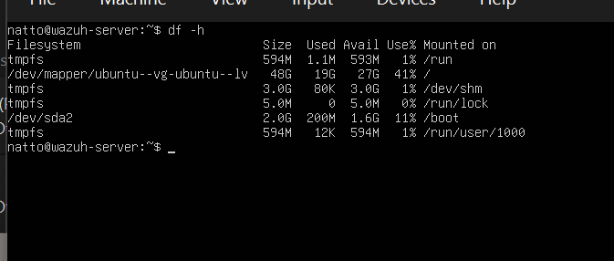
*Figure 1.1: Pre-installation storage analysis on Ubuntu server (`df -h`).*

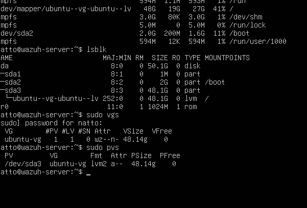
*Figure 1.2: LVM volume group and physical volume checks (`lsblk`, `vgs`, `pvs`).*

---

### 2. Verified Wazuh Infrastructure
- **Wazuh Manager Service:** `active` (`systemctl status wazuh-manager`)
- **Wazuh Indexer Service:** `active` (`systemctl status wazuh-indexer`)
- **Wazuh Dashboard Service:** `active` (`systemctl status wazuh-dashboard`)
- **System Health:** No failed systemd services detected across the stack.
- **Operational Status:** Wazuh server remains fully operational and stable.

---

### 3. Verified Wazuh Agents
- **Agent 000:** `wazuh-server` — Status: **Active / Local**
- **Agent 003:** `hackme` — Status: **Active**
- **Agent 004:** `kali` — Status: **Disconnected**

---

### 4. Verified Windows Endpoint
- **Endpoint System:** Windows 11 victim/endpoint workstation
- **Assigned IP:** `192.168.100.8`
- **Wazuh Agent Service:** Running
- **Sysmon64 Service:** Running (`Sysmon64` driver and service active)
- **Sysmon Log Channel:** `Microsoft-Windows-Sysmon/Operational` enabled and logging
- **Telemetry Volume:** Approximately **22,921** Sysmon records were present during verification.

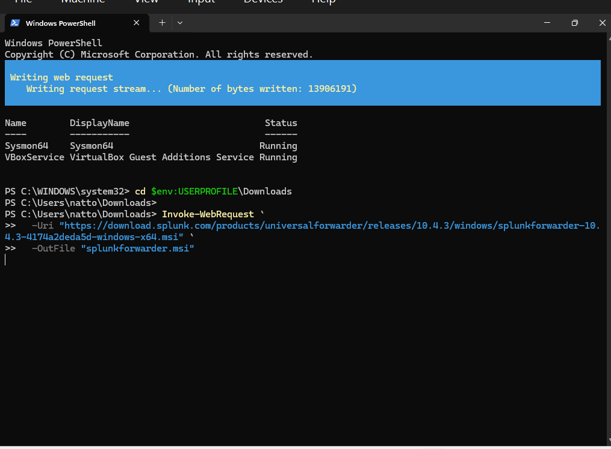
*Figure 4.1: Windows 11 PowerShell verifying active Sysmon64 service and starting forwarder download.*

---

### 5. Verified Sysmon Ingestion into Wazuh
- **Configuration:** Windows Sysmon `EventChannel` configuration is confirmed present in the agent baseline.
- **Pipeline Validation:** Sysmon events successfully appeared in Wazuh archives (`archives.log` / `archives.json`).
- **Observed Event:** Confirmed live Sysmon Event ID 13 (Registry value modification) successfully collected and parsed.

---

### 6. Installed Splunk Enterprise
- **Software Version:** Splunk Enterprise `10.4.3`
- **Installation Path:** `/opt/splunk`
- **Service User Account:** `splunk` (least-privilege dedicated system user created via `useradd -m -s /bin/bash splunk`)
- **Administrative Credentials:** Initial Splunk administrator account provisioned.
- **Debian Package Ingestion:** 1.23 GB package fetched directly via `wget`.

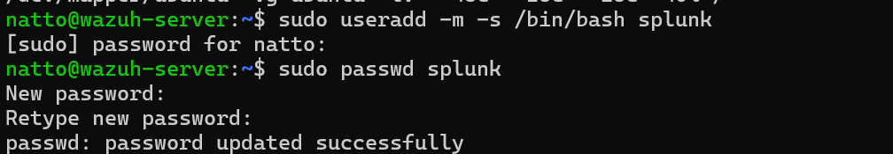
*Figure 6.1: Dedicated service user creation (`useradd -m -s /bin/bash splunk`).*

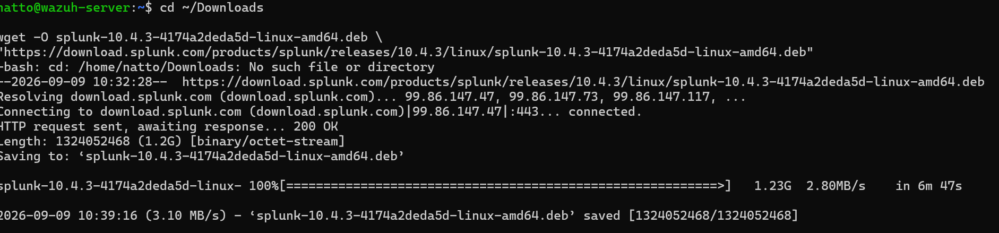
*Figure 6.2: Splunk Enterprise 10.4.3 Debian package download (`wget`).*

---

### 7. Fixed Splunk Installation Permissions
- **Issue Identified:** Permission/ownership discrepancies following initial setup files.
- **Remediation Executed:** Ownership recursively corrected:
  ```bash
  sudo chown -R splunk:splunk /opt/splunk
  ```
- **Verification:** Verified user `splunk` possesses valid read and write permissions to critical configuration files:
  - `/opt/splunk/etc/users/users.ini`
  - `/opt/splunk/etc/myinstall/splunkd.xml`

---

### 8. Successfully Started Splunk Enterprise
- **Core Daemon:** `splunkd` running under service user `splunk`
- **HTTP / Web Port:** `8000/tcp`
- **Management Port:** `8089/tcp`
- **Appserver Port:** `8065/tcp`
- **KV Store Port:** `8191/tcp`

---

### 9. Verified Splunk Locally
- **CLI Validation:** Local HTTP request executed:
  ```bash
  curl -I http://127.0.0.1:8000
  ```
- **Result:** Returned HTTP `303 See Other` (expected redirect to login page).
- **Operational Status:** Splunk Web is fully operational.

---

### 10. Configured VirtualBox Networking
- **Network Mode:** NAT Network (`LabNetwork`)
- **Network CIDR:** `192.168.100.0/24`
- **Default Gateway:** `192.168.100.1`
- **Windows Endpoint IP:** `192.168.100.8`
- **Ubuntu Server IP:** `192.168.100.7`

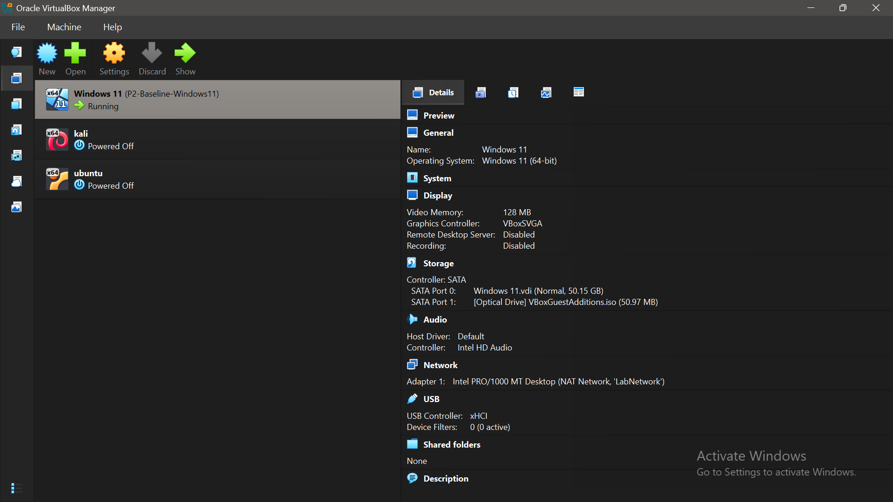
*Figure 10.1: VirtualBox Manager confirming Windows 11 VM network adapter bound to 'LabNetwork'.*

---

### 11. Configured Access to Splunk Web
- **Port Forwarding Rule:**
  - Host Port: `18000`
  - Guest Port: `8000`
- **Web UI Endpoint:** Accessible from the host system browser via:
  ```
  http://127.0.0.1:18000
  ```

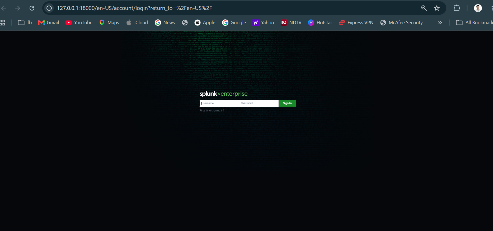
*Figure 11.1: Splunk Enterprise login page accessed through host port 18000.*

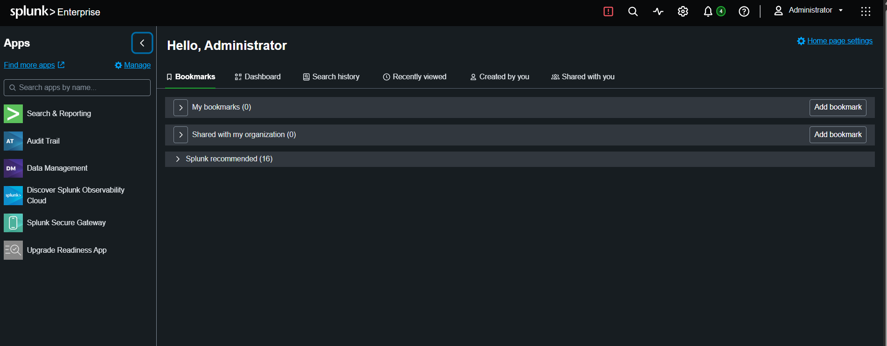
*Figure 11.2: Authenticated Splunk Enterprise Administrator workspace.*

---

### 12. Verified Windows-to-Ubuntu Network Connectivity
- **ICMP Reachability:** `ping 192.168.100.7` from Windows 11 endpoint succeeded.
- **Port Reachability:** TCP `8000` connectivity confirmed from Windows endpoint to Ubuntu server.
- **Application Response:** Splunk HTTP response successfully confirmed from the Windows environment.

---

### 13. Configured Ubuntu Firewall (`ufw`)
- **SSH (`22/tcp`):** Verified active and restricted with rate-limiting.
- **Wazuh Agent Channel (`1514/tcp`):** Allowed from subnet `192.168.100.0/24`.
- **Wazuh Registration (`1515/tcp`):** Allowed from subnet `192.168.100.0/24`.
- **Splunk Web (`8000/tcp`):** Allowed from subnet `192.168.100.0/24`.
- **Splunk Ingestion Port (`9997/tcp`):** Allowed and configured for the SOC lab ingestion pipeline.

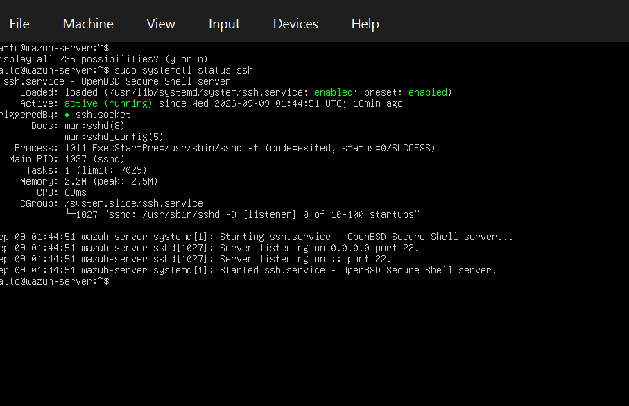
*Figure 13.1: OpenSSH server service active on port 22/tcp.*

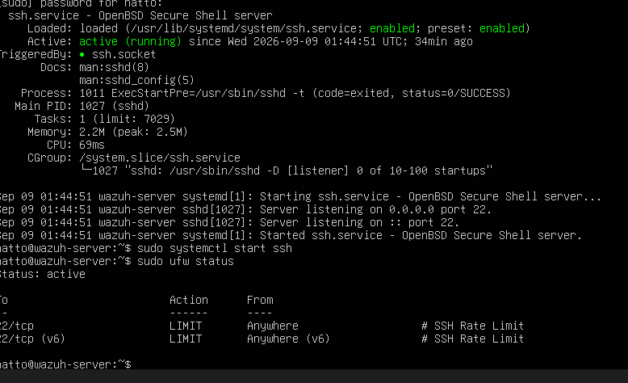
*Figure 13.2: Baseline UFW status with SSH rate limiting.*

---

### 14. Configured Splunk Receiving Capability
- **Splunk Enterprise Receiving Port:** `9997/tcp` enabled via command line:
  ```bash
  sudo -u splunk /opt/splunk/bin/splunk enable listen 9997 -auth admin:********
  ```
- **Socket Verification:** Confirmed active listening socket on `0.0.0.0:9997` via `ss -lntp | grep 9997` bound to process `splunkd`.
- **Designated Ingestion Target:** The Windows endpoint will forward logs to `192.168.100.7:9997`.

---

### 15. Architectural Correction & Firewall Enablement
> [!NOTE]
> **Forwarder Architecture Realignment & Port 9997 Activation:**
> - An accidental Splunk self-forwarder configuration was initially added to the Ubuntu server (`splunk add forward-server 192.168.100.7:9997`).
> - This was diagnosed and identified as incorrect because Splunk Enterprise serves as the **central indexer/receiver**, not a forwarder.
> - The configuration was promptly removed (`splunk remove forward-server 192.168.100.7:9997`), and `enable listen 9997` was properly established.
> - Finally, `ufw allow from 192.168.100.0/24 to any port 9997 proto tcp` was enacted and validated.

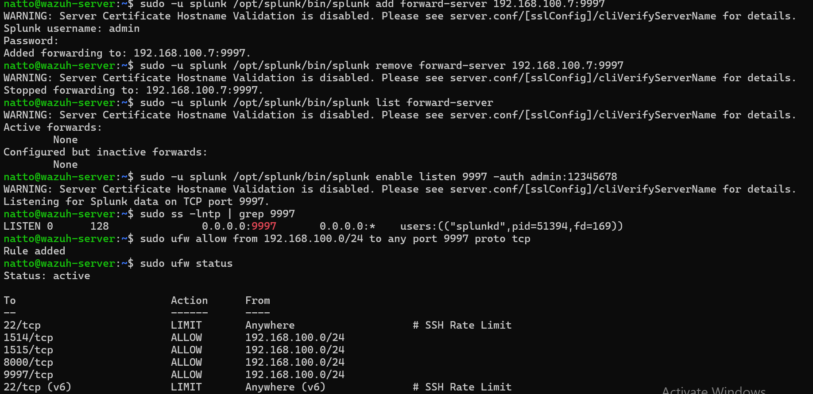
*Figure 15.1: Terminal exhibit showing self-forwarder removal, 'enable listen 9997', socket verification, and UFW rule creation.*

---

## 🏛️ Current Architecture

```text
Windows 11 Endpoint (192.168.100.8)
    │
    │ Splunk Universal Forwarder
    │ Ingestion Port: TCP 9997
    ▼
Ubuntu 24.04 Server (192.168.100.7)
    │
    ├── Splunk Enterprise 10.4.3
    │     ├── Web UI: 18000 (Host) / 8000 (Guest)
    │     ├── Management: 8089/tcp
    │     └── Receiving Port: 9997/tcp [splunktcp]
    │
    └── Wazuh Manager
          ├── Agent Ingestion: 1514/tcp
          └── Agent Enrollment: 1515/tcp
```

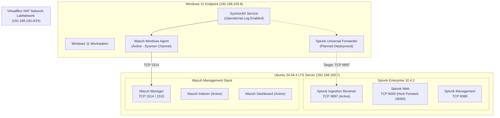

---

## 📊 P2 Status

### ✅ Completed Tasks (11 Items)
1. **Ubuntu verification** — Ubuntu 24.04.4 LTS (x86_64, `wazuh-server`, `192.168.100.7`) confirmed active and verified.
2. **Wazuh verification** — `wazuh-manager`, `wazuh-indexer`, `wazuh-dashboard` active; no systemd service failures.
3. **Windows endpoint verification** — Windows 11 endpoint (`192.168.100.8`) verified with active Wazuh agent and Sysmon64.
4. **Sysmon verification** — Sysmon Operational log active; 22,921 records present; Event ID 13 verified in archives.
5. **Splunk Enterprise installation** — Splunk Enterprise 10.4.3 installed in `/opt/splunk` under dedicated user `splunk`.
6. **Splunk Enterprise startup** — `splunkd` running; ports 8000, 8089, 8065, 8191 operational.
7. **Splunk Web verification** — Local curl returned HTTP 303; Splunk Web fully operational.
8. **VirtualBox LabNetwork verification** — NAT Network `LabNetwork` (`192.168.100.0/24`) operational with gateway `192.168.100.1`.
9. **Windows-to-Ubuntu connectivity** — Ping to `192.168.100.7` and TCP port 8000 connectivity confirmed from Windows 11.
10. **Ubuntu firewall configuration** — `ufw` rules configured: 1514/tcp, 1515/tcp, 8000/tcp, and 9997/tcp allowed from `192.168.100.0/24`.
11. **Splunk receiving port configuration** — Splunk receiver port `9997/tcp` configured and validated on Splunk Enterprise.

### 🟡 Next / In Progress Tasks (12 Items)
1. **Install/configure Splunk Universal Forwarder on Windows 11**
2. **Configure outputs.conf** (Target: `192.168.100.7:9997`)
3. **Configure inputs.conf** (Windows Event Logs & Sysmon channels)
4. **Forward Windows Event Logs** (`WinEventLog:Security`, `System`, `Application`, `PowerShell`)
5. **Forward Sysmon logs** (`Microsoft-Windows-Sysmon/Operational`)
6. **Create Splunk indexes** (`index=windows`, `index=sysmon`)
7. **Verify events arriving in Splunk**
8. **Build SPL detection searches**
9. **Create SOC dashboards**
10. **Create Splunk alerts**
11. **Perform attack simulations**
12. **Compare Wazuh vs Splunk detections**

### 📈 Completion Metrics
- **Completed Infrastructure Items:** 11 / 23 tasks (**47.8%**)
- **Pending Implementation Items:** 12 / 23 tasks (**52.2%**)

---

## 🎯 Next Milestone

### **P2.2 — Windows Universal Forwarder → Splunk Enterprise**

#### Target Data Flow:
```text
Windows 11 Endpoint (192.168.100.8)
  └── Splunk Universal Forwarder
        └── Ingestion Stream (TCP 9997)
              └── Splunk Enterprise Receiver (192.168.100.7:9997)
                    └── Windows & Sysmon Indexes
                          └── SPL Detections Engine
                                └── SOC Dashboards & Real-Time Alerts
```

#### Windows Universal Forwarder Setup Verification (In Progress Exhibits):
During Milestone P2.1 transition, the Universal Forwarder package preparation, wizard walkthrough, and directory scaffolding on Windows 11 were captured:

| Step | Exhibit | Description |
|---|---|---|
| **Package Download** | [`p2-03-windows11-uf-msi-download-complete.png`](../P2-Windows-Security-Monitoring/screenshots/p2-03-windows11-uf-msi-download-complete.png) | 152 MB MSI package download completed |
| **Setup Wizard** | [`p2-04-windows11-uf-setup-wizard-license.png`](../P2-Windows-Security-Monitoring/screenshots/p2-04-windows11-uf-setup-wizard-license.png) | License agreement and deployment target selection |
| **Credentials** | [`p2-05-windows11-uf-setup-admin-credentials.png`](../P2-Windows-Security-Monitoring/screenshots/p2-05-windows11-uf-setup-admin-credentials.png) | Admin account configuration (`natto`) |
| **Install Prompt** | [`p2-06-windows11-uf-setup-ready-to-install.png`](../P2-Windows-Security-Monitoring/screenshots/p2-06-windows11-uf-setup-ready-to-install.png) | Ready to install prompt with elevated privileges |
| **Execution** | [`p2-07-windows11-uf-setup-install-progress.png`](../P2-Windows-Security-Monitoring/screenshots/p2-07-windows11-uf-setup-install-progress.png) | MSI installer progress copying files |
| **Directory Structure** | [`p2-08-windows11-uf-install-directory-verify.png`](../P2-Windows-Security-Monitoring/screenshots/p2-08-windows11-uf-install-directory-verify.png) | Forwarder root directory verification |
| **Configuration Folders** | [`p2-10-windows11-uf-local-configuration-paths.png`](../P2-Windows-Security-Monitoring/screenshots/p2-10-windows11-uf-local-configuration-paths.png) | Verification of `local/` and `apps/` directory paths |
